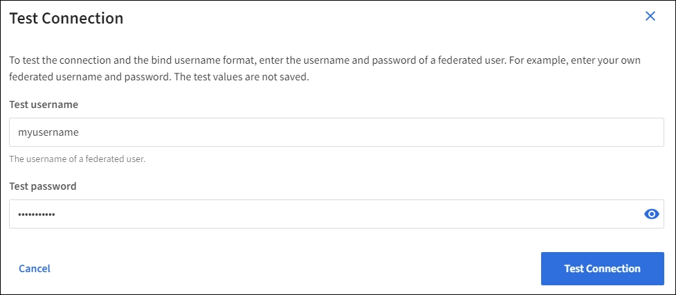

= Pruebe la conexión y guarde la configuración
:allow-uri-read: 

. Seleccione *Activar federación de identidades*.
. En la sección Tipo de servicio LDAP, seleccione el tipo de servicio LDAP que desea configurar.
+
image::../media/ldap_service_type.png[Página Federación de identidades que muestra las opciones de tipo de servicio LDAP]

+
Seleccione *otros* para configurar valores para un servidor LDAP que utilice Oracle Directory Server.

. Si ha seleccionado *otros*, complete los campos de la sección atributos LDAP . De lo contrario, vaya al paso siguiente.
+
** *Nombre único de usuario*: el nombre del atributo que contiene el identificador único de un usuario LDAP.  Este atributo es equivalente a `sAMAccountName` para Active Directory y `uid` para OpenLDAP.  Si está configurando Oracle Directory Server, ingrese `uid` .
** *UUID de usuario*: el nombre del atributo que contiene el identificador único permanente de un usuario LDAP.  Este atributo es equivalente a `objectGUID` para Active Directory y `entryUUID` para OpenLDAP.  Si está configurando Oracle Directory Server, ingrese `nsuniqueid` .  El valor de cada usuario para el atributo especificado debe ser un número hexadecimal de 32 dígitos en formato de 16 bytes o de cadena, donde se ignoran los guiones.
** *Nombre único del grupo*: el nombre del atributo que contiene el identificador único de un grupo LDAP.  Este atributo es equivalente a `sAMAccountName` para Active Directory y `cn` para OpenLDAP.  Si está configurando Oracle Directory Server, ingrese `cn` .
** *UUID de grupo*: el nombre del atributo que contiene el identificador único permanente de un grupo LDAP.  Este atributo es equivalente a `objectGUID` para Active Directory y `entryUUID` para OpenLDAP.  Si está configurando Oracle Directory Server, ingrese `nsuniqueid` .  El valor de cada grupo para el atributo especificado debe ser un número hexadecimal de 32 dígitos en formato de 16 bytes o de cadena, donde se ignoran los guiones.

. Para todos los tipos de servicio LDAP, introduzca la información de servidor LDAP y conexión de red necesaria en la sección Configure LDAP Server.
+
** *Hostname*: El nombre de dominio completo (FQDN) o la dirección IP del servidor LDAP.
** *Puerto*: El puerto utilizado para conectarse al servidor LDAP.
+

NOTE: El puerto predeterminado para STARTTLS es 389 y el puerto predeterminado para LDAPS es 636. Sin embargo, puede utilizar cualquier puerto siempre que su firewall esté configurado correctamente.

** *Nombre de usuario*: La ruta completa del nombre completo (DN) para el usuario que se conectará al servidor LDAP.
+
Para Active Directory, también puede especificar el nombre de inicio de sesión de nivel inferior o el nombre principal del usuario.

+
El usuario especificado debe tener permiso para enumerar grupos y usuarios y para tener acceso a los siguientes atributos:

+
*** `sAMAccountName` o. `uid`
*** `objectGUID`, , `entryUUID` o. `nsuniqueid`
*** `cn`
*** `memberOf` o. `isMemberOf`
*** *Active Directory* `objectSid`: , , `primaryGroupID`, `userAccountControl` Y. `userPrincipalName`
*** *ID de entrada*: `accountEnabled` y `userPrincipalName`

** *Contraseña*: La contraseña asociada al nombre de usuario.
+

NOTE: Si cambia la contraseña en el futuro, debe actualizarla en esta página.

** *DN base de grupo*: La ruta completa del nombre distinguido (DN) para un subárbol LDAP que desea buscar grupos. En el ejemplo de Active Directory (a continuación), se pueden usar como grupos federados todos los grupos cuyo nombre distintivo sea relativo al DN base (DC=storagegrid,DC=example,DC=com).
+

NOTE: Los valores de *Nombre único de grupo* deben ser únicos dentro del *DN base de grupo* al que pertenecen.

** *DN base de usuario*: La ruta completa del nombre completo (DN) de un subárbol LDAP que desea buscar usuarios.
+

NOTE: Los valores de *Nombre único de usuario* deben ser únicos dentro del *DN base de usuario* al que pertenecen.

** *Formato de nombre de usuario de enlace* (opcional): El patrón de nombre de usuario predeterminado StorageGRID debe usarse si el patrón no se puede determinar automáticamente.
+
Se recomienda proporcionar *Formato de nombre de usuario Bind* porque puede permitir que los usuarios inicien sesión si StorageGRID no puede enlazar con la cuenta de servicio.

+
Introduzca uno de estos patrones:

+
*** *Patrón UserPrincipalName (ID de AD y Entra)*: `[USERNAME]@_example_.com`
*** *Patrón de nombre de inicio de sesión de nivel inferior (ID de AD y Entra)*: `_example_\[USERNAME]`
*** * Patrón de nombre distinguido *: `CN=[USERNAME],CN=Users,DC=_example_,DC=com`
+
Incluya *[USERNAME]* exactamente como está escrito.

. En la sección Seguridad de la capa de transporte (TLS), seleccione una configuración de seguridad.
+
** *Usar STARTTLS*: utilice STARTTLS para proteger las comunicaciones con el servidor LDAP.  Esta es la opción recomendada para Active Directory, OpenLDAP u otros, pero esta opción no es compatible con Microsoft Entra ID.
** *Usar LDAPS*: La opción LDAPS (LDAP sobre SSL) utiliza TLS para establecer una conexión con el servidor LDAP.  Debe seleccionar esta opción para Microsoft Entra ID.
** *No utilizar TLS*: El tráfico de red entre el sistema StorageGRID y el servidor LDAP no estará protegido.  Esta opción no es compatible con Microsoft Entra ID.
+

NOTE: No se admite el uso de la opción *No usar TLS* si su servidor de Active Directory aplica la firma LDAP.  Debe utilizar STARTTLS o LDAPS.

. Si seleccionó STARTTLS o LDAPS, elija el certificado utilizado para proteger la conexión.
+
** *Utilizar certificado CA del sistema operativo*: Utilice el certificado predeterminado de CA de red instalado en el sistema operativo para asegurar las conexiones.
** *Utilizar certificado de CA personalizado*: Utilice un certificado de seguridad personalizado.
+
Si selecciona esta opción, copie y pegue el certificado de seguridad personalizado en el cuadro de texto del certificado de CA.

=== Pruebe la conexión y guarde la configuración

Después de introducir todos los valores, es necesario probar la conexión para poder guardar la configuración. StorageGRID verifica la configuración de conexión del servidor LDAP y el formato de nombre de usuario de enlace, si proporcionó uno.

.Pasos
. Seleccione *probar conexión*.
. Si no proporcionó un formato de nombre de usuario vinculado:
+
** Si la configuración de conexión es válida, aparecerá un mensaje que indica que la conexión se ha realizado correctamente. Seleccione *Guardar* para guardar la configuración.
** Si la configuración de conexión no es válida, aparecerá un mensaje que indica que no se ha podido establecer la conexión de prueba. Seleccione *Cerrar*. Luego, resuelva cualquier problema y vuelva a probar la conexión.

. Si proporcionó un formato de nombre de usuario de enlace, introduzca el nombre de usuario y la contraseña de un usuario federado válido.
+
Por ejemplo, introduzca su propio nombre de usuario y contraseña. No incluya ningún carácter especial en el nombre de usuario, como @ o /.

+

+
** Si la configuración de conexión es válida, aparecerá un mensaje que indica que la conexión se ha realizado correctamente. Seleccione *Guardar* para guardar la configuración.
** Aparecerá un mensaje de error si las opciones de conexión, el formato de nombre de usuario de enlace o el nombre de usuario y la contraseña de prueba no son válidos. Resuelva los problemas y vuelva a probar la conexión.

