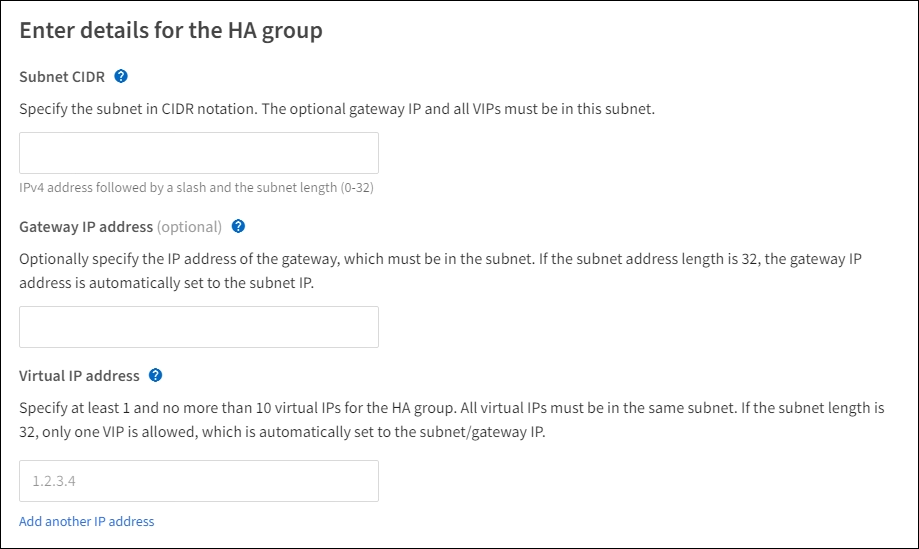

= Configuración de grupos de alta disponibilidad
:allow-uri-read: 
:icons: font
:imagesdir: ../media/

[role="lead"]
Puede configurar grupos de alta disponibilidad para proporcionar acceso de alta disponibilidad a los servicios en nodos de administración o de puerta de enlace.

NOTE: Un sistema StorageGRID puede tener un máximo de 255 grupos HA.

.Antes de empezar
* Ha iniciado sesión en Grid Manager mediante una link:../admin/web-browser-requirements.html["navegador web compatible"].
* Usted tiene el link:admin-group-permissions.html["Permiso de acceso raíz"].
* Si piensa utilizar una interfaz VLAN en un grupo de alta disponibilidad, ha creado la interfaz VLAN. Consulte link:../admin/configure-vlan-interfaces.html["Configure las interfaces VLAN"].
* Si planea utilizar una interfaz de acceso para un nodo en un grupo de alta disponibilidad, ha creado la interfaz:
+
** *Linux (antes de instalar el nodo)*:link:../swnodes/creating-node-configuration-files.html["Crear archivos de configuración del nodo"]
** *Linux (después de instalar el nodo)*:link:../maintain/linux-adding-trunk-or-access-interfaces-to-node.html["Agregar interfaces troncales o de acceso a un nodo"]
** *VMware (después de instalar el nodo)*:link:../maintain/vmware-adding-trunk-or-access-interfaces-to-node.html["Agregar interfaces troncales o de acceso a un nodo"]

NOTE: "Linux" se refiere a una implementación de RHEL, Ubuntu o Debian.  Para obtener una lista de las versiones compatibles, consulte la https://imt.netapp.com/matrix/#welcome["Herramienta de matriz de interoperabilidad de NetApp (IMT)"^] .

== Crear un grupo de alta disponibilidad

Cuando crea un grupo de alta disponibilidad, selecciona una o varias interfaces y las organiza por orden de prioridad. A continuación, debe asignar una o varias direcciones VIP al grupo.

Una interfaz debe ser para que un nodo de puerta de enlace o un nodo de administrador se incluyan en un grupo de alta disponibilidad. Un grupo de alta disponibilidad solo puede usar una interfaz para cualquier nodo concreto; sin embargo, se pueden usar otras interfaces para el mismo nodo en otros grupos de alta disponibilidad.

=== Acceda al asistente

.Pasos
. Seleccione *Configuración* > *Red* > *Grupos de alta disponibilidad*.
. Seleccione *Crear*.

=== Introduzca los detalles del grupo de alta disponibilidad

.Pasos
. Proporcione un nombre único para el grupo de alta disponibilidad.
. De forma opcional, puede introducir una descripción para el grupo de alta disponibilidad.
. Seleccione *continuar*.

=== Añada interfaces al grupo de alta disponibilidad

.Pasos
. Seleccione una o varias interfaces para añadirlas a este grupo de alta disponibilidad.
+
Utilice los encabezados de columna para ordenar las filas o introduzca un término de búsqueda para localizar las interfaces más rápidamente.

+
image::../media/ha_group_add_interfaces.png[Interfaces de adición de grupos de ALTA DISPONIBILIDAD]

+

NOTE: Después de crear una interfaz VLAN, espere hasta 5 minutos para que la nueva interfaz aparezca en la tabla.

+
.Directrices para seleccionar interfaces
** Debe seleccionar al menos una interfaz.
** Solo puede seleccionar una interfaz para un nodo.
** Si el grupo ha es para la protección de alta disponibilidad de los servicios Admin Node, que incluyen Grid Manager y el inquilino Manager, seleccione interfaces sólo en nodos de administrador.
** Si el grupo de alta disponibilidad está destinado a la protección de alta disponibilidad del tráfico de cliente S3, seleccione interfaces en los nodos de administración, nodos de puerta de enlace o ambos.
** Si selecciona interfaces en diferentes tipos de nodos, aparece una nota informativa. Se le recuerda que si se produce una conmutación al respaldo, los servicios que proporciona el nodo que antes estaba activo podrían no estar disponibles en el nodo recién activo. Por ejemplo, un nodo de puerta de enlace de backup no puede ofrecer una protección de alta disponibilidad de los servicios de nodo de administración. Del mismo modo, un nodo de administración de copia de seguridad no puede realizar todos los procedimientos de mantenimiento que puede proporcionar el nodo de administración primario.
** Si no puede seleccionar una interfaz, su casilla de verificación está desactivada. La sugerencia de herramienta proporciona más información.
+
image::../media/vlan_parent_interface_tooltip.png[Sugerencia de la herramienta de interfaz VLAN]

** No puede seleccionar una interfaz si su valor de subred o puerta de enlace entra en conflicto con otra interfaz seleccionada.
** No puede seleccionar una interfaz configurada si no tiene una dirección IP estática.

. Seleccione *continuar*.

=== Determinar el orden de prioridad

Si el grupo HA incluye más de una interfaz, puede determinar cuál es la interfaz principal y cuáles son las interfaces de backup (failover). Si la interfaz principal falla, las direcciones VIP se mueven a la interfaz de mayor prioridad que está disponible. Si falla esa interfaz, las direcciones VIP pasan a la siguiente interfaz de mayor prioridad que esté disponible, etc.

.Pasos
. Arrastre filas en la columna *Orden de prioridad* para determinar la interfaz principal y cualquier interfaz de respaldo.
+
La primera interfaz de la lista es la interfaz principal. La interfaz Primary es la interfaz activa a menos que se produzca un fallo.

+
image::../media/ha_group_determine_failover.png[Los grupos DE ALTA DISPONIBILIDAD determinan el orden de prioridad]

+

TIP: Si el grupo ha proporciona acceso a Grid Manager, debe seleccionar una interfaz en el nodo de administración principal para que sea la interfaz principal. Algunos procedimientos de mantenimiento solo se pueden realizar desde el nodo de administración principal.

. Seleccione *continuar*.

=== Introduzca las direcciones IP

.Pasos
. En el campo *CIDR de subred*, especifique la subred VIP en notación CIDR --una dirección IPv4 seguida de una barra y la longitud de subred (0-32).
+
La dirección de red no debe tener ningún bit de host configurado. Por ejemplo, `192.16.0.0/22`.

+

NOTE: Si utiliza un prefijo de 32 bits, la dirección de red VIP también funciona como dirección de puerta de enlace y dirección VIP.

+

. Opcionalmente, si cualquier cliente administrativo o inquilino de S3 accederá a estas direcciones VIP desde una subred diferente, introduzca la dirección IP de la puerta de enlace *. La dirección de la puerta de enlace debe estar en la subred VIP.
+
Los usuarios de cliente y administrador utilizarán esta puerta de enlace para acceder a las direcciones IP virtuales.

. Introduzca al menos una y como máximo diez direcciones VIP para la interfaz activa en el grupo de alta disponibilidad. Todas las direcciones VIP deben estar dentro de la subred VIP y todas estarán activas al mismo tiempo en la interfaz activa.
+
Debe proporcionar al menos una dirección IPv4. De manera opcional, es posible especificar direcciones IPv4 e IPv6 adicionales.

. Seleccione *Crear grupo ha* y seleccione *Finalizar*.
+
El grupo ha se ha creado y ahora puede utilizar las direcciones IP virtuales configuradas.

=== Siguientes pasos

Si utilizará este grupo de ha para el equilibrio de carga, cree un extremo de equilibrio de carga para determinar el puerto y el protocolo de red y para conectar los certificados necesarios. Consulte link:configuring-load-balancer-endpoints.html["Configurar puntos finales del equilibrador de carga"].

== Editar un grupo de alta disponibilidad

Puede editar un grupo de alta disponibilidad para cambiar su nombre y descripción, agregar o quitar interfaces, cambiar el orden de prioridad o agregar o actualizar direcciones IP virtuales.

Por ejemplo, es posible que deba editar un grupo de alta disponibilidad si desea quitar el nodo asociado a una interfaz seleccionada en un procedimiento de retirada del sitio o nodo.

.Pasos
. Seleccione *Configuración* > *Red* > *Grupos de alta disponibilidad*.
+
La página grupos de alta disponibilidad muestra todos los grupos de alta disponibilidad existentes.

. Seleccione la casilla de comprobación del grupo de alta disponibilidad que desea editar.
. Realice una de las siguientes acciones, según lo que desee actualizar:
+
** Seleccione *acciones* > *Editar dirección IP virtual* para agregar o eliminar direcciones VIP.
** Seleccione *acciones* > *Editar grupo ha* para actualizar el nombre o la descripción del grupo, agregar o quitar interfaces, cambiar el orden de prioridad o agregar o quitar direcciones VIP.

. Si ha seleccionado *Editar dirección IP virtual*:
+
.. Actualice las direcciones IP virtuales del grupo de alta disponibilidad.
.. Seleccione *Guardar*.
.. Seleccione *Finalizar*.

. Si ha seleccionado *Editar grupo ha*:
+
.. Si lo desea, actualice el nombre o la descripción del grupo.
.. Opcionalmente, seleccione o desactive las casillas de verificación para agregar o eliminar interfaces.
+

NOTE: Si el grupo ha proporciona acceso a Grid Manager, debe seleccionar una interfaz en el nodo de administración principal para que sea la interfaz principal. Algunos procedimientos de mantenimiento solo se pueden realizar desde el nodo de administración principal

.. Opcionalmente, arrastre Filas para cambiar el orden de prioridad de la interfaz principal y cualquier interfaz de backup de este grupo de alta disponibilidad.
.. De manera opcional, actualice las direcciones IP virtuales.
.. Seleccione *Guardar* y, a continuación, seleccione *Finalizar*.

== Eliminar un grupo de alta disponibilidad

Puede eliminar uno o varios grupos de alta disponibilidad al mismo tiempo.

TIP: No puede eliminar un grupo de alta disponibilidad si está vinculado a un extremo de equilibrador de carga. Para eliminar un grupo de alta disponibilidad, debe eliminarlo de los extremos de equilibrio de carga que lo utilicen.

Para evitar interrupciones en el cliente, actualice las aplicaciones cliente S3 afectadas antes de eliminar un grupo de alta disponibilidad. Actualice cada cliente para que se conecte mediante otra dirección IP, por ejemplo, la dirección IP virtual de un grupo ha diferente o la dirección IP configurada para una interfaz durante la instalación.

.Pasos
. Seleccione *Configuración* > *Red* > *Grupos de alta disponibilidad*.
. Revise la columna *Load Balancer Endpoints* para cada grupo HA que desee eliminar. Si se muestra algún punto final del equilibrador de carga:
+
.. Vaya a *Configuración* > *Red* > *Puntos finales del balanceador de carga*.
.. Seleccione la casilla de verificación para el punto final.
.. Seleccione *acciones* > *Editar modo de enlace de punto final*.
.. Actualice el modo de enlace para eliminar el grupo HA.
.. Seleccione *Guardar cambios*.

. Si no aparece ningún punto final del equilibrador de carga, seleccione la casilla de verificación de cada grupo de alta disponibilidad que desee quitar.
. Selecciona *Acciones* > *Eliminar grupo HA*.
. Revise el mensaje y seleccione *Eliminar grupo ha* para confirmar su selección.
+
Se eliminan todos los grupos de alta disponibilidad seleccionados. Aparecerá un banner verde de éxito en la página grupos de alta disponibilidad.

