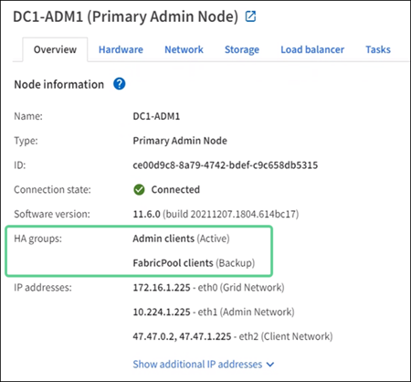

= ¿Cuáles son los grupos de alta disponibilidad?
:allow-uri-read: 
:icons: font
:imagesdir: ../media/

[role="lead"]
Los grupos de alta disponibilidad proporcionan conexiones de datos de alta disponibilidad para los clientes S3 y conexiones de alta disponibilidad a Grid Manager y al Gestor de inquilinos.

Puede agrupar las interfaces de red de varios nodos de administrador y puerta de enlace en un grupo de alta disponibilidad (ha). Si la interfaz activa del grupo de alta disponibilidad falla, una interfaz de backup puede administrar la carga de trabajo.

Cada grupo de alta disponibilidad proporciona acceso a los servicios compartidos en los nodos seleccionados.

* Los grupos de ALTA disponibilidad que incluyen nodos de puerta de enlace, nodos de administración o ambos proporcionan conexiones de datos de alta disponibilidad para clientes S3.
* Los grupos DE ALTA DISPONIBILIDAD que incluyen solo los nodos de administrador proporcionan conexiones de alta disponibilidad con el administrador de grid y el administrador de inquilinos.
* Un grupo de alta disponibilidad que incluya solo dispositivos de servicios y nodos de software basados en VMware puede proporcionar conexiones altamente disponibles para link:../admin/manage-s3-select-for-tenant-accounts.html["Inquilinos de S3 que usan S3 Select"]. Se recomienda a los grupos de ALTA DISPONIBILIDAD cuando se usa S3 Select, pero no es obligatorio.

== ¿Cómo se crea un grupo de alta disponibilidad?

. Debe seleccionar una interfaz de red para uno o más nodos de administrador o nodos de puerta de enlace. Puede usar una interfaz de red de cuadrícula (eth0), una interfaz de red de cliente (eth2), una interfaz VLAN o una interfaz de acceso que haya agregado al nodo.
+

NOTE: No puede agregar una interfaz a un grupo de alta disponibilidad si tiene una dirección IP asignada por DHCP.

. Se especifica una interfaz para ser la interfaz principal. La interfaz Primary es la interfaz activa a menos que se produzca un fallo.
. El orden de prioridad de las interfaces de copia de seguridad se determina.
. Asigne una a 10 direcciones IP virtuales (VIP) al grupo. Las aplicaciones cliente pueden utilizar cualquiera de estas direcciones VIP para conectarse a StorageGRID.

Para obtener instrucciones, consulte link:configure-high-availability-group.html["Configuración de grupos de alta disponibilidad"].

== ¿Cuál es la interfaz activa?

Durante el funcionamiento normal, todas las direcciones VIP del grupo ha se añaden a la interfaz principal, que es la primera interfaz en el orden de prioridad. Siempre que la interfaz principal siga estando disponible, se utiliza cuando los clientes se conectan a cualquier dirección VIP del grupo. Es decir, durante el funcionamiento normal, la interfaz principal es la interfaz activa del grupo.

Del mismo modo, durante el funcionamiento normal, las interfaces de menor prioridad del grupo de alta disponibilidad actúan como interfaces de backup. Estas interfaces de copia de seguridad no se utilizan a menos que la interfaz primaria (actualmente activa) deje de estar disponible.

== Ver el estado actual del grupo de alta disponibilidad de un nodo

Para ver si un nodo está asignado a un grupo de alta disponibilidad y determinar su estado actual, seleccione *Nodos* > *_nodo_*.

Si la ficha *Descripción general* incluye una entrada para *grupos ha*, el nodo se asigna a los grupos ha enumerados. El valor después de que el nombre del grupo sea el estado actual del nodo del grupo de alta disponibilidad:

* *Activo*: El grupo ha se está alojando actualmente en este nodo.
* *Copia de seguridad*: El grupo ha no está utilizando actualmente este nodo; se trata de una interfaz de copia de seguridad.
* *Detenido*: El grupo HA no se puede alojar en este nodo porque el servicio High Availability (Keepalived) se ha detenido manualmente.
* *Fallo*: El grupo HA no se puede alojar en este nodo debido a uno o más de los siguientes:
+
** El servicio Load Balancer (nginx-gw) no se está ejecutando en el nodo.
** La interfaz eth0 o VIP del nodo está inactiva.
** El nodo está inactivo.

En este ejemplo, el nodo de administración principal se ha añadido a dos grupos de alta disponibilidad. Este nodo es actualmente la interfaz activa del grupo de clientes de administración y una interfaz de respaldo del grupo de clientes de FabricPool.

== ¿Qué ocurre cuando falla la interfaz activa?

La interfaz que aloja actualmente las direcciones VIP es la interfaz activa. Si el grupo ha incluye más de una interfaz y la interfaz activa falla, las direcciones VIP se mueven a la primera interfaz de respaldo disponible en el orden de prioridad. Si falla esa interfaz, las direcciones VIP se mueven a la siguiente interfaz de respaldo disponible, etc.

La conmutación por error puede activarse por cualquiera de estas razones:

* El nodo en el que se configura la interfaz se desactiva.
* El nodo en el que se configura la interfaz pierde la conectividad con los demás nodos durante al menos 2 minutos.
* La interfaz activa se desactiva.
* El servicio Load Balancer se detiene.
* El servicio de alta disponibilidad se detiene.

NOTE: Es posible que la conmutación al respaldo no se active por errores de red externos al nodo que aloja la interfaz activa. Del mismo modo, los servicios para Grid Manager o el Gestor de inquilinos no activan la conmutación por error.

Por lo general, el proceso de recuperación tras fallos sólo se realiza en unos pocos segundos y es lo suficientemente rápido como para que las aplicaciones cliente tengan un impacto escaso y puedan confiar en los comportamientos normales de reintento para continuar con el funcionamiento.

Cuando se resuelve un fallo y hay una interfaz de mayor prioridad disponible de nuevo, las direcciones VIP se mueven automáticamente a la interfaz de mayor prioridad disponible.
