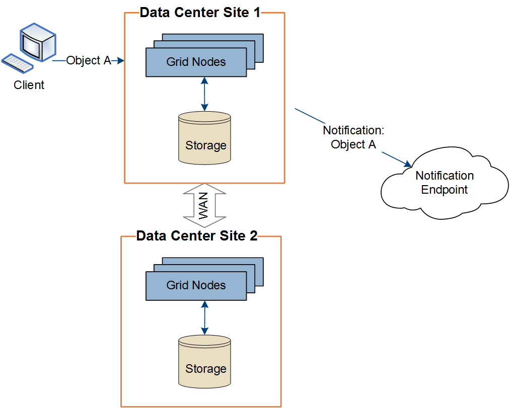

= Entrega de mensajes de servicios de plataforma por sitio
:allow-uri-read: 
:icons: font
:imagesdir: ../media/

[role="lead"]
Todas las operaciones de servicios de plataforma se realizan in situ.

Es decir, si un inquilino utiliza un cliente para realizar una operación S3 API Create en un objeto conectando a un nodo de puerta de enlace en el sitio 1 del centro de datos, se activa y envía la notificación acerca de esa acción desde el sitio 1 del centro de datos.

Si el cliente realiza posteriormente una operación de eliminación de API de S3 en ese mismo objeto desde el centro de datos Sitio 2, se activa y envía la notificación sobre la acción de eliminación desde el centro de datos Sitio 2.

image::../media/notifications_site_2.gif[el diagrama que muestra la acción en el objeto del sitio 2 activa las notificaciones del sitio 2]

Asegúrese de que la red de cada sitio esté configurada de modo que los mensajes de servicios de la plataforma se puedan entregar a sus destinos.
