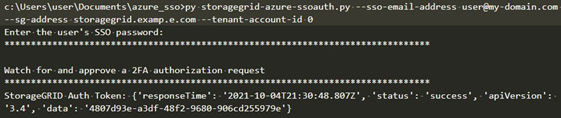

= Utilice la API si el inicio de sesión único está habilitado (ID de entrada)
:allow-uri-read: 
:icons: font
:imagesdir: ../media/

[role="lead"]
Si tieneslink:../admin/how-sso-works.html["Inicio de sesión único configurado y habilitado (SSO)"] y utiliza Entra ID como proveedor de SSO, puede usar dos scripts de ejemplo para obtener un token de autenticación que sea válido para la API de administración de red o la API de administración de inquilinos.

== Sign in en la API si el inicio de sesión único de Entra ID está habilitado

Estas instrucciones se aplican si está utilizando Entra ID como proveedor de identidad SSO

.Antes de empezar
* Conoce la dirección de correo electrónico y la contraseña de SSO para un usuario federado que pertenece a un grupo de usuarios de StorageGRID.
* Si desea acceder a la API de gestión de inquilinos, conoce el ID de cuenta de inquilino.

.Acerca de esta tarea
Para obtener un token de autenticación, puede utilizar las siguientes secuencias de comandos de ejemplo:

* El `storagegrid-ssoauth-azure.py` script de Python
*  `storagegrid-ssoauth-azure.js`El script Node.js

Ambos scripts se encuentran en el directorio de archivos de instalación de StorageGRID(`./rpms` para RHEL, `./debs` para Ubuntu o Debian, y `./vsphere` para VMware).

Para escribir su propia integración de API con Entra ID, consulte la `storagegrid-ssoauth-azure.py` guion.  El script de Python realiza dos solicitudes a StorageGRID directamente (primero para obtener SAMLRequest y luego para obtener el token de autorización) y también llama al script Node.js para interactuar con Entra ID para realizar las operaciones de SSO.

Las operaciones de SSO se pueden ejecutar mediante una serie de solicitudes de API, pero hacerlo no es sencillo.  El módulo Node.js Puppeteer se utiliza para extraer la interfaz SSO de Entra ID.

Si tiene un problema de codificación de URL, puede que aparezca el error: `Unsupported SAML version`.

.Pasos
. Instale las dependencias necesarias de la siguiente manera:
+
.. Instale Node.js (consulte https://nodejs.org/en/download/["https://nodejs.org/en/download/"^]).
.. Instale los módulos Node.js necesarios (tippeteer y jsdom):
+
`npm install -g <module>`

. Pase la secuencia de comandos de Python al intérprete de Python para ejecutar la secuencia de comandos.
+
Luego, el script de Python llamará al script Node.js correspondiente para realizar las interacciones SSO de Entra ID.

. Cuando se le solicite, introduzca valores para los siguientes argumentos (o bien, pasarlos mediante parámetros):
+
** La dirección de correo electrónico SSO utilizada para iniciar sesión en Entra ID
** La dirección de StorageGRID
** El ID de cuenta de inquilino, si desea acceder a la API de gestión de inquilinos

. Cuando se le solicite, ingrese la contraseña y prepárese para proporcionar una autorización MFA a Entra ID si se le solicita.
+

+

NOTE: La secuencia de comandos asume que la MFA se realiza utilizando Microsoft Authenticator. Es posible que necesite modificar el script para admitir otras formas de MFA (como introducir un código recibido en un mensaje de texto).

+
El token de autorización de StorageGRID se proporciona en la salida. Ahora puede utilizar el token para otras solicitudes, de forma similar a cómo utilizaría la API si no se estuviera utilizando SSO.

