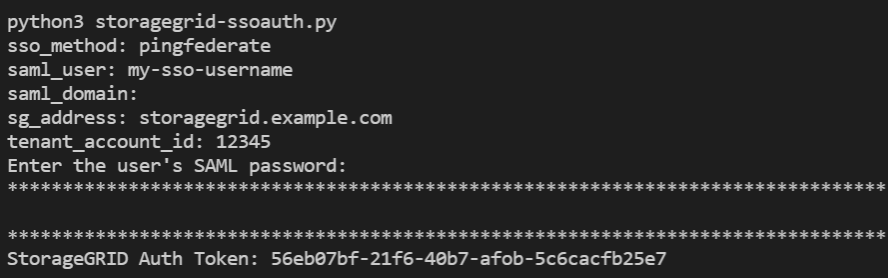

= Usa la API de StorageGRID si el inicio de sesión único está activado (PingFederate)
:allow-uri-read: 
:icons: font
:imagesdir: ../media/

[role="lead"]
Si tieneslink:../admin/how-sso-works.html["Inicio de sesión único configurado y habilitado (SSO)"] y utiliza PingFederate como proveedor de SSO, debe emitir una serie de solicitudes de API para obtener un token de autenticación que sea válido para la API de administración de red o la API de administración de inquilinos.

== Inicie sesión en la API si está habilitado el inicio de sesión único

Estas instrucciones se aplican si está utilizando PingFederate como proveedor de identidades SSO

.Antes de empezar
* Conoce el nombre de usuario y la contraseña de SSO para un usuario federado que pertenece a un grupo de usuarios de StorageGRID.
* Si desea acceder a la API de gestión de inquilinos, conoce el ID de cuenta de inquilino.

.Acerca de esta tarea
Para obtener un token de autenticación, puede utilizar uno de los siguientes ejemplos:

* El `storagegrid-ssoauth.py` Script de Python, que se encuentra en el directorio de archivos de instalación de StorageGRID(`./rpms` para RHEL, `./debs` para Ubuntu o Debian, y `./vsphere` para VMware).
* Ejemplo de flujo de trabajo de solicitudes curl.
+
El flujo de trabajo curl podría llegar a ocurrir si lo hace demasiado lentamente. Es posible que vea el error: `A valid SubjectConfirmation was not found on this Response`.

+

NOTE: El flujo de trabajo curl de ejemplo no protege la contraseña de ser vista por otros usuarios.

+
Si tiene un problema de codificación de URL, puede que aparezca el error: `Unsupported SAML version`.

.Pasos
. Seleccione uno de los siguientes métodos para obtener un token de autenticación:
+
** Utilice `storagegrid-ssoauth.py` el script de Python. Vaya al paso 2.
** Usar solicitudes curl. Vaya al paso 3.

. Si desea utilizar `storagegrid-ssoauth.py` el script, pase el script al intérprete de Python y ejecute el script.
+
Cuando se le solicite, escriba valores para los siguientes argumentos:

+
** El método SSO. Puede introducir cualquier variación de “pingfederate” (PINGFEDERATE, pingfederate, etc.).
** El nombre de usuario de SSO
** El dominio en el que está instalado StorageGRID. Este campo no se utiliza para PingFederate. Puede dejarlo en blanco o introducir cualquier valor.
** La dirección de StorageGRID
** El ID de cuenta de inquilino, si desea acceder a la API de gestión de inquilinos.
+

+
El token de autorización de StorageGRID se proporciona en la salida. Ahora puede utilizar el token para otras solicitudes, de forma similar a cómo utilizaría la API si no se estuviera utilizando SSO.

. Si desea usar solicitudes curl, use el siguiente procedimiento.
+
.. Declare las variables necesarias para iniciar sesión.
+
[source, bash]
----
export SAMLUSER='my-sso-username'
export SAMLPASSWORD='my-password'
export TENANTACCOUNTID='12345'
export STORAGEGRID_ADDRESS='storagegrid.example.com'
----
+

NOTE: Para acceder a la API de gestión de grid, utilice 0 como `TENANTACCOUNTID`.

.. Para recibir una URL de autenticación firmada, emita una solicitud POST a `/api/v3/authorize-saml` y elimine la codificación JSON adicional de la respuesta.
+
En este ejemplo se muestra una solicitud POST para una dirección URL de autenticación firmada para TENANTACCOUNTID. Los resultados se pasan a python -m json.tool para quitar la codificación JSON.

+
[source, bash]
----
curl -X POST "https://$STORAGEGRID_ADDRESS/api/v3/authorize-saml" \
  -H "accept: application/json" -H  "Content-Type: application/json" \
  --data "{\"accountId\": \"$TENANTACCOUNTID\"}" | python -m json.tool
----
+
La respuesta de este ejemplo incluye una dirección URL firmada codificada por URL, pero no incluye la capa de codificación JSON adicional.

+
[listing]
----
{
    "apiVersion": "3.0",
    "data": "https://my-pf-baseurl/idp/SSO.saml2?...",
    "responseTime": "2018-11-06T16:30:23.355Z",
    "status": "success"
}
----
.. Guarde el `SAMLRequest` de la respuesta para utilizarlo en comandos posteriores.
+
[listing]
----
export SAMLREQUEST="https://my-pf-baseurl/idp/SSO.saml2?..."
----
.. Exporte la respuesta y el cookie y añada la respuesta:
+
[source, bash]
----
RESPONSE=$(curl -c - "$SAMLREQUEST")
----
+
[source, bash]
----
echo "$RESPONSE" | grep 'input type="hidden" name="pf.adapterId" id="pf.adapterId"'
----
.. Exporte el valor 'pf.adapterId' y añada la respuesta:
+
[listing]
----
export ADAPTER='myAdapter'
----
+
[source, bash]
----
echo "$RESPONSE" | grep 'base'
----
.. Exporte el valor 'href' (retire la barra diagonal inversa /) y añada la respuesta:
+
[listing]
----
export BASEURL='https://my-pf-baseurl'
----
+
[source, bash]
----
echo "$RESPONSE" | grep 'form method="POST"'
----
.. Exporte el valor de 'acción':
+
[listing]
----
export SSOPING='/idp/.../resumeSAML20/idp/SSO.ping'
----
.. Enviar cookies junto con credenciales:
+
[source, bash]
----
curl -b <(echo "$RESPONSE") -X POST "$BASEURL$SSOPING" \
--data "pf.username=$SAMLUSER&pf.pass=$SAMLPASSWORD&pf.ok=clicked&pf.cancel=&pf.adapterId=$ADAPTER" --include
----
.. Guarde el `SAMLResponse` desde el campo oculto:
+
[source, bash]
----
export SAMLResponse='PHNhbWxwOlJlc3BvbnN...1scDpSZXNwb25zZT4='
----
.. Uso de Guardado `SAMLResponse`, Realice una solicitud StorageGRID``/api/saml-response`` para generar un token de autenticación StorageGRID.
+
Para `RelayState`, utilice el ID de cuenta de inquilino o utilice 0 si desea iniciar sesión en la API de gestión de grid.

+
[source, bash]
----
curl -X POST "https://$STORAGEGRID_ADDRESS:443/api/saml-response" \
  -H "accept: application/json" \
  --data-urlencode "SAMLResponse=$SAMLResponse" \
  --data-urlencode "RelayState=$TENANTACCOUNTID" \
  | python -m json.tool
----
+
La respuesta incluye el token de autenticación.

+
[listing]
----
{
    "apiVersion": "3.0",
    "data": "56eb07bf-21f6-40b7-af0b-5c6cacfb25e7",
    "responseTime": "2018-11-07T21:32:53.486Z",
    "status": "success"
}
----
.. Guarde el token de autenticación en la respuesta como `MYTOKEN`.
+
[source, bash]
----
export MYTOKEN="56eb07bf-21f6-40b7-af0b-5c6cacfb25e7"
----
+
Ahora puede usar `MYTOKEN` para otras solicitudes, de forma similar a cómo usaría la API si no se estaba utilizando SSO.

== Cierre sesión en la API si el inicio de sesión único está habilitado

Si se ha activado el inicio de sesión único (SSO), debe emitir una serie de solicitudes API para cerrar sesión en la API de gestión de grid o en la API de gestión de inquilinos. Estas instrucciones se aplican si está utilizando PingFederate como proveedor de identidades SSO

.Acerca de esta tarea
Si es necesario, puede cerrar sesión en la API de StorageGRID cerrando sesión en la página de cierre de sesión único de su organización. O bien, puede activar el cierre de sesión único (SLO) desde StorageGRID, que requiere un token de portador de StorageGRID válido.

.Pasos
. Para generar una solicitud de cierre de sesión firmada, pase la cookie «sso=true» a la API de SLO:
+
[source, bash]
----
curl -k -X DELETE "https://$STORAGEGRID_ADDRESS/api/v3/authorize" \
-H "accept: application/json" \
-H "Authorization: Bearer $MYTOKEN" \
--cookie "sso=true" \
| python -m json.tool
----
+
Se devuelve una URL de cierre de sesión:

+
[listing]
----
{
    "apiVersion": "3.0",
    "data": "https://my-ping-url/idp/SLO.saml2?SAMLRequest=fZDNboMwEIRfhZ...HcQ%3D%3D",
    "responseTime": "2021-10-12T22:20:30.839Z",
    "status": "success"
}
----
. Guarde la URL de cierre de sesión.
+
[source, bash]
----
export LOGOUT_REQUEST='https://my-ping-url/idp/SLO.saml2?SAMLRequest=fZDNboMwEIRfhZ...HcQ%3D%3D'
----
. Envíe una solicitud a la URL de cierre de sesión para activar SLO y redirigir de nuevo a StorageGRID.
+
[source, bash]
----
curl --include "$LOGOUT_REQUEST"
----
+
Se devuelve la respuesta de 302. La ubicación de redirección no se aplica a la salida de sólo API.

+
[listing]
----
HTTP/1.1 302 Found
Location: https://$STORAGEGRID_ADDRESS:443/api/saml-logout?SAMLResponse=fVLLasMwEPwVo7ss%...%23rsa-sha256
Set-Cookie: PF=QoKs...SgCC; Path=/; Secure; HttpOnly; SameSite=None
----
. Elimine el token del portador de StorageGRID.
+
La eliminación del token del portador de StorageGRID funciona de la misma forma que sin SSO. Si no se proporciona 'cookie 'sso=true', el usuario se cierra la sesión de StorageGRID sin afectar al estado de SSO.

+
[source, bash]
----
curl -X DELETE "https://$STORAGEGRID_ADDRESS/api/v3/authorize" \
-H "accept: application/json" \
-H "Authorization: Bearer $MYTOKEN" \
--include
----
+
Una `204 No Content` respuesta indica que el usuario ha cerrado sesión.

+
[listing]
----
HTTP/1.1 204 No Content
----

