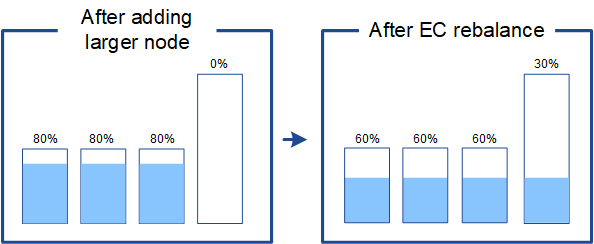

= Obtenga información sobre el reequilibrio de EC después de la expansión en StorageGRID
:allow-uri-read: 
:icons: font
:imagesdir: ../media/

[role="lead"]
Si va a realizar una ampliación para añadir nodos de almacenamiento y utiliza reglas de ILM para borrar datos de código, es posible que deba ejecutar el procedimiento de reequilibrio de codificación de borrado (EC) si no puede agregar nodos de almacenamiento suficientes para el esquema de código de borrado que está utilizando.

Después de revisar estas consideraciones, realice la expansión y, a continuación, vaya a link:rebalancing-erasure-coded-data-after-adding-storage-nodes.html["Reequilibre los datos con código de borrado tras añadir nodos de almacenamiento"] para ejecutar el procedimiento.

== ¿Qué es el reequilibrio de la CE?

El reequilibrado de EC es un procedimiento de StorageGRID que puede ser necesario después de una ampliación de nodo de almacenamiento. El procedimiento se ejecuta como un script de línea de comandos desde el nodo de administración principal. Cuando ejecuta el procedimiento de reequilibrio de EC, StorageGRID redistribuye los fragmentos con código de borrado entre los nodos de almacenamiento existentes y los recién añadidos en un sitio.

Procedimiento de reequilibrio de EC:

* Solo mueve datos de objetos codificados con borrado. No mueve los datos de objetos replicados.
* Redistribuye los datos dentro de un sitio. No mueve datos de un sitio a otro.
* Redistribuye los datos entre todos los nodos de almacenamiento de un sitio. No redistribuye datos dentro de los volúmenes de almacenamiento.
* Intenta distribuir la misma cantidad de bytes a cada nodo.  Los nodos que contienen más datos replicados almacenarán menos datos codificados por borrado una vez que se complete el reequilibrio.
* Redistribuye los datos codificados por borrado de manera uniforme entre los nodos de almacenamiento sin tener en cuenta las capacidades relativas de cada nodo.  Los datos replicados se incluyen en el cálculo.
* No distribuirá datos codificados por borrado a nodos de almacenamiento que estén llenos en más del 80 %.
* Puede disminuir el rendimiento de las operaciones de ILM y de las operaciones de cliente del S3 cuando este se ejecuta&#8212; se necesitan recursos adicionales para redistribuir los fragmentos de código de borrado.

Una vez finalizado el procedimiento de reequilibrio de EC:

* Los datos con código de borrado se habrán movido de los nodos de almacenamiento con menos espacio disponible hasta los nodos de almacenamiento que tienen más espacio disponible.
* La protección de datos de los objetos codificados de borrado no cambiará.
* Los valores usados (%) pueden ser diferentes entre los nodos de almacenamiento por dos motivos:
+
** Las copias de objetos replicados seguirán consumiendo espacio en los nodos existentes&#8212;El procedimiento de reequilibrio de EC no mueve datos replicados.
** Los nodos de mayor capacidad estarán relativamente menos llenos que los de menor capacidad, aunque todos los nodos terminarán con aproximadamente la misma cantidad de datos.
+
Por ejemplo, suponga que tres nodos de 200 TB se llenan al 80 % cada uno (200 &#215; 0,8 = 160 TB en cada nodo o 480 TB en el sitio). Si agrega un nodo de 400 TB y ejecuta el procedimiento de reequilibrio, ahora todos los nodos tendrán aproximadamente la misma cantidad de datos de código de borrado (480/4 TB = 120 TB). Sin embargo, el utilizado (%) para el nodo más grande será menor que el usado (%) para los nodos más pequeños.

+

== Cuándo reequilibrar los datos con código de borrado

El procedimiento de reequilibrio de EC redistribuye los datos codificados por borrado existentes para garantizar que los nodos no se llenen o permanezcan llenos.  El procedimiento ayuda a garantizar que la codificación EC pueda continuar en el sitio.

Ejecute el procedimiento de reequilibrio cuando exista un sesgo preocupante en la distribución de datos en un sitio y el sitio almacene principalmente datos EC (ya que los datos replicados no se pueden mover mediante el reequilibrio).

Considere el siguiente escenario:

* StorageGRID se ejecuta en un solo sitio, que contiene tres nodos de almacenamiento.
* La política de ILM usa una regla de codificación de borrado de 2+1 para todos los objetos de mayor tamaño que 1.0 MB y una regla de replicación de 2 copias para los objetos más pequeños.
* Todos los nodos de almacenamiento se han lleno por completo. La alerta *Low Object Storage* se ha disparado en el nivel de gravedad principal.
+
image::../media/used_space_before_expansion.png[Espacio usado antes de la expansión]

=== No es necesario reequilibrar si se agregan suficientes nodos

Para comprender cuándo no es necesario reequilibrar EC, suponga que se han añadido tres (o más) nuevos nodos de almacenamiento. En este caso, no es necesario realizar un reequilibrio de EC. Los nodos de almacenamiento originales se mantendrán llenos, pero los objetos nuevos ahora usarán los tres nodos nuevos para 2+1 código de borrado&#8212;Los dos fragmentos de datos y el fragmento de paridad único podrán almacenarse en un nodo diferente.

image::../media/used_space_after_3_node_expansion.png[Espacio utilizado tras la ampliación de 3 nodos]

CAUTION: Aunque puede ejecutar el procedimiento de equilibrio de EC en este caso, mover los datos existentes con código de borrado reducirá temporalmente el rendimiento del grid, lo que puede afectar a las operaciones del cliente.

=== Si no puede agregar suficientes nodos, es necesario reequilibrar

Para comprender cuándo es necesario reequilibrar EC, suponga que solo puede añadir dos nodos de almacenamiento, en lugar de tres. Dado que el esquema de 2+1 requiere al menos tres nodos de almacenamiento para tener espacio disponible, los nodos vacíos no se pueden usar para nuevos datos codificados de borrado.

image::../media/used_space_after_2_node_expansion.png[Espacio utilizado tras la ampliación de 2 nodos]

Para utilizar los nuevos nodos de almacenamiento, debe ejecutar el procedimiento de reequilibrio de EC. Cuando este procedimiento se ejecuta, StorageGRID redistribuye los datos existentes con código de borrado y los fragmentos de paridad entre todos los nodos de almacenamiento del sitio. En este ejemplo, cuando se haya completado el procedimiento de reequilibrio de EC, los cinco nodos ahora sólo estarán llenos al 60 % y los objetos pueden seguir ingiriendo en el esquema de código de borrado 2+1 en todos los nodos de almacenamiento.

image::../media/used_space_after_ec_rebalance.png[Espacio usado aAfter EC reequilibrar]

== Recomendaciones para el reequilibrio de EC

NetApp requiere el reequilibrio de EC si _all_ de las siguientes afirmaciones son verdaderas:

* Se utiliza la codificación de borrado para los datos de objetos.
* La alerta *almacenamiento de objetos bajo* se ha activado para uno o más nodos de almacenamiento de un sitio, lo que indica que los nodos están al menos un 80% llenos.
* No puede añadir nodos de almacenamiento nuevos suficientes para el esquema de codificación de borrado en uso. Consulte link:adding-storage-capacity-for-erasure-coded-objects.html["Añada capacidad de almacenamiento para objetos codificados de borrado"].
* Sus clientes de S3 pueden tolerar un bajo rendimiento para sus operaciones de escritura y lectura mientras se ejecuta el procedimiento de reequilibrio de EC.

Opcionalmente, puede ejecutar el procedimiento de reequilibrio de EC si prefiere que los nodos de almacenamiento se llenen a niveles similares. Los clientes S3 podrán tolerar un menor rendimiento en sus operaciones de escritura y lectura mientras se ejecuta el procedimiento de reequilibrio de EC.

== La forma en que el procedimiento de reequilibrio de EC interactúa con otras tareas de mantenimiento

No puede realizar determinados procedimientos de mantenimiento al mismo tiempo que ejecuta el procedimiento de reequilibrio de EC.

[cols="1a,2a"]
|===
| Procedimiento | Permitido durante el procedimiento de reequilibrio de EC? 

 a| 
Procedimientos adicionales de reequilibrio de EC
 a| 
No

Sólo puede ejecutar un procedimiento de reequilibrio de EC a la vez.

 a| 
Procedimiento de retirada

Trabajo de reparación de datos de EC
 a| 
No

* Se le impide iniciar un procedimiento de retirada de servicio o una reparación de datos de EC mientras se está ejecutando el procedimiento de reequilibrio de EC.
* Se le impide iniciar el procedimiento de reequilibrio de EC mientras se ejecuta un procedimiento de retirada del nodo de almacenamiento o una reparación de datos de EC.

 a| 
Procedimiento de expansión
 a| 
No

Si necesita añadir nodos de almacenamiento nuevos en una ampliación, ejecute el procedimiento de reequilibrio de EC después de agregar todos los nodos nuevos.

 a| 
Procedimiento de actualización
 a| 
No

Si necesita actualizar el software StorageGRID, realice el procedimiento de actualización antes o después de ejecutar el procedimiento de reequilibrio de EC. Según sea necesario, puede finalizar el procedimiento de reequilibrio de EC para realizar una actualización de software.

 a| 
Procedimiento de clonación del nodo de dispositivos
 a| 
No

Si necesita clonar un nodo de almacenamiento de dispositivo, ejecute el procedimiento de reequilibrio de EC después de agregar el nuevo nodo.

 a| 
Procedimiento de revisión
 a| 
Sí.

Puede aplicar una revisión StorageGRID mientras se ejecuta el procedimiento de reequilibrio de EC.

 a| 
Otros procedimientos de mantenimiento
 a| 
No

Debe finalizar el procedimiento de reequilibrio de EC antes de ejecutar otros procedimientos de mantenimiento.

|===

== La interacción del procedimiento de reequilibrio de EC con ILM

Mientras se ejecuta el procedimiento de reequilibrio de EC, evite realizar cambios en la gestión de la información durante el proceso que puedan cambiar la ubicación de los objetos ya codificados de borrado. Por ejemplo, no empiece a utilizar una regla de ILM que tenga un perfil de código de borrado diferente. Si necesita realizar estos cambios en ILM, debe finalizar el procedimiento de reequilibrio de EC.
