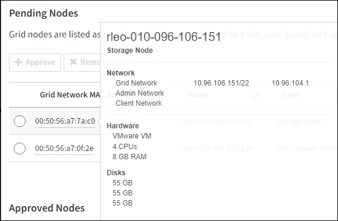

= Realizar la expansión
:allow-uri-read: 
:icons: font
:imagesdir: ../media/

[role="lead"]
Cuando se realiza la ampliación, los nuevos nodos de grid se añaden a la puesta en marcha de StorageGRID existente.

.Antes de empezar
* Ha iniciado sesión en Grid Manager mediante una link:../admin/web-browser-requirements.html["navegador web compatible"].
* Tiene la clave de acceso de aprovisionamiento.
* Se han implementado todos los nodos de grid que se están añadiendo en esta ampliación.
* Usted tiene el link:../admin/admin-group-permissions.html["Permiso de mantenimiento o acceso raíz"].
* Si añade nodos de almacenamiento, confirma que se han completado todas las operaciones de reparación de datos realizadas como parte de una recuperación. Consulte link:../maintain/checking-data-repair-jobs.html["Compruebe los trabajos de reparación de datos"].
* Si va a añadir nodos de almacenamiento y desea asignar un grado de almacenamiento personalizado a esos nodos, ya tiene link:../ilm/creating-and-assigning-storage-grades.html["se ha creado el grado de almacenamiento personalizado"]. También tiene el permiso de acceso raíz o los permisos de mantenimiento y de ILM.
* Si va a añadir un sitio nuevo, ha revisado y actualizado las reglas de ILM. Debe asegurarse de que las copias de los objetos no se almacenen en el sitio nuevo hasta que se complete la expansión. Por ejemplo, si una regla utiliza el pool de almacenamiento predeterminado (*Todos los nodos de almacenamiento*), debe que link:../ilm/creating-storage-pool.html["cree un nuevo pool de almacenamiento"]contenga solo los nodos de almacenamiento existentes y link:../ilm/working-with-ilm-rules-and-ilm-policies.html["Actualice las reglas de ILM"]la política ILM para utilizar ese nuevo pool de almacenamiento. De lo contrario, los objetos se copiarán en el sitio nuevo tan pronto como el primer nodo de ese sitio se active.

.Acerca de esta tarea
La expansión incluye las siguientes tareas principales de usuario:

. Configure la expansión.
. Inicie la expansión.
. Descargue un nuevo archivo de paquete de recuperación.
. Supervise los pasos y etapas de expansión hasta que todos los nodos nuevos estén instalados y configurados y todos los servicios se hayan iniciado.
+

CAUTION: Algunos pasos y etapas de expansión pueden tardar una cantidad significativa de tiempo en ejecutarse en una cuadrícula grande. Por ejemplo, la transmisión de Cassandra a un nuevo nodo de almacenamiento podría tardar solo unos minutos si la base de datos de Cassandra está vacía. Sin embargo, si la base de datos de Cassandra incluye una gran cantidad de metadatos de objetos, esta etapa puede tardar varias horas o más. No reinicie ningún nodo de almacenamiento durante las etapas de «Expansión del clúster de Cassandra» o «Inicio de Cassandra y transmisión de datos».

.Pasos
. Seleccione *Mantenimiento* > *Tareas* > *Expansión*.
+
Aparece la página expansión de cuadrícula. En la sección Pending Nodes, se enumeran los nodos listos para añadir.

+
image::../media/grid_expansion_page.png[Captura de pantalla que muestra la página expansión de cuadrícula]

. Seleccione *Configurar expansión*.
+
Aparece el cuadro de diálogo selección de sitio.

. Seleccione el tipo de expansión que está iniciando:
+
** Si va a añadir un sitio nuevo, seleccione *Nuevo* e introduzca el nombre del sitio nuevo.
** Si va a agregar uno o más nodos a un sitio existente, seleccione *Existente*.

. Seleccione *Guardar*.
. Revise la lista *nodos pendientes* y confirme que muestra todos los nodos de cuadrícula que ha implementado.
+
Según sea necesario, puede colocar el cursor sobre la *Dirección MAC de red de cuadrícula* de un nodo para ver los detalles sobre ese nodo.

+

+

NOTE: Si falta un nodo, confirme que se ha implementado correctamente.

. En la lista de nodos pendientes, apruebe los nodos que desea añadir en esta expansión.
+
.. Seleccione el botón de opción situado junto al primer nodo de cuadrícula pendiente que desee aprobar.
.. Seleccione *aprobar*.
+
Aparece el formulario de configuración del nodo de cuadrícula.

.. Según sea necesario, modifique los ajustes generales:
+
[cols="1a,2a"]
|===
| Campo | Descripción 

 a| 
Sitio
 a| 
Nombre de la ubicación a la que se asociará el nodo de cuadrícula. Si va a añadir varios nodos, asegúrese de seleccionar el sitio correcto para cada nodo. Si va a añadir un sitio nuevo, todos los nodos se añadirán al sitio nuevo.

 a| 
Nombre
 a| 
El nombre del sistema para el nodo. Los nombres del sistema son necesarios para las operaciones internas de StorageGRID y no se pueden cambiar.

 a| 
Tipo de almacenamiento (solo nodos de almacenamiento)
 a| 
*** *Datos y metadatos* (“combinados”): Object-data y metadata Storage Node
*** *Solo datos*: Nodo de almacenamiento que contiene solo datos de objetos (sin metadatos)
*** *Solo metadatos*: Nodo de almacenamiento que contiene solo metadatos (sin datos de objetos)

 a| 
Rol de NTP
 a| 
El rol de protocolo de tiempo de red (NTP) del nodo de grid:

*** Seleccione *Automático* (predeterminado) para asignar automáticamente el rol NTP al nodo. El rol primario se asignará a los nodos de administración, los nodos de almacenamiento con servicios ADC, los nodos de puerta de enlace y cualquier nodo de cuadrícula que tenga direcciones IP no estáticas. El rol de cliente se asignará a todos los demás nodos de grid.
*** Seleccione *Primario* para asignar manualmente el rol NTP principal al nodo. Al menos dos nodos en cada sitio deben tener el rol principal para proporcionar acceso redundante al sistema a orígenes de tiempo externos.
*** Seleccione *Client* para asignar manualmente el rol NTP del cliente al nodo.

 a| 
Servicio ADC (nodos de almacenamiento combinados o solo metadatos)
 a| 
Si este nodo de almacenamiento ejecutará el servicio del controlador de dominio administrativo (ADC).  El servicio ADC realiza un seguimiento de la ubicación y la disponibilidad de los servicios de la red.  Al menos tres nodos de almacenamiento en cada sitio deben incluir el servicio ADC.

*** Seleccione *Sí* si el nodo de almacenamiento que está reemplazando incluye el servicio ADC.  Dado que no es posible desmantelar un nodo de almacenamiento si quedan muy pocos servicios ADC, esta configuración garantiza que haya un nuevo servicio ADC disponible antes de que se elimine el servicio anterior.
*** Puedelink:../maintain/move-adc-service.html["mover el servicio ADC a otro nodo de almacenamiento en el mismo sitio"] para garantizar que se cumpla el quórum del servicio ADC.
*** Seleccione *Automático* para que el sistema determine si este nodo requiere el servicio ADC.

Aprenda sobre el link:../maintain/understanding-adc-service-quorum.html["Quórum ADC"].

 a| 
Grado de almacenamiento (nodos de almacenamiento combinados o solo de datos)
 a| 
Utilice el grado de almacenamiento *default*, o seleccione el grado de almacenamiento personalizado que desea asignar a este nuevo nodo.

Los pools de almacenamiento usan los grados de almacenamiento ILM, por lo que su selección puede afectar a los objetos que se colocarán en el nodo de almacenamiento.

|===
.. Según sea necesario, modifique los ajustes de Grid Network, Admin Network y Client Network.
+
*** *Dirección IPv4 (CIDR)*: Dirección de red CIDR para la interfaz de red. Por ejemplo: 172.16.10.100/24
+

NOTE: Si descubre que los nodos tienen direcciones IP duplicadas en la red de grid mientras aprueba nodos, debe cancelar la expansión, volver a desplegar las máquinas virtuales o los dispositivos con una IP no duplicada y reiniciar la expansión.

*** *Gateway*: La puerta de enlace predeterminada del nodo de red. Por ejemplo: 172.16.10.1
*** *Subredes (CIDR)*: Una o varias subredes para la Red de administración.

.. Seleccione *Guardar*.
+
El nodo de grid aprobado se mueve a la lista de nodos aprobados.

+
*** Para modificar las propiedades de un nodo de cuadrícula aprobado, seleccione su botón de opción y seleccione *Editar*.
*** Para volver a mover un nodo de cuadrícula aprobado a la lista nodos pendientes, seleccione el botón de opción correspondiente y seleccione *Restablecer*.
*** Para quitar de forma permanente un nodo de grid aprobado, apague el nodo. A continuación, seleccione el botón de radio y seleccione *Quitar*.

.. Repita estos pasos para cada nodo de cuadrícula pendiente que desee aprobar.
+

NOTE: Si es posible, debe aprobar todas las notas de cuadrícula pendientes y realizar una sola expansión. Se necesitará más tiempo si realiza varias expansiones pequeñas.

. Cuando haya aprobado todos los nodos de cuadrícula, introduzca la *frase de paso de aprovisionamiento* y seleccione *expandir*.
+
Después de unos minutos, esta página se actualiza para mostrar el estado del procedimiento de expansión. Cuando las tareas que afectan a los nodos de cuadrícula individuales están en curso, la sección Estado de Nodo de Grid muestra el estado actual de cada nodo de cuadrícula.

+

NOTE: Durante el paso de instalación de nodos de grid para un dispositivo nuevo, el instalador de dispositivos StorageGRID muestra la instalación pasando de la fase 3 a la fase 4, Finalizar la instalación. Cuando finaliza la fase 4, se reinicia la controladora.

+

NOTE: Una expansión de sitio incluye una tarea adicional para configurar Cassandra para el nuevo sitio.

. Tan pronto como aparezca el enlace *Descargar paquete de recuperación*, descargue el archivo del paquete de recuperación.
+
Debe descargar una copia actualizada del archivo del paquete de recuperación lo antes posible después de realizar cambios en la topología de la red en el sistema StorageGRID .  El archivo del paquete de recuperación le permite restaurar el sistema si ocurre una falla.

+
.. Seleccione el enlace de descarga.
.. Introduzca la frase de acceso de aprovisionamiento y seleccione *Iniciar descarga*.
.. Cuando finalice la descarga, abra el `.zip` archivo y confirme que puede acceder al contenido, incluido el `Passwords.txt` archivo.
.. Copie el archivo del paquete de recuperación descargado(`.zip` ) a dos lugares seguros, protegidos y separados.
+

CAUTION: El archivo del paquete de recuperación debe estar protegido porque contiene claves de cifrado y contraseñas que se pueden utilizar para obtener datos del sistema StorageGRID .

. Si agrega nodos de almacenamiento a un sitio existente o agrega un sitio, supervise las etapas de Cassandra, que se producen cuando se inician los servicios en los nuevos nodos de grid.
+

CAUTION: No reinicie ningún nodo de almacenamiento durante las etapas de «Expansión del clúster de Cassandra» o «Inicio de Cassandra y transmisión de datos». Estas fases pueden tardar varias horas en completarse para cada nodo de almacenamiento nuevo, especialmente si los nodos de almacenamiento existentes contienen una gran cantidad de metadatos de objetos.

+
[role="tabbed-block"]
====
.Añadir nodos de almacenamiento
--
Si va a añadir nodos de almacenamiento a un sitio existente, revise el porcentaje que se muestra en el mensaje de estado Iniciar Cassandra y transmisión de datos.

Este porcentaje calcula lo completo que es la operación de retransmisión de Cassandra, que se basa en la cantidad total de datos de Cassandra disponibles y en la cantidad que ya se ha escrito en el nodo nuevo.

--
.Agregando sitio
--
Si va a agregar un nuevo sitio, utilice `nodetool status` para supervisar el progreso de la transmisión de Cassandra y para ver cuántos metadatos se han copiado en el nuevo sitio durante la etapa de “Expandir el clúster de Cassandra”. La carga total de datos en el nuevo sitio debe estar dentro de aproximadamente el 20% del total de un sitio actual.

--
====
. Continúe supervisando la expansión hasta que se hayan completado todas las tareas y vuelva a aparecer el botón *Configurar expansión*.

.Después de terminar
En función de los tipos de nodos de cuadrícula que haya agregado, realice pasos adicionales de integración y configuración. Consulte link:configuring-expanded-storagegrid-system.html["Pasos de configuración tras la ampliación"].
