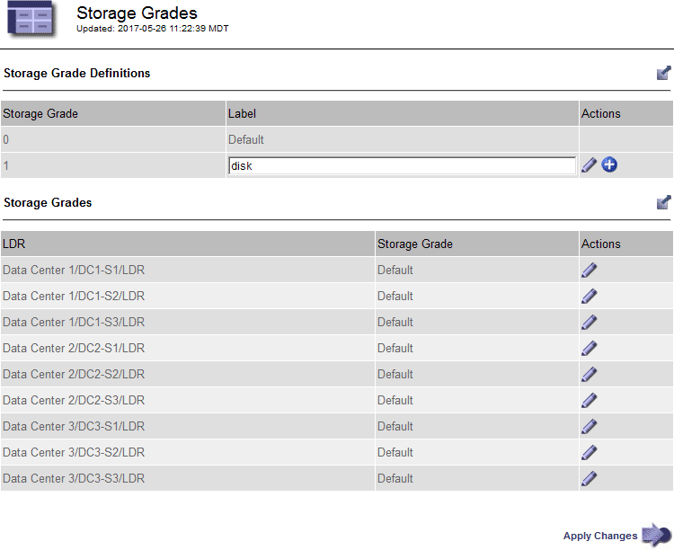
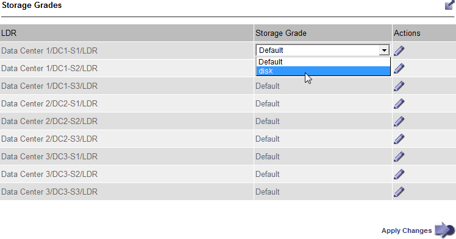

= Crear y asignar grados de almacenamiento
:allow-uri-read: 
:icons: font
:imagesdir: ../media/

[role="lead"]
Los grados de almacenamiento identifican el tipo de almacenamiento que utiliza un nodo de almacenamiento. Puede crear grados de almacenamiento si desea que las reglas de ILM coloquen determinados objetos en ciertos nodos de almacenamiento.

.Antes de empezar
* Ha iniciado sesión en Grid Manager mediante una link:../admin/web-browser-requirements.html["navegador web compatible"].
* Tienes link:../admin/admin-group-permissions.html["permisos de acceso específicos"].

.Acerca de esta tarea
Cuando instala StorageGRID por primera vez, el grado de almacenamiento *default* se asigna automáticamente a cada nodo de almacenamiento en su sistema. Como sea necesario, puede definir opcionalmente grados de almacenamiento personalizados y asignarlos a diferentes nodos de almacenamiento.

El uso de grados de almacenamiento personalizados permite crear pools de almacenamiento ILM que contienen solo un tipo específico de nodo de almacenamiento. Por ejemplo, quizás desee almacenar determinados objetos en los nodos de almacenamiento más rápidos, como los dispositivos de almacenamiento all-flash StorageGRID.

NOTE: Los nodos de almacenamiento se pueden configurar durante la instalación de modo que solo contengan metadatos de objetos y no datos de objetos. Los nodos de almacenamiento solo de metadatos no se pueden asignar a un grado de almacenamiento. Para obtener más información, consulte link:../primer/what-storage-node-is.html#types-of-storage-nodes["Tipos de nodos de almacenamiento"].

Si el grado de almacenamiento no es una preocupación (por ejemplo, todos los nodos de almacenamiento son idénticos), puede omitir este procedimiento y usar la selección *Incluye todos los grados de almacenamiento* para el grado de almacenamiento cuando usted link:creating-storage-pool.html["cree pools de almacenamiento"]. El uso de esta selección garantiza que el pool de almacenamiento incluirá todos los nodos de almacenamiento en el sitio, independientemente de su grado de almacenamiento.

NOTE: No cree más grados de almacenamiento de los necesarios. Por ejemplo, no cree una categoría de almacenamiento para cada nodo de almacenamiento. En su lugar, asigne cada grado de almacenamiento a dos o más nodos. Las leyes de almacenamiento asignadas a un solo nodo pueden provocar reversiones de ILM si ese nodo deja de estar disponible.

.Pasos
. Seleccione *ILM* > *grados de almacenamiento*.
. Definir grados de almacenamiento personalizados:
+
.. Para cada grado de almacenamiento personalizado que desee agregar, seleccione *Insertar* image:../media/icon_nms_insert.gif["insertar icono"] para agregar una fila.
.. Introduzca una etiqueta descriptiva.
+

.. Seleccione *aplicar cambios*.
.. Opcionalmente, si necesitas modificar una etiqueta guardada, selecciona *Editar* image:../media/icon_nms_edit.gif["icono editar"] y selecciona *Aplicar cambios*.
+

NOTE: No se pueden eliminar los grados de almacenamiento.

. Asigne nuevos grados de almacenamiento a los nodos de almacenamiento:
+
.. Localice el nodo de almacenamiento en la lista LDR y seleccione su icono *Editar* image:../media/icon_nms_edit.gif["icono editar"].
.. Seleccione el grado de almacenamiento adecuado en la lista.
+

+

NOTE: Asigne un nivel de almacenamiento solo una vez a un nodo de almacenamiento determinado. Un nodo de almacenamiento recuperado del error mantiene el grado de almacenamiento anteriormente asignado. No cambie esta asignación después de activar la política de ILM. Si se modifica la asignación, los datos se almacenan según el nuevo grado de almacenamiento.

.. Seleccione *aplicar cambios*.

