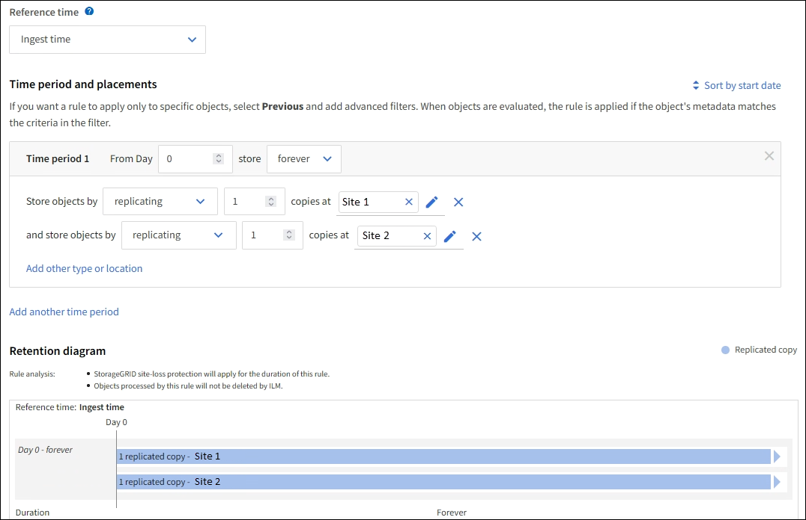

= Ejemplo 1: Reglas de ILM y políticas para el almacenamiento de objetos
:allow-uri-read: 
:icons: font
:imagesdir: ../media/

[role="lead"]
Es posible usar las siguientes reglas y políticas de ejemplo como punto de inicio al definir una política de ILM para cumplir con los requisitos de retención y protección de objetos.

CAUTION: Las siguientes reglas y políticas de ILM son solo ejemplos. Existen varias formas de configurar las reglas de ILM. Antes de activar una nueva política, simule para confirmar que funcionará según lo previsto para proteger el contenido de la pérdida.

== Regla ILM 1 Por ejemplo 1: Copiar datos de objetos en dos sitios

Este ejemplo de regla ILM copia datos de objetos en pools de almacenamiento en dos sitios.

[cols="1a,2a"]
|===
| Definición de regla | Valor de ejemplo 

 a| 
Pools de almacenamiento in situ
 a| 
Dos pools de almacenamiento, cada uno de los cuales contiene sitios diferentes, denominados Sitio 1 y Sitio 2.

 a| 
Nombre de regla
 a| 
Dos copias Dos sitios

 a| 
Tiempo de referencia
 a| 
Tiempo de ingesta

 a| 
Ubicaciones
 a| 
En el día 0 hasta siempre, conserve una copia replicada en el sitio 1 y una copia replicada en el sitio 2.

|===
La sección de análisis de reglas del diagrama de retención indica lo siguiente:

* La protección contra pérdida de sitios de StorageGRID se aplicará mientras dure esta regla.
* ILM no eliminará los objetos procesados por esta regla.

== Regla de ILM 2 Por ejemplo 1: Perfil de código de borrado con coincidencia de bloques

En esta regla de ILM de ejemplo se utiliza un perfil de código de borrado y un bloque de S3 para determinar dónde y cuánto tiempo se almacena el objeto.

[cols="1a,2a"]
|===
| Definición de regla | Valor de ejemplo 

 a| 
Pool de almacenamiento con múltiples sitios
 a| 
* Un pool de almacenamiento en tres sitios (sitios 1, 2, 3)
* Utilice un esquema de codificación de borrado de 6+3

 a| 
Nombre de regla
 a| 
S3 registros financieros del bloque

 a| 
Tiempo de referencia
 a| 
Tiempo de ingesta

 a| 
Ubicaciones
 a| 
Para los objetos del bloque de S3 denominados registros financieros, cree una copia con código de borrado en el pool especificado por el perfil de código de borrado. Guarde esta copia para siempre.

|===
image::../media/ilm_rule_ec_for_s3_bucket_finance_records.png[Regla de ILM 2 Por ejemplo 1: Perfil de código de borrado con coincidencia de bloques]

== Política de ILM, por ejemplo 1

En la práctica, la mayoría de las políticas de ILM son sencillas, a pesar de que el sistema StorageGRID permite diseñar políticas de ILM sofisticadas y complejas.

Una política de ILM típica para un grid de varios sitios podría incluir reglas de ILM como las siguientes:

* Durante la ingesta, almacene todos los objetos que pertenecen al bloque de S3 denominado `finance-records` en un pool de almacenamiento que contiene tres sitios. Use el código de borrado 6+3.
* Si un objeto no coincide con la primera regla de ILM, utilice la regla de ILM predeterminada de la política, dos copias dos centros de datos, para almacenar una copia de ese objeto en el sitio 1 y una copia en el sitio 2.
+
image::../media/policy_1_configured_policy.png[Política de ILM, por ejemplo 1]

.Información relacionada
* link:ilm-policy-overview.html["Use políticas de ILM"]
* link:creating-ilm-policy.html["Crear políticas de ILM"]

