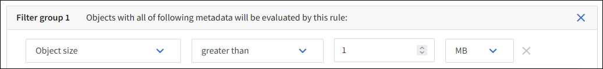

= Ejemplo 2: Reglas de ILM y política para el filtrado de tamaño de objetos de EC
:allow-uri-read: 
:icons: font
:imagesdir: ../media/

[role="lead"]
Puede usar las siguientes reglas y políticas de ejemplo como puntos de inicio para definir una política de ILM que filtra por tamaño de objeto para cumplir los requisitos de EC recomendados.

CAUTION: Las siguientes reglas y políticas de ILM son solo ejemplos. Existen varias formas de configurar las reglas de ILM. Antes de activar una nueva política, simule para confirmar que funcionará según lo previsto para proteger el contenido de la pérdida.

== Regla de ILM 1 por ejemplo 2: Utilice EC para objetos de más de 1 MB

Este ejemplo codifica los objetos de borrado de regla ILM que tienen más de 1 MB.

NOTE: El código de borrado se adapta mejor a los objetos de más de 1 MB. No use el código de borrado para objetos de menos de 200 KB para evitar la sobrecarga de gestionar fragmentos de código de borrado muy pequeños.

[cols="2a,2a"]
|===
| Definición de regla | Valor de ejemplo 

 a| 
Nombre de regla
 a| 
Objetos sólo EC > 1 MB

 a| 
Tiempo de referencia
 a| 
Tiempo de ingesta

 a| 
Filtro avanzado para Tamaño de objeto
 a| 
Tamaño de objeto superior a 1 MB

 a| 
Ubicaciones
 a| 
Cree una copia codificada con borrado al 2+1 mediante tres ubicaciones

|===

== Regla de ILM 2 por ejemplo 2: Dos copias replicadas

Esta regla de ILM de ejemplo crea dos copias replicadas y no filtra por el tamaño del objeto. Esta regla es la regla predeterminada para la directiva. Dado que la primera regla filtra todos los objetos mayores de 1 MB, esta regla sólo se aplica a objetos de 1 MB o menos.

[cols="1a,2a"]
|===
| Definición de regla | Valor de ejemplo 

 a| 
Nombre de regla
 a| 
Dos copias replicadas

 a| 
Tiempo de referencia
 a| 
Tiempo de ingesta

 a| 
Filtro avanzado para Tamaño de objeto
 a| 
Ninguno

 a| 
Ubicaciones
 a| 
En el día 0 hasta siempre, conserve una copia replicada en el sitio 1 y una copia replicada en el sitio 2.

|===

== Política de ILM, por ejemplo 2: Usar EC para objetos de más de 1 MB

Este ejemplo de política de ILM incluye dos reglas ILM:

* La primera regla de borrado codifica todos los objetos que sean mayores de 1 MB.
* La segunda regla de ILM (predeterminada) crea dos copias replicadas. Dado que los objetos mayores de 1 MB se han filtrado mediante la regla 1, la regla 2 sólo se aplica a objetos de 1 MB o menos.

