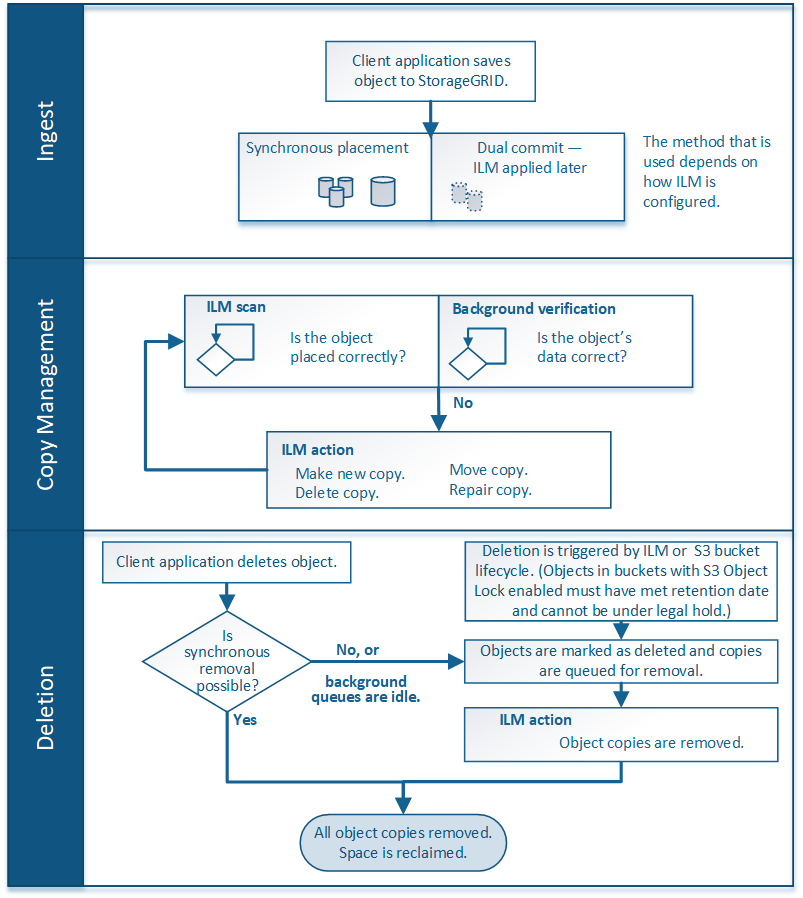

= Cómo funciona ILM a lo largo de la vida de un objeto
:allow-uri-read: 
:icons: font
:imagesdir: ../media/

[role="lead"]
Comprender cómo utiliza StorageGRID ILM para gestionar objetos durante cada fase de su vida útil puede ayudarle a diseñar una política más eficaz.

* *Ingreso*: La ingesta comienza cuando una aplicación cliente S3 establece una conexión para guardar un objeto en el sistema StorageGRID, y se completa cuando StorageGRID devuelve un mensaje de “Ingreso correcto” al cliente. Los datos de objetos se protegen durante la ingesta aplicando instrucciones de ILM inmediatamente (ubicación síncrona) o creando copias provisionales y aplicando ILM más tarde (registro doble), según cómo se especifiquen los requisitos de ILM.
* *Administración de copias*: Después de crear el número y el tipo de copias de objetos que se especifican en las instrucciones de colocación de ILM, StorageGRID administra las ubicaciones de objetos y protege los objetos contra pérdidas.
+
** * Análisis y evaluación de ILM*: StorageGRID analiza continuamente la lista de objetos almacenados en la cuadrícula y comprueba si las copias actuales cumplen con los requisitos de ILM. Cuando se requieren diferentes tipos, números o ubicaciones de copias de objetos, StorageGRID crea, elimina o mueve copias según sea necesario.
** *Verificación de antecedentes*: StorageGRID realiza continuamente la verificación de fondo para verificar la integridad de los datos de los objetos. Si se encuentra un problema, StorageGRID crea automáticamente una copia de objeto nueva o un fragmento de objeto con código de borrado de reemplazo en una ubicación que cumple los requisitos actuales de ILM. Consulte link:../troubleshoot/verifying-object-integrity.html["Verifique la integridad del objeto"].

* *Eliminación de objetos*: La gestión de un objeto finaliza cuando se eliminan todas las copias del sistema StorageGRID. Los objetos se pueden eliminar como resultado de una solicitud de eliminación por parte de un cliente, o bien como resultado de la eliminación por ILM o la eliminación provocada por el vencimiento del ciclo de vida de un bloque de S3.
+

NOTE: Los objetos de un depósito que tiene S3 Object Lock activado no se pueden eliminar si están en una retención legal o si se ha especificado una fecha de retención hasta que no se cumple.

El diagrama resume el funcionamiento de ILM a lo largo del ciclo de vida de un objeto.

