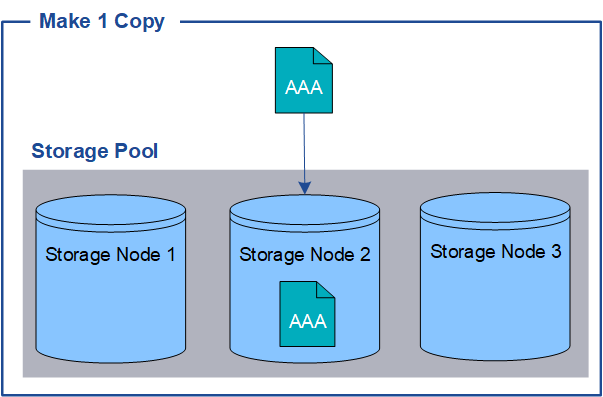

= Por qué no se debe utilizar la replicación de copia única
:allow-uri-read: 
:icons: font
:imagesdir: ../media/

[role="lead"]
Al crear una regla de ILM para crear copias replicadas, debe especificar siempre al menos dos copias durante cualquier periodo de tiempo en las instrucciones de ubicación.

NOTE: No utilice una regla de ILM que cree solo una copia replicada durante un período de tiempo. Si sólo existe una copia replicada de un objeto, éste se pierde si falla un nodo de almacenamiento o tiene un error importante. También perderá temporalmente el acceso al objeto durante procedimientos de mantenimiento, como las actualizaciones.

En el ejemplo siguiente, la regla Make 1 Copy ILM especifica que una copia replicada de un objeto se coloca en un pool de almacenamiento que contiene tres nodos de almacenamiento. Cuando se ingiere un objeto que coincida con esta regla, StorageGRID coloca una sola copia en un solo nodo de almacenamiento.

Cuando una regla de ILM crea solo una copia replicada de un objeto, se vuelve inaccesible cuando el nodo de almacenamiento no está disponible. En este ejemplo, perderá temporalmente el acceso al objeto AAA siempre que el nodo de almacenamiento 2 esté desconectado, como durante una actualización u otro procedimiento de mantenimiento. Perderá el objeto AAA completamente si falla el nodo de almacenamiento 2.

image::../media/ilm_replication_make_1_copy_sn_fails.png[Error en la replicación ILM Make 1 Copy SN]

Para evitar la pérdida de datos de objetos, siempre debe realizar al menos dos copias de todos los objetos que desee proteger con replicación. Si existen dos o más copias, puede seguir teniendo acceso al objeto si un nodo de almacenamiento falla o se desconecta.

image::../media/ilm_replication_make_2_copies_sn_fails.png[La replicación de ILM hace 2 copias SN da error]
