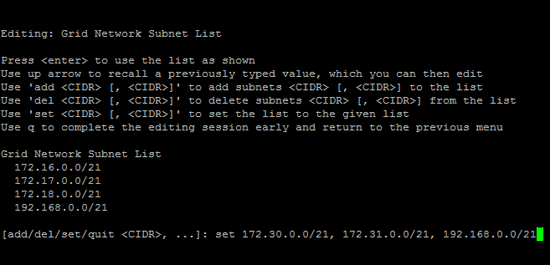

= Agregar o cambiar listas de subred en Grid Network
:allow-uri-read: 
:icons: font
:imagesdir: ../media/

[role="lead"]
Puede utilizar la herramienta Cambiar IP para agregar o cambiar subredes en la red de cuadrícula.

.Antes de empezar
* Tiene el `Passwords.txt` archivo.

Puede agregar, eliminar o cambiar subredes en la Lista de subredes de red de cuadrícula. Los cambios afectarán el enrutamiento de todos los nodos de la cuadrícula.

NOTE: Si sólo va a realizar cambios en la lista de subredes de red de cuadrícula, utilice el administrador de cuadrícula para agregar o cambiar la configuración de red. De lo contrario, utilice la herramienta Cambiar IP si no se puede acceder a Grid Manager debido a un problema de configuración de red o si está realizando un cambio de enrutamiento de red de cuadrícula y otros cambios de red al mismo tiempo.

[NOTE]
====
No utilice subredes que contengan las siguientes direcciones IPv4 para la red de cuadrícula, la red de administración o la red de cliente de ningún nodo:

* 192.168.130.101
* 192.168.131.101
* 192.168.130.102
* 192.168.131.102
* 198.51.100.2
* 198.51.100.4

Por ejemplo, no utilice los siguientes rangos de subred para la red de cuadrícula, la red de administración o la red de cliente de ningún nodo:

* 192.168.130.0/24 porque este rango de subred contiene las direcciones IP 192.168.130.101 y 192.168.130.102
* 192.168.131.0/24 porque este rango de subred contiene las direcciones IP 192.168.131.101 y 192.168.131.102
* 198.51.100.0/24 porque este rango de subred contiene las direcciones IP 198.51.100.2 y 198.51.100.4

====
.Pasos
. Inicie sesión en el nodo de administración principal:
+
.. Introduzca el siguiente comando: `ssh admin@_primary_Admin_Node_IP_`
.. Introduzca la contraseña que aparece en el `Passwords.txt` archivo.
.. Introduzca el siguiente comando para cambiar a raíz: `su -`
.. Introduzca la contraseña que aparece en el `Passwords.txt` archivo.

+
Al iniciar sesión como root, la petición de datos cambia de `$` a `#`.

. Inicie la herramienta Change IP introduciendo el siguiente comando: `change-ip`
. Introduzca la clave de acceso de aprovisionamiento en el aviso de.
+
Aparece el menú principal.

+
image::../media/change_ip_tool_main_menu.png[Captura de pantalla que muestra la pantalla de bienvenida de la herramienta Change IP]

. En el menú principal, seleccione la opción para editar subredes para la red de cuadrícula (opción *4*).
+

NOTE: Los cambios en la lista de subredes de red de cuadrícula se realizan en toda la cuadrícula.

. Elija una de las siguientes opciones:
+
--
** Introduzca este comando para añadir una subred: `add CIDR`
** Para eliminar una subred, introduzca este comando: `del CIDR`
** Defina la lista de subredes introduciendo este comando: `set CIDR`

--
+
--

NOTE: En todos los comandos, puede introducir varias direcciones con este formato: `add CIDR, CIDR`

Ejemplo: `add 172.14.0.0/16, 172.15.0.0/16, 172.16.0.0/16`

TIP: Puede reducir la cantidad de escritura necesaria con la flecha hacia arriba para recuperar los valores previamente escritos en la petición de datos de entrada actual y, a continuación, editarlos si es necesario.

La entrada de ejemplo siguiente muestra la configuración de subredes para la Lista de subredes de redes de cuadrícula:

--
. Cuando esté listo, introduzca *q* para volver a la pantalla del menú principal. Los cambios se mantienen hasta que se borran o se aplican.
. Elija una de las siguientes opciones:
+
** Seleccione la opción *5* para mostrar las ediciones en la salida que está aislada para mostrar sólo el elemento cambiado. Los cambios se resaltan en verde (adiciones) o rojo (eliminaciones), como se muestra en la siguiente salida de ejemplo:
+
image::../media/change_ip_tool_gnsl_sample_output.gif[captura de pantalla descrita por el texto circundante]

** Seleccione la opción *6* para mostrar las ediciones en la salida que muestran la configuración completa. Los cambios se resaltan en verde (adiciones) o rojo (eliminaciones).
+

NOTE: Algunas interfaces de línea de comandos pueden mostrar adiciones y eliminaciones utilizando formato de tachado.

. Seleccione la opción *7* para validar todos los cambios organizados.
+
Esta validación garantiza que se sigan las reglas para las redes Grid, Admin y Client, como el uso de subredes superpuestas.

. Opcionalmente, seleccione la opción *8* para guardar todos los cambios organizados y volver más tarde para continuar realizando cambios.
+
Esta opción le permite salir de la herramienta Cambiar IP e iniciarla de nuevo más tarde, sin perder ningún cambio no aplicado.

. Debe realizar una de las siguientes acciones:
+
** Seleccione la opción *9* si desea borrar todos los cambios sin guardar ni aplicar la nueva configuración de red.
** Seleccione la opción *10* si está listo para aplicar cambios y para aprovisionar la nueva configuración de red. Durante el aprovisionamiento, la salida muestra el estado a medida que se aplican las actualizaciones, tal y como se muestra en la siguiente salida de ejemplo:
+
[listing]
----
Generating new grid networking description file...

Running provisioning...

Updating grid network configuration on Name
----

. Si ha seleccionado la opción *10* al realizar cambios en la red de cuadrícula, seleccione una de las siguientes opciones:
+
** *Aplicar*: Aplique los cambios inmediatamente y reinicie automáticamente cada nodo si es necesario.
+
Si la nueva configuración de red funcionará simultáneamente con la configuración de red antigua sin ningún cambio externo, puede utilizar la opción *aplicar* para un cambio de configuración completamente automatizado.

** *Fase*: Aplique los cambios la próxima vez que se reinicien los nodos.
+
Si necesita realizar cambios físicos o virtuales en la configuración de red para que funcione la nueva configuración de red, debe utilizar la opción *Stage*, apagar los nodos afectados, realizar los cambios físicos de red necesarios y reiniciar los nodos afectados.

+

NOTE: Si utiliza la opción *stage*, reinicie el nodo lo antes posible después de la puesta en escena para minimizar las interrupciones.

** *CANCELAR*: No realice ningún cambio de red en este momento.
+
Si no sabía que los cambios propuestos requieren que se reinicien los nodos, puede aplazar los cambios para minimizar el impacto del usuario. Si selecciona *cancelar*, volverá al menú principal y mantendrá los cambios para que los pueda aplicar más tarde.

+
Después de aplicar o almacenar en zona intermedia los cambios, se genera un nuevo paquete de recuperación como resultado del cambio de configuración de cuadrícula.

. Si la configuración se detiene debido a errores, están disponibles las siguientes opciones:
+
** Para finalizar el procedimiento de cambio de IP y volver al menú principal, introduzca *A*.
** Para volver a intentar la operación que falló, introduzca *r*.
** Para continuar con la siguiente operación, introduzca *c*.
+
La operación fallida se puede volver a intentar más tarde seleccionando la opción *10* (aplicar cambios) en el menú principal. El procedimiento de cambio de IP no se completará hasta que todas las operaciones se hayan completado correctamente.

** Si tuvo que intervenir manualmente (para reiniciar un nodo, por ejemplo) y está seguro de que la acción que la herramienta considera que ha fallado se ha completado correctamente, introduzca *f* para marcarlo como correcto y pasar a la siguiente operación.

. Descargue un nuevo paquete de recuperación desde Grid Manager.
+
.. Seleccione *MANTENIMIENTO* > *sistema* > *paquete de recuperación*.
.. Introduzca la clave de acceso de aprovisionamiento.

+

CAUTION: El archivo del paquete de recuperación debe estar protegido porque contiene claves de cifrado y contraseñas que se pueden usar para obtener datos del sistema StorageGRID.

