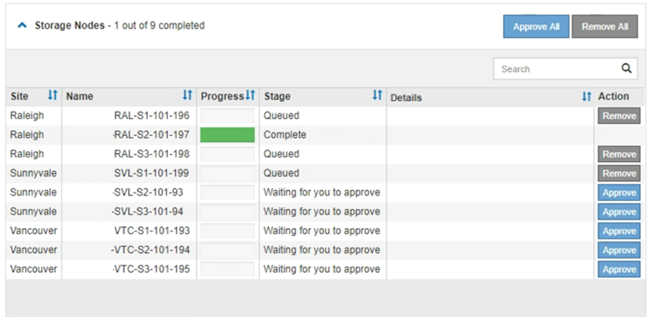

= Aplicar revisión
:allow-uri-read: 
:icons: font
:imagesdir: ../media/

[role="lead"]
La revisión se aplica automáticamente por primera vez al nodo de administración principal. A continuación, debe aprobar la aplicación de la revisión a otros nodos de cuadrícula hasta que todos los nodos ejecuten la misma versión de software. Puede personalizar la secuencia de aprobación seleccionando aprobar nodos de cuadrícula individuales, grupos de nodos de cuadrícula o todos los nodos de cuadrícula.

.Antes de empezar
* Ha revisado el link:storagegrid-hotfix-procedure.html["consideraciones sobre la aplicación de una revisión"].
* Tiene la clave de acceso de aprovisionamiento.
* Tiene acceso root o permiso de mantenimiento.

.Acerca de esta tarea
* Puede retrasar la aplicación de una revisión a un nodo, pero el proceso de revisión no se completa hasta que aplique la revisión a todos los nodos.
* No puede realizar una actualización de software de StorageGRID ni una actualización de SANtricity OS hasta que haya completado el proceso de corrección.

.Pasos
. Inicie sesión en Grid Manager mediante una link:../admin/web-browser-requirements.html["navegador web compatible"].
. Seleccione *Mantenimiento* > *Sistema* > *Actualización de software*.
+
Aparece la página actualización de software.

+
image::../media/software_update_landing.png[Página de destino de la actualización del software]

. Seleccione *aplicar revisión*.
+
Aparece la página de corrección de StorageGRID.

+
image::../media/hotfix_choose_file.png[HotFix Elija Archivo]

. Seleccione el archivo de corrección que descargó del sitio de soporte de NetApp.
+
.. Seleccione *examinar*.
.. Localice y seleccione el archivo.
+
`hotfix-install-_version_`

.. Seleccione *Abrir*.
+
El archivo se carga. Cuando la carga haya finalizado, el nombre del archivo se mostrará en el campo Detalles.

+

NOTE: No cambie el nombre del archivo porque forma parte del proceso de verificación.

. Introduzca la clave de acceso de aprovisionamiento en el cuadro de texto.
+
El botón *Inicio* se activa.

. Seleccione *Iniciar*.
+
Aparece una advertencia que indica que la conexión del explorador puede perderse temporalmente cuando se reinician los servicios del nodo de administración principal.

. Seleccione *Aceptar* para comenzar a aplicar la revisión al nodo de administración principal.
+
Cuando se inicia la revisión:

+
.. Se ejecutan las validaciones de revisión, incluida la verificación de la firma del código.
+

NOTE: Si se informa de algún error, solucione, vuelva a cargar el archivo de revisión y seleccione *Iniciar* de nuevo.

.. Aparece la tabla de progreso de la instalación de la revisión.
+
En esta tabla se muestran todos los nodos de la cuadrícula y la fase actual de la instalación de la revisión para cada nodo. Los nodos de la tabla se agrupan por tipo (nodos de administración, nodos de puerta de enlace y nodos de almacenamiento).

.. La barra de progreso llega al final y el nodo de administración principal se muestra como completado.
+
image::../media/hotfix_progress_table.png[Tabla de progreso de Hotfix]

. Opcionalmente, ordene las listas de nodos de cada agrupación en orden ascendente o descendente por *Sitio*, *Nombre*, *progreso*, *etapa* o *Detalles*. O bien, introduzca un término en el cuadro *Buscar* para buscar nodos específicos.
. Apruebe los nodos de cuadrícula que están listos para actualizarse. Los nodos aprobados del mismo tipo se actualizan de uno en uno.
+

CAUTION: No apruebe la revisión de un nodo a menos que esté seguro de que el nodo está listo para actualizarse. Cuando se aplica la revisión a un nodo de cuadrícula, algunos servicios de ese nodo se pueden reiniciar. Estas operaciones pueden provocar interrupciones del servicio en los clientes que se comunican con el nodo.

+
** Seleccione uno o más botones *aprobar* para agregar uno o más nodos individuales a la cola de revisiones.
** Seleccione el botón *aprobar todo* de cada agrupación para agregar todos los nodos del mismo tipo a la cola de revisiones. Si ha introducido criterios de búsqueda en el cuadro *Buscar*, el botón *aprobar todo* se aplica a todos los nodos seleccionados por los criterios de búsqueda.
+

NOTE: El botón *aprobar todo* situado en la parte superior de la página aprueba todos los nodos enumerados en la página, mientras que el botón *aprobar todo* situado en la parte superior de una agrupación de tablas sólo aprueba todos los nodos de ese grupo. Si el orden en el que se actualizan los nodos es importante, apruebe los nodos o grupos de nodos de uno en uno y espere a que la actualización se complete en cada nodo antes de aprobar los siguientes nodos.

** Seleccione el botón de nivel superior *aprobar todo* en la parte superior de la página para agregar todos los nodos de la cuadrícula a la cola de revisiones.
+

NOTE: Debe completar la revisión de StorageGRID antes de poder iniciar una actualización de software diferente. Si no puede completar la revisión, póngase en contacto con el soporte técnico.

** Seleccione *Quitar* o *Quitar todo* para quitar un nodo o todos los nodos de la cola de revisiones.
+
Cuando la etapa progresa más allá de “En cola”, el botón *Eliminar* se oculta y ya no se puede eliminar el nodo del proceso de revisión.

+

. Espere mientras la revisión se aplica a cada nodo de cuadrícula aprobado.
+
Cuando la revisión se ha instalado correctamente en todos los nodos, se cierra la tabla de progreso de instalación de Hotfix. Un banner verde muestra la fecha y la hora en que se completó la revisión.

. Si la revisión no se pudo aplicar a ningún nodo, revise el error para cada nodo, resuelva el problema y repita estos pasos.
+
El procedimiento no se completa hasta que la revisión se aplica correctamente a todos los nodos. Puede volver a intentar de forma segura el proceso de revisión tantas veces como sea necesario hasta que se complete.

