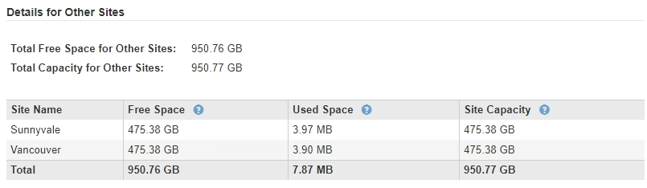

= Paso 2: Ver detalles
:allow-uri-read: 
:icons: font
:imagesdir: ../media/

[role="lead"]
En el paso 2 (Ver detalles) del asistente del sitio de decoración, puede revisar qué nodos están incluidos en el sitio, ver cuánto espacio se ha utilizado en cada nodo de almacenamiento y evaluar cuánto espacio libre está disponible en los otros sitios de la cuadrícula.

.Antes de empezar
Antes de retirar un sitio, debe revisar la cantidad de datos de objeto que hay en el sitio.

* Si está realizando una retirada de sitios conectados, debe comprender cuántos datos de objetos hay actualmente en el sitio antes de actualizar ILM. En función de las capacidades del sitio y de sus necesidades de protección de datos, puede crear nuevas reglas de ILM para mover datos a otros sitios o eliminar datos de objetos del sitio.
* Realice las expansiones de nodos de almacenamiento necesarias antes de iniciar el procedimiento de retirada del servicio, si es posible.
* Si está realizando una retirada de sitio desconectado, debe entender cuántos datos de objeto se volverán permanentemente inaccesibles al quitar el sitio.

CAUTION: Si está realizando una retirada del sitio desconectada, ILM no podrá mover ni eliminar datos de objetos. Se perderán todos los datos que permanezcan en las instalaciones. Sin embargo, si su política de ILM se diseñó para protegerse contra la pérdida de un solo sitio, las copias de los datos de objetos siguen existiendo en los sitios restantes. Consulte link:../ilm/using-multiple-storage-pools-for-cross-site-replication.html["Habilite la protección contra pérdida de sitio"].

.Pasos
. En el paso 2 (Ver detalles), revise las advertencias relacionadas con el sitio que seleccionó para quitar.
+
image::../media/decommission_site_step_2_site_warnings.png[Advertencias de retirada del sitio paso 2]

+
Aparecerá una advertencia en los siguientes casos:

+
** El sitio incluye un nodo de puerta de enlace. Si S3 clientes se están conectando actualmente a este nodo, debe configurar un nodo equivalente en otro sitio. Asegúrese de que los clientes pueden conectarse al nodo de repuesto antes de continuar con el procedimiento de retirada.
** El sitio contiene una mezcla de nodos conectados (image:../media/icon_alert_green_checkmark.png["Icono Alerta verde marca de verificación"]) y desconectados (image:../media/icon_alarm_gray_administratively_down.png["Icono alarma gris administrativamente abajo"] o image:../media/icon_alarm_blue_unknown.png["Icono alarma azul desconocida"]). Antes de poder quitar este sitio, deben volver a conectar todos los nodos sin conexión.

. Revise los detalles sobre el sitio que ha seleccionado para eliminar.
+
image::../media/decommission_site_step_2_view_details.png[Retirada del sitio Paso 2 Ver detalles]

+
Se incluye la siguiente información para el sitio seleccionado:

+
** Número de nodos
** El espacio total usado, el espacio libre y la capacidad de todos los nodos de almacenamiento del sitio.
+
*** Para una retirada de sitios conectados, el valor *espacio usado* representa la cantidad de datos de objetos que deben moverse a otros sitios o eliminarse con ILM.
*** Para un retiro de sitio desconectado, el valor *espacio usado* indica cuántos datos de objeto serán inaccesibles cuando usted quita el sitio.

** Nombres de nodo, tipos y estados de conexión:
+
*** image:../media/icon_alert_green_checkmark.png["Icono Alerta verde marca de verificación"] (Conectado)
*** image:../media/icon_alarm_gray_administratively_down.png["Icono alarma gris administrativamente abajo"] (Administrativamente inactivo)
*** image:../media/icon_alarm_blue_unknown.png["Icono alarma azul desconocida"] (Desconocido)

** Detalles sobre cada nodo:
+
*** Para cada nodo de almacenamiento, la cantidad de espacio que se ha usado para los datos de objetos.
*** Para los nodos de administrador y los nodos de puerta de enlace, si el nodo se utiliza actualmente en un grupo de alta disponibilidad (ha). No puede decomisionar un nodo de administración ni un nodo de puerta de enlace que se utilice en un grupo de alta disponibilidad. Antes de iniciar el decomiso, edite los grupos de alta disponibilidad para quitar todos los nodos del sitio o quitar el grupo de alta disponibilidad si solo incluye nodos de este sitio. Para obtener instrucciones, consulte link:../admin/managing-high-availability-groups.html["Gestione grupos de alta disponibilidad"].

. En la sección Detalles de otros sitios de la página, evalúe cuánto espacio hay disponible en los otros sitios de la cuadrícula.
+

+
Si va a realizar una retirada de sitios conectados y va a utilizar ILM para mover datos de objetos del sitio seleccionado (en lugar de eliminarlos solamente), debe asegurarse de que los otros sitios tengan suficiente capacidad para acomodar los datos movidos y de que la capacidad adecuada quede para un crecimiento futuro.

+

NOTE: Aparecerá una advertencia si el *espacio usado* del sitio que desea quitar es mayor que el *espacio libre total para otros sitios*. Es posible que deba realizar una ampliación antes de realizar este procedimiento para garantizar que haya disponible la capacidad de almacenamiento adecuada una vez se ha eliminado el sitio.

. Seleccione *Siguiente*.
+
Aparece el paso 3 (revisar la política de ILM).

