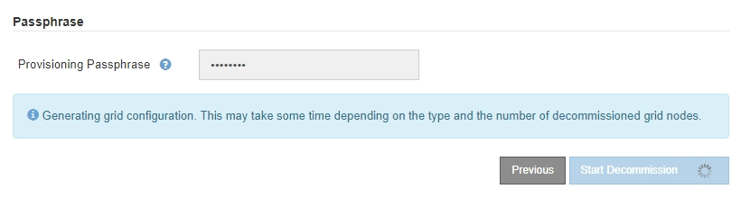

= Paso 5: Resolver conflictos de nodos (e iniciar retirada)
:allow-uri-read: 
:icons: font
:imagesdir: ../media/

[role="lead"]
En el paso 5 (resolver conflictos de nodos) del asistente para sitio de retirada, puede determinar si alguno de los nodos del sistema StorageGRID está desconectado o si alguno de los nodos del sitio seleccionado pertenece a un grupo de alta disponibilidad (ha). Después de resolver cualquier conflicto de nodo, se inicia el procedimiento de retirada desde esta página.

.Antes de empezar
Debe asegurarse de que todos los nodos del sistema StorageGRID tengan el estado correcto, de la siguiente manera:

* Todos los nodos del sistema StorageGRID deben estar conectados (image:../media/icon_alert_green_checkmark.png["Icono Alerta verde marca de verificación"]).
+

NOTE: Si está realizando una retirada de sitios desconectada, todos los nodos del sitio que va a quitar deben estar desconectados y todos los nodos del resto de sitios deben estar conectados.

+

NOTE: La retirada no se iniciará si uno o más volúmenes están sin conexión (sin montar) o si están en línea (montados), pero en estado de error.

+

NOTE: Si uno o más volúmenes quedan sin conexión mientras existe una decomisión en curso, el proceso de decomiso se completa una vez que estos volúmenes vuelvan a estar en línea.

* Ningún nodo del sitio que va a quitar puede tener una interfaz que pertenezca a un grupo de alta disponibilidad.

.Acerca de esta tarea
Si alguno de los nodos aparece en la lista del paso 5 (resolver conflictos de nodos), debe corregir el problema antes de poder iniciar la retirada.

Antes de iniciar el procedimiento de retirada del sitio desde esta página, revise las siguientes consideraciones:

* Debe dejar tiempo suficiente para completar el procedimiento de retirada.
+

NOTE: La transferencia o eliminación de datos de objetos de un sitio puede llevar días, semanas o incluso meses, en función de la cantidad de datos almacenados en el sitio, la carga en el sistema, las latencias de red y la naturaleza de los cambios de ILM necesarios.

* Mientras se está ejecutando el procedimiento de retirada de instalaciones:
+
** No se pueden crear reglas de ILM que hagan referencia al sitio que se va a retirar. Tampoco puede editar una regla de ILM existente para hacer referencia al sitio.
** No se pueden llevar a cabo otros procedimientos de mantenimiento, como la ampliación o la actualización.
+

NOTE: Si necesita realizar otro procedimiento de mantenimiento durante un desmantelamiento de un sitio conectado, puede pausar el procedimiento mientras se quitan los nodos de almacenamiento. El botón *Pausa* está habilitado durante la etapa “Descomisionado de Datos Replicados y con Código de Borrado”.

** Si necesita recuperar algún nodo después de iniciar el procedimiento de retirada del sitio, debe ponerse en contacto con el servicio de soporte de.

.Pasos
. Revise la sección Nodos Desconectados del Paso 5 (Resolver conflictos de nodos) para determinar si algún nodo del sistema StorageGRID tiene un estado de conexión desconocido (image:../media/icon_alarm_blue_unknown.png["Icono alarma azul desconocida"]) o administrativamente caído ( )image:../media/icon_alarm_gray_administratively_down.png["Icono alarma gris administrativamente abajo"].
+
image::../media/decommission_site_step_5_disconnected_nodes.png[Retirar del servicio Paso 5 resolver conflictos de nodos]

. Si alguno de los nodos está desconectado, vuelva a ponerlos en línea.
+
Consulte la link:../maintain/grid-node-procedures.html["Procedimientos de nodo"]. Si necesita ayuda, póngase en contacto con el soporte técnico.

. Cuando todos los nodos desconectados hayan vuelto a estar en línea, revise la sección de grupos de alta disponibilidad del paso 5 (resolver conflictos de nodos).
+
En esta tabla se enumeran los nodos del sitio seleccionado que pertenecen a un grupo de alta disponibilidad.

+
image::../media/decommission_site_step_5_ha_groups.png[Retirada de grupos de alta disponibilidad del paso 5 del sitio]

. Si aparece algún nodo, realice una de las siguientes acciones:
+
** Edite cada grupo de alta disponibilidad afectado para quitar la interfaz del nodo.
** Quite un grupo de alta disponibilidad que solo incluye nodos de este sitio. Consulte las instrucciones para administrar StorageGRID.

+
Si todos los nodos están conectados y no se utiliza ningún nodo en el sitio seleccionado en un grupo ha, se activa el campo *frase de paso* de aprovisionamiento.

. Introduzca la clave de acceso de aprovisionamiento.
+
El botón *Iniciar misión* se activa.

+
image::../media/decommission_site_step_5_provision_passphrase.png[Retirada de la frase de paso 5 de la instalación]

. Si está listo para iniciar el procedimiento de retirada del sitio, seleccione *Iniciar misión*.
+
Una advertencia indica el sitio y los nodos que se van a quitar. Se le recuerda que puede tardar días, semanas o incluso meses en eliminar completamente el sitio.

+
image::../media/decommission_site_step_5_warning.png[Advertencia de retirada del emplazamiento, paso 5]

. Revise la advertencia. Si está listo para comenzar, seleccione *Aceptar*.
+
Aparece un mensaje cuando se genera la nueva configuración de cuadrícula. Este proceso puede tardar algún tiempo, dependiendo del tipo y el número de nodos de cuadrícula que se retiraron.

+

+
Cuando se ha generado la nueva configuración de cuadrícula, aparece el paso 6 (retirada del monitor).

+

NOTE: El botón *anterior* permanece desactivado hasta que se completa la retirada.

