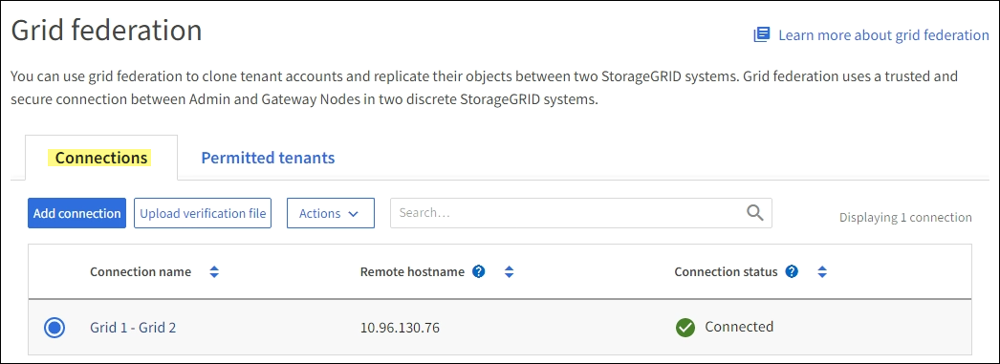

= Supervisar las conexiones de federación de grid
:allow-uri-read: 
:icons: font
:imagesdir: ../media/

[role="lead"]
Puede supervisar la información básica sobre todos link:../admin/grid-federation-overview.html["conexiones de federación de grid"], información detallada sobre una conexión específica o las métricas de Prometheus sobre las operaciones de replicación entre redes. Puede supervisar una conexión desde cualquier cuadrícula.

.Antes de empezar
* Ha iniciado sesión en Grid Manager en cualquiera de las cuadrículas mediante una link:../admin/web-browser-requirements.html["navegador web compatible"].
* Tiene link:../admin/admin-group-permissions.html["Permiso de acceso raíz"]el para la cuadrícula en la que ha iniciado sesión.

== Ver todas las conexiones

La página de federación de grid muestra información básica sobre todas las conexiones de federación de grid y sobre todas las cuentas de arrendatario que pueden utilizar conexiones de federación de grid.

.Pasos
. Seleccione *Configuración* > *Sistema* > *Federación de red*.
+
Aparecerá la página Grid federation.

. Para ver la información básica de todas las conexiones en esta cuadrícula, seleccione la pestaña *Conexiones*.
+
Desde esta pestaña, puede:

+
** link:../admin/grid-federation-create-connection.html["Cree una nueva conexión"].
** Seleccione una conexión existente a link:../admin/grid-federation-manage-connection.html["editar o probar"].

+

. Para ver información básica de todas las cuentas de inquilino en esta cuadrícula que tienen el permiso *Usar conexión de federación de grid*, selecciona la pestaña *Inquilinos permitidos*.
+
Desde esta pestaña, puede:

+
** link:../monitor/monitoring-tenant-activity.html["Consulte la página de detalles de cada inquilino permitido"].
** Consulte la página de detalles de cada conexión. Consulte <<view-specific-connection,Ver una conexión específica>>.
** Seleccione un arrendatario permitido y link:../admin/grid-federation-manage-tenants.html["elimine el permiso"].
** Compruebe si hay errores de replicación entre cuadrículas y borre el último error, si lo hubiera. Consulte link:../admin/grid-federation-troubleshoot.html["Solucionar errores de federación de grid"].
+
image::../media/grid-federation-permitted-tenants-tab.png[Pestaña Inquilinos permitidos de federación de grid]

== [[view-specific-connection]]Ver una conexión específica

Puede ver los detalles de una conexión de federación de grid específica.

.Pasos
. Seleccione cualquiera de los separadores de la página federación de Cuadrículas y, a continuación, seleccione el nombre de la conexión en la tabla.
+
En la página de detalles de la conexión, puede:

+
** Consulte la información básica sobre el estado de la conexión, incluidos los nombres de host locales y remotos, el puerto y el estado de la conexión.
** Seleccione una conexión a link:../admin/grid-federation-manage-connection.html["editar, probar o eliminar"].

. Cuando vea una conexión específica, seleccione la pestaña *Arrendatarios permitidos* para ver detalles sobre los inquilinos permitidos para la conexión.
+
Desde esta pestaña, puede:

+
** link:../monitor/monitoring-tenant-activity.html["Consulte la página de detalles de cada inquilino permitido"].
** link:../admin/grid-federation-manage-tenants.html["Eliminar el permiso de un inquilino"] para utilizar la conexión.
** Compruebe si hay errores de replicación entre cuadrículas y borre el último error. Consulte link:../admin/grid-federation-troubleshoot.html["Solucionar errores de federación de grid"].
+
image::../media/grid-federation-permitted-tenants-tab-for-connection.png[grid-federation-allowed-tenants-tab-for-connection]

. Cuando vea una conexión específica, seleccione la pestaña *Certificados* para ver los certificados de servidor y cliente generados por el sistema para esta conexión.
+
Desde esta pestaña, puede:

+
** link:../admin/grid-federation-manage-connection.html["Rotar certificados de conexión"].
** Seleccione *Servidor* o *Cliente* para ver o descargar el certificado asociado o copiar el certificado PEM.
+
image::../media/grid-federation-certificates-tab.png[grid-federación-certificados-tab]

== Revisión de las métricas de replicación entre grid

Puede utilizar el panel de control de replicación de cuadrícula cruzada en Grafana para ver las métricas de Prometheus sobre las operaciones de replicación entre grid en su grid.

.Pasos
. Desde el Administrador de cuadrícula, seleccione *Soporte* > *Herramientas* > *Métricas*.
+

NOTE: Las herramientas disponibles en la página Métricas están destinadas al soporte técnico. Algunas funciones y elementos de menú de estas herramientas no son intencionalmente funcionales y están sujetos a cambios. Consulte la lista de link:../monitor/commonly-used-prometheus-metrics.html["Métricas de Prometheus que se usan habitualmente"].

. En la sección Grafana de la página, selecciona *Replicación de cuadrícula cruzada*.
+
Para obtener instrucciones detalladas, consulte link:../monitor/reviewing-support-metrics.html["Revisar las métricas de soporte"].

. Para volver a intentar la replicación de objetos que no se han podido replicar, consulte link:../admin/grid-federation-retry-failed-replication.html["Identifique y vuelva a intentar operaciones de replicación fallidas"].

