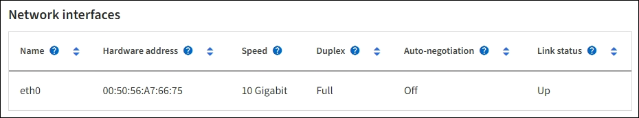
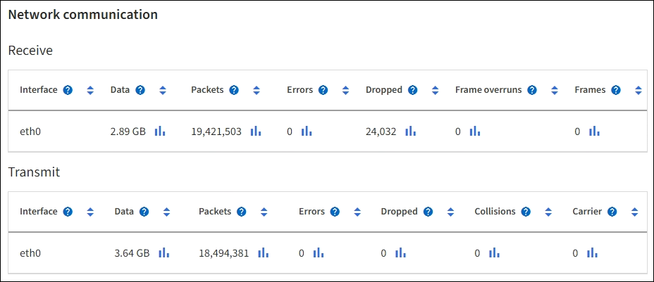

= Supervise las redes y los recursos del sistema
:allow-uri-read: 
:icons: font
:imagesdir: ../media/

[role="lead"]
La integridad y el ancho de banda de la red entre nodos y los sitios, y el uso de recursos por parte de los nodos de grid individuales, son esenciales para la eficacia de las operaciones.

== Supervisar las conexiones de red y el rendimiento

La conectividad de red y el ancho de banda son especialmente importantes si la política de gestión del ciclo de vida de la información (ILM) copia los objetos replicados entre sitios o almacena objetos codificados con borrado mediante un esquema que proporciona protección contra pérdida de sitio. Si la red entre sitios no está disponible, la latencia de la red es demasiado alta o el ancho de banda de la red es insuficiente, es posible que algunas reglas de ILM no puedan colocar objetos donde se espera. Esto puede provocar errores de ingesta (cuando se selecciona la opción de ingesta estricta para reglas de ILM) o errores en el rendimiento de procesamiento y los trabajos de gestión de la vida útil.

Utilice Grid Manager para supervisar la conectividad y el rendimiento de la red, de modo que pueda resolver cualquier problema con prontitud.

Además, tenga  en cuenta link:../admin/managing-traffic-classification-policies.html["creación de políticas de clasificación del tráfico de red"] que puede supervisar el tráfico relacionado con inquilinos, depósitos, subredes o extremos de equilibrio de carga específicos. Puede definir políticas de limitación de tráfico según sea necesario.

.Pasos
. Selecciona *NODOS*.
+
Aparece la página Nodes. Cada nodo de la cuadrícula se muestra en formato de tabla.

+
image::../media/nodes_menu.png[Menú nodos]

. Seleccione el nombre de la cuadrícula, un sitio específico del centro de datos o un nodo de la cuadrícula y, a continuación, seleccione la ficha *Red*.
+
El gráfico de tráfico de red proporciona un resumen del tráfico general de red para la cuadrícula en su conjunto, el sitio del centro de datos o para el nodo.

+
image::../media/nodes_page_network_traffic_graph.png[Gráfico de tráfico de red de la página Nodes]

+
.. Si ha seleccionado un nodo de cuadrícula, desplácese hacia abajo para revisar la sección *interfaces de red* de la página.
+

.. Para nodos de cuadrícula, desplácese hacia abajo para revisar la sección *Comunicación de red* de la página.
+
Las tablas de recepción y transmisión muestran cuántos bytes y paquetes se han recibido y enviado a través de cada red, así como otras métricas de recepción y transmisión.

+

. Utilice las métricas asociadas a las directivas de clasificación del tráfico para supervisar el tráfico de red.
+
.. Seleccione *CONFIGURACIÓN* > *Red* > *Clasificación de tráfico*.
+
Aparece la página Directivas de clasificación del tráfico y las directivas existentes se muestran en la tabla.

+
image::../media/traffic_classification_policies_main_screen_w_examples.png[Ejemplo de directiva de tráfico para gráfico]

.. Para ver gráficos que muestran las métricas de red asociadas a una directiva, seleccione el botón de opción situado a la izquierda de la directiva y, a continuación, haga clic en *métricas*.
.. Revise los gráficos para comprender el tráfico de red asociado a la directiva.
+
Si una directiva de clasificación de tráfico está diseñada para limitar el tráfico de red, analice la frecuencia con la que el tráfico es limitado y decida si la directiva continúa satisfaciendo sus necesidades. De vez en cuando, link:../admin/managing-traffic-classification-policies.html["ajuste cada política de clasificación de tráfico según sea necesario"].

.Información relacionada
* link:viewing-network-tab.html["Abra la pestaña Network"]
* link:monitoring-system-health.html#monitor-node-connection-states["Supervise los estados de conexión de los nodos"]

== Supervise los recursos a nivel de nodo

Supervisar nodos de cuadrícula individuales para comprobar sus niveles de uso de recursos. Si los nodos están sobrecargados de forma continua, es posible que se necesiten más nodos para realizar operaciones eficientes.

.Pasos
. En la página *NODES*, seleccione el nodo.
. Seleccione la ficha *hardware* para visualizar gráficos de utilización de CPU y uso de memoria.
+
image::../media/nodes_page_hardware_tab_graphs.png[Página Nodes pestaña hardware]

. Para mostrar un intervalo de tiempo diferente, seleccione uno de los controles situados encima del gráfico o gráfico. Puede visualizar la información disponible para intervalos de 1 hora, 1 día, 1 semana o 1 mes. También puede establecer un intervalo personalizado, que le permite especificar intervalos de fecha y hora.
. Si el nodo está alojado en un dispositivo de almacenamiento o un dispositivo de servicios, desplácese hacia abajo para ver las tablas de los componentes. El estado de todos los componentes debe ser «Nominal». Investigue los componentes que tienen otro estado.

.Información relacionada
* link:viewing-hardware-tab.html#view-information-about-appliance-storage-nodes["Ver información sobre los nodos de almacenamiento de dispositivos"]
* link:viewing-hardware-tab.html#view-information-about-appliance-admin-nodes-and-gateway-nodes["Consulte información sobre los nodos de administración del dispositivo y los nodos de puerta de enlace"]

