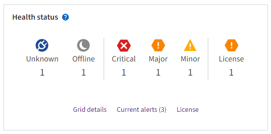

= Supervise el estado del sistema
:allow-uri-read: 
:icons: font
:imagesdir: ../media/

[role="lead"]
Supervise el estado general del sistema StorageGRID diariamente.

.Acerca de esta tarea
El sistema StorageGRID puede seguir funcionando cuando algunas partes de la red no están disponibles. Los problemas potenciales que indican las alertas no son necesariamente problemas con las operaciones del sistema. Investigue los problemas resumidos en la tarjeta de estado del panel de Grid Manager.

Para recibir notificaciones de alertas tan pronto como se activen, puede https://docs.netapp.com/us-en/storagegrid-appliances/installconfig/setting-up-email-notifications-for-alerts.html["configurar notificaciones por correo electrónico para alertas"^] o link:using-snmp-monitoring.html["Configure las capturas SNMP"].

Cuando existen problemas, aparecen vínculos que le permiten ver detalles adicionales:

[cols="1a,2a"]
|===
| Enlace | Aparece cuando... 

 a| 
Detalles de la cuadrícula
 a| 
Todos los nodos están desconectados (estado de conexión desconocido o desconectado de forma administrativa).

 a| 
Alertas actuales (críticas, principales, menores)
 a| 
Las alertas son <<Ver las alertas actuales y resueltas,actualmente activo>>.

 a| 
Alertas resueltas recientemente
 a| 
Alertas activadas en la semana pasada <<Ver las alertas actuales y resueltas,ahora están resueltos>>.

 a| 
Licencia
 a| 
Hay un problema con la licencia de software de este sistema StorageGRID. Puede link:../admin/updating-storagegrid-license-information.html["actualice la información de licencia según sea necesario"].

|===

== Supervise los estados de conexión de los nodos

Si uno o más nodos están desconectados de la cuadrícula, es posible que se vean afectadas las operaciones críticas de StorageGRID. Supervise los estados de conexión de los nodos y resuelva cualquier problema con prontitud.

[cols="1a,3a,3a"]
|===
| . | Descripción | Acción necesaria 

 a| 
image:../media/icon_alarm_blue_unknown.png["icono de signo de interrogación azul"]
 a| 
*No conectado - Desconocido*

Por una razón desconocida, un nodo está desconectado o los servicios del nodo se desactivan inesperadamente. Por ejemplo, un servicio del nodo podría estar detenido o podría haber perdido la conexión de red debido a un fallo de alimentación o a un corte inesperado.

La alerta *no se puede comunicar con el nodo* también puede activarse. Otras alertas también pueden estar activas.
 a| 
Requiere atención inmediata. <<Ver las alertas actuales y resueltas,Seleccione cada alerta>> y siga las acciones recomendadas.

Por ejemplo, es posible que deba reiniciar un servicio que haya detenido o reiniciar el host del nodo.

*Nota*: Un nodo puede aparecer como Desconocido durante las operaciones de cierre administradas. Puede ignorar el estado Desconocido en estos casos.

 a| 
image:../media/icon_alarm_gray_administratively_down.png["icono de questionmark gris"]
 a| 
*No conectado - administrativamente abajo*

Por un motivo esperado, el nodo no está conectado a la cuadrícula.

Por ejemplo, el nodo o los servicios del nodo se han apagado correctamente, el nodo se está reiniciando o se está actualizando el software. Una o más alertas también pueden estar activas.

En función del problema subyacente, estos nodos suelen volver a estar en línea sin ninguna intervención.
 a| 
Determine si alguna alerta afecta a este nodo.

Si hay una o más alertas activas, <<Ver las alertas actuales y resueltas,seleccione cada alerta>>siga las acciones recomendadas.

 a| 
image:../media/icon_alert_green_checkmark.png["icono de alerta verde marca de verificación"]
 a| 
*Conectado*

El nodo está conectado a la cuadrícula.
 a| 
No se requiere ninguna acción.

|===

== Ver las alertas actuales y resueltas

*Alertas actuales*: Cuando se activa una alerta, se muestra un icono de alerta en el panel de control. También se muestra un icono de alerta para el nodo en la página Nodes. If link:email-alert-notifications.html["las notificaciones por correo electrónico de alertas están configuradas"], también se enviará una notificación por correo electrónico, a menos que se haya silenciado la alerta.

*Alertas resueltas*: Puedes buscar y ver un historial de alertas que se han resuelto.

Opcionalmente has visto el vídeo:

.Descripción general de alertas
video::2eea81c5-8323-417f-b0a0-b1ff008506c1[panopto]
En la siguiente tabla se describe la información que se muestra en Grid Manager para las alertas actuales y resueltas.

[cols="1a,3a"]
|===
| Encabezado de columna | Descripción 

 a| 
Nombre o título
 a| 
El nombre de la alerta y su descripción.

 a| 
Gravedad
 a| 
La gravedad de la alerta. Para las alertas actuales, si se agrupan varias alertas, la fila de título muestra cuántas instancias de esa alerta se producen en cada gravedad.

image:../media/icon_alert_red_critical.png["Alerta de icono Rojo crítico"] *Crítico*: Existe una condición anormal que ha detenido las operaciones normales de un nodo o servicio StorageGRID. Debe abordar el problema subyacente de inmediato. Se pueden producir interrupciones del servicio y pérdida de datos si no se resuelve el problema.

image:../media/icon_alert_orange_major.png["Alerta de icono naranja principal"] *Mayor*: Existe una condición anormal que está afectando las operaciones actuales o acercándose al umbral de una alerta crítica. Debe investigar las alertas principales y solucionar cualquier problema subyacente para garantizar que esta condición no detenga el funcionamiento normal de un nodo o servicio de StorageGRID.

image:../media/icon_alert_yellow_minor.png["Alerta de icono menor amarilla"] *Menor*: El sistema funciona normalmente, pero existe una condición anormal que podría afectar la capacidad del sistema para funcionar si continúa. Debe supervisar y resolver alertas menores que no borren por sí solas para asegurarse de que no den lugar a un problema más grave.

 a| 
Tiempo activado
 a| 
*Alertas actuales*: La fecha y hora en que se activó la alerta en su hora local y en UTC. Si se agrupan varias alertas, la fila de título muestra las horas de la instancia más reciente de la alerta (_Newest_) y la instancia más antigua de la alerta (_oldest_).

*Alertas resueltas*: Hace cuánto tiempo se activó la alerta.

 a| 
Sitio/nodo
 a| 
El nombre del sitio y del nodo donde se produce o se ha producido la alerta.

 a| 
Estado
 a| 
Si la alerta está activa, silenciada o resuelta. Si se agrupan varias alertas y se selecciona *todas las alertas* en la lista desplegable, la fila de título muestra cuántas instancias de esa alerta están activas y cuántas instancias se han silenciado.

 a| 
Tiempo de resolución (solo alertas resueltas)
 a| 
Hace cuánto tiempo se resolvió la alerta.

 a| 
Valores actuales o _valores de datos_
 a| 
El valor de la métrica que provocó el activación de la alerta. En el caso de algunas alertas, se muestran valores adicionales que le ayudarán a comprender e investigar la alerta. Por ejemplo, los valores mostrados para una alerta *almacenamiento de datos de objeto bajo* incluyen el porcentaje de espacio en disco utilizado, la cantidad total de espacio en disco y la cantidad de espacio en disco utilizado.

*Nota:* Si se agrupan varias alertas actuales, los valores actuales no se muestran en la fila de título.

 a| 
Valores disparados (solo alertas resueltas)
 a| 
El valor de la métrica que provocó el activación de la alerta. En el caso de algunas alertas, se muestran valores adicionales que le ayudarán a comprender e investigar la alerta. Por ejemplo, los valores mostrados para una alerta *almacenamiento de datos de objeto bajo* incluyen el porcentaje de espacio en disco utilizado, la cantidad total de espacio en disco y la cantidad de espacio en disco utilizado.

|===
.Pasos
. Seleccione el enlace *Alertas actuales* o *Alertas resueltas* para ver una lista de alertas en esas categorías. También puede ver los detalles de una alerta seleccionando *NODOS* > *_NODO_* > *Descripción general* y, a continuación, seleccionando la alerta en la tabla Alertas.
+
De manera predeterminada, las alertas actuales se muestran del siguiente modo:

+
** Primero se muestran las alertas activadas más recientemente.
** Se muestran varias alertas del mismo tipo como un grupo.
** No se muestran las alertas silenciadas.
** Para una alerta específica de un nodo específico, si los umbrales se alcanzan para más de una gravedad, solo se muestra la alerta más grave. Es decir, si se alcanzan los umbrales de alerta para las gravedades leve, grave y crítica, solo se muestra la alerta crítica.
+
La página de alertas actuales se actualiza cada dos minutos.

. Para expandir grupos de alertas, seleccione el signo de intercalación hacia abajo . Para reducir alertas individuales de un grupo, seleccione el signo de intercalación ascendente image:../media/icon_alert_caret_up.png["Icono de signo de intercalación arriba"]o seleccione el nombre del grupo.
. Para mostrar alertas individuales en lugar de grupos de alertas, desactive la casilla de verificación *Alertas de grupo*.
. Para ordenar las alertas actuales o los grupos de alertas, seleccione las flechas arriba/abajo image:../media/icon_alert_sort_column.png["Icono de flechas de ordenación"]en cada encabezado de columna.
+
** Cuando se selecciona *Alertas de grupo*, se ordenan tanto los grupos de alertas como las alertas individuales de cada grupo. Por ejemplo, es posible que desee ordenar las alertas de un grupo por *tiempo activado* para encontrar la instancia más reciente de una alerta específica.
** Cuando se borra *Alertas de grupo*, se ordena toda la lista de alertas. Por ejemplo, es posible que desee ordenar todas las alertas por *nodo/Sitio* para ver todas las alertas que afectan a un nodo específico.

. Para filtrar las alertas actuales por estado (*Todas las alertas*, *Activa* o *Silenciada*, usa el menú desplegable en la parte superior de la tabla.
+
Consulte link:silencing-alert-notifications.html["Silenciar notificaciones de alerta"].

. Para ordenar alertas resueltas:
+
** Seleccione un período de tiempo en el menú desplegable *When Trigger*.
** Seleccione una o más gravedades en el menú desplegable *Gravedad*.
** Seleccione una o más reglas de alerta predeterminadas o personalizadas en el menú desplegable *Regla de alerta* para filtrar las alertas resueltas relacionadas con una regla de alerta específica.
** Seleccione uno o más nodos en el menú desplegable *Node* para filtrar las alertas resueltas relacionadas con un nodo específico.

. Para ver los detalles de una alerta específica, seleccione la alerta. Un cuadro de diálogo proporciona detalles y acciones recomendadas para la alerta seleccionada.
. (Opcional) Para una alerta específica, seleccione Silenciar esta alerta para silenciar la regla de alerta que provocó la activación de esta alerta.
+
Debe tener el link:../admin/admin-group-permissions.html["Gestionar alertas o permisos de acceso raíz"] para silenciar una regla de alerta.

+

CAUTION: Tenga cuidado al decidir silenciar una regla de alerta. Si se silencia una regla de alerta, es posible que no detecte un problema subyacente hasta que impida que se complete una operación crítica.

. Para ver las condiciones actuales de la regla de alerta:
+
.. En los detalles de la alerta, selecciona *Ver condiciones*.
+
Aparece una ventana emergente que muestra la expresión Prometheus de cada gravedad definida.

.. Para cerrar la ventana emergente, haga clic en cualquier lugar fuera de la ventana emergente.

. Opcionalmente, seleccione *Editar regla* para editar la regla de alerta que provocó que se activara esta alerta.
+
Debe tener el link:../admin/admin-group-permissions.html["Gestionar alertas o permisos de acceso raíz"] para editar una regla de alerta.

+

CAUTION: Tenga cuidado al decidir editar una regla de alerta. Si cambia los valores de activación, es posible que no detecte un problema subyacente hasta que no se complete una operación crucial.

. Para cerrar los detalles de la alerta, selecciona *Cerrar*.

