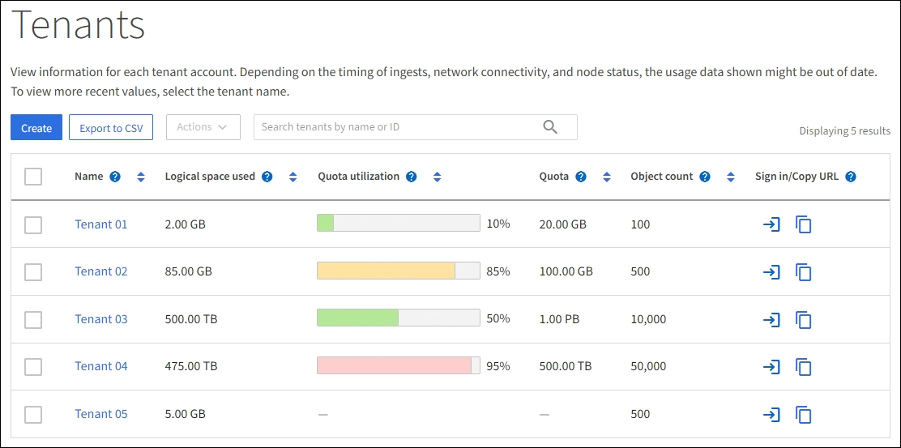

= Supervise la actividad de los inquilinos
:allow-uri-read: 
:icons: font
:imagesdir: ../media/

[role="lead"]
Toda la actividad de los clientes de S3 se asocia con las cuentas de inquilino de StorageGRID. Puede usar Grid Manager para supervisar el uso del almacenamiento o el tráfico de red de todos los inquilinos o de un inquilino específico. Puede utilizar el registro de auditoría o los paneles de Grafana para recopilar información más detallada sobre cómo usan los inquilinos StorageGRID.

.Antes de empezar
* Ha iniciado sesión en Grid Manager mediante una link:../admin/web-browser-requirements.html["navegador web compatible"].
* Usted tiene el link:../admin/admin-group-permissions.html["Acceso raíz o cuentas de inquilino"].

== Ver todos los inquilinos

La página Tenedores muestra información básica para todas las cuentas de arrendatario actuales.

.Pasos
. Seleccione *Inquilinos*.
. Revise la información que se muestra en las páginas de arrendatario.
+
El espacio lógico utilizado, el uso de cuota, la cuota y el recuento de objetos se enumeran para cada inquilino. Si no se establece una cuota para un arrendatario, los campos Uso de cuota y Cuota contienen un guión (&#8212;).

+

NOTE: El tamaño lógico de todos los objetos que pertenecen a este inquilino incluye cargas multiparte incompletas y en progreso.  El tamaño no incluye el espacio físico adicional utilizado para las políticas de ILM.  Los valores de espacio utilizado son estimaciones.  Estas estimaciones se ven afectadas por el momento de la ingesta, la conectividad de la red y el estado del nodo.

+

. Opcionalmente, inicie sesión en una cuenta de inquilino seleccionando el enlace de inicio de sesión en la columna *Iniciar sesión/Copiar URL*.
. Opcionalmente, copie la URL de la página de inicio de sesión de un inquilino seleccionando el enlace de copia URL image:../media/icon_tenant_copy_url.png["Icono de URL de copia de inquilino"]en la columna *Iniciar sesión/Copiar URL*.
. Opcionalmente, seleccione *Exportar a CSV* para ver y exportar un `.csv` archivo que contiene los valores de uso para todos los inquilinos.
+
Se le pedirá que abra o guarde el `.csv` archivo.

+
El contenido del `.csv` archivo se parece al siguiente ejemplo:

+
image::../media/tenant_accounts_example_csv.png[Ejemplo de cuentas de inquilino .csv]

+
Puede abrir `.csv` el archivo en una aplicación de hoja de cálculo o utilizarlo en la automatización.

. Si no se muestra ningún objeto, opcionalmente, seleccione *Acciones* > *Eliminar* para eliminar uno o más inquilinos. Consulte link:../admin/deleting-tenant-account.html["Eliminar cuenta de inquilino"].
+
No puede eliminar una cuenta de inquilino si la cuenta incluye depósitos o contenedores.

== Ver un arrendatario específico

Puede ver los detalles de un arrendatario específico.

.Pasos
. Seleccione el nombre del arrendatario en la página Inquilinos.
+
Aparece la página de detalles del arrendatario.

+
image::../media/tenant_usage_modal.png[Uso de arrendatario modal]

. Revise la información general del inquilino en la parte superior de la página.
+
En esta sección de la página de detalles se proporciona información de resumen para el inquilino, incluido el recuento de objetos del inquilino, el uso de la cuota, el espacio lógico utilizado y la configuración de la cuota.

+

NOTE: El tamaño lógico de todos los objetos que pertenecen a este inquilino incluye cargas multiparte incompletas y en progreso.  El tamaño no incluye el espacio físico adicional utilizado para las políticas de ILM.  Los valores de espacio utilizado son estimaciones.  Estas estimaciones se ven afectadas por el momento de la ingesta, la conectividad de la red y el estado del nodo.

. Desde la pestaña *Desglose del espacio*, revisa el gráfico *Consumo de espacio*.
+
Este gráfico muestra el consumo de espacio total para todos los bloques de S3 del inquilino.

+
Si se ha establecido una cuota para este arrendatario, la cantidad de cuota utilizada y restante se muestra en texto (por ejemplo, `85.00 GB of 100 GB used`). Si no se ha establecido ninguna cuota, el arrendatario tiene una cuota ilimitada y el texto sólo incluye una cantidad de espacio utilizado (por ejemplo, `85.00 GB used`). El gráfico de barras muestra el porcentaje de cuota de cada segmento o contenedor. Si el inquilino ha superado la cuota de almacenamiento en más de un 1% y en al menos 1 GB, el gráfico muestra la cuota total y el exceso.

+
Puede colocar el cursor sobre el gráfico de barras para ver el almacenamiento que utiliza cada cucharón o contenedor. Puede colocar el cursor sobre el segmento de espacio libre para ver la cantidad de cuota de almacenamiento restante.

+
image::../media/tenant_bucket_space_consumption_GM.png[Gráfico de barra de consumo del bloque de inquilinos]

+

CAUTION: El uso de la cuota se basa en estimaciones internas y puede superarse en algunos casos. Por ejemplo, StorageGRID comprueba la cuota cuando un inquilino comienza a cargar objetos y rechaza nuevas búsquedas si el inquilino ha superado la cuota. Sin embargo, StorageGRID no tiene en cuenta el tamaño de la carga actual al determinar si se ha superado la cuota. Si se eliminan objetos, se puede evitar temporalmente que un arrendatario cargue nuevos objetos hasta que se vuelva a calcular el uso de cuota. Los cálculos de uso de cuotas pueden tardar 10 minutos o más.

+

NOTE: El uso de cuota de un inquilino indica la cantidad total de datos de objeto que el inquilino ha cargado en StorageGRID (tamaño lógico). El uso de cuota no representa el espacio utilizado para almacenar copias de dichos objetos y sus metadatos (tamaño físico).

+

NOTE: Puede habilitar la regla de alerta *Uso de cuota de inquilino alto* para determinar si los inquilinos están consumiendo sus cuotas. Si está habilitada, esta alerta se activa cuando un inquilino ha utilizado el 90% de su cuota. Para obtener instrucciones, consulte link:../monitor/editing-alert-rules.html["Editar reglas de alerta"].

. Desde la pestaña *Desglose del espacio*, revisa los detalles de *Bucket*.
+
En esta tabla se muestran los bloques S3 para el arrendatario. El espacio usado es la cantidad total de datos de objetos en el bloque o contenedor. Este valor no representa el espacio de almacenamiento necesario para las copias de ILM y los metadatos de objetos.

. Opcionalmente, seleccione *Exportar a CSV* para ver y exportar un archivo .csv que contenga los valores de uso para cada contenedor o bloque.
+
El contenido de un archivo de un inquilino S3 individual `.csv` se parece al siguiente ejemplo:

+
image::../media/tenant_bucket_details_csv.png[Ejemplo de CSV de detalles de bloque de inquilinos]

+
Puede abrir `.csv` el archivo en una aplicación de hoja de cálculo o utilizarlo en la automatización.

. Opcionalmente, seleccione la pestaña *Características permitidas* para ver una lista de los permisos y características que están habilitados para el inquilino. Compruebe link:../admin/editing-tenant-account.html["Edite la cuenta de inquilino"] si necesita cambiar alguno de estos ajustes.
. Si el inquilino tiene el permiso *Usar conexión de federación de cuadrícula*, opcionalmente seleccione la pestaña *federación de cuadrícula* para obtener más información sobre la conexión.
+
Consulte link:../admin/grid-federation-overview.html["¿Qué es GRID federation?"] y link:../admin/grid-federation-manage-tenants.html["Gestione los inquilinos permitidos para la federación de grid"].

== Ver el tráfico de red

Si se han establecido directivas de clasificación de tráfico para un inquilino, revise el tráfico de red para ese arrendatario.

.Pasos
. Seleccione *Configuración* > *Red* > *Clasificación de tráfico*.
+
Aparece la página Directivas de clasificación del tráfico y las directivas existentes se muestran en la tabla.

. Revise la lista de políticas para identificar las que se aplican a un arrendatario específico.
. Para ver las métricas asociadas a una política, seleccione el botón de opción situado a la izquierda de la política y seleccione *Métricas*.
. Analice los gráficos para determinar con qué frecuencia la política limita el tráfico y si necesita ajustar la política.

Consulte link:../admin/managing-traffic-classification-policies.html["Administrar directivas de clasificación de tráfico"] para obtener más información.

== Use el registro de auditoría

Opcionalmente, se puede utilizar el registro de auditoría para una supervisión más granular de las actividades de un inquilino.

Por ejemplo, puede supervisar los siguientes tipos de información:

* Operaciones específicas del cliente, como PUT, GET o DELETE
* Tamaños de objeto
* La regla de ILM se aplica a los objetos
* La IP de origen de las solicitudes del cliente

Los registros de auditoría se escriben en archivos de texto que se pueden analizar con la herramienta de análisis de registros que elija. Esto le permite comprender mejor las actividades de los clientes o implementar modelos sofisticados de pago por uso y facturación.

Consulte link:../audit/index.html["Revisar los registros de auditoría"] para obtener más información.

== Utilizar métricas de Prometheus

Opcionalmente, utilice las métricas de Prometheus para generar informes sobre la actividad del inquilino.

* En el Administrador de cuadrícula, seleccione *Soporte* > *Herramientas* > *Métricas*.  Puede utilizar paneles existentes, como S3 Overview, para revisar las actividades del cliente.
+

NOTE: Las herramientas disponibles en la página Metrics están destinadas principalmente al soporte técnico. Algunas funciones y elementos de menú de estas herramientas no son intencionalmente funcionales.

* En la parte superior de Grid Manager, selecciona el icono de ayuda y selecciona *Documentación de API*. Puede utilizar las métricas de la sección Métricas de la API de gestión de grid para crear reglas de alerta y paneles personalizados para la actividad de inquilinos.

Consulte link:reviewing-support-metrics.html["Revisar las métricas de soporte"] para obtener más información.
