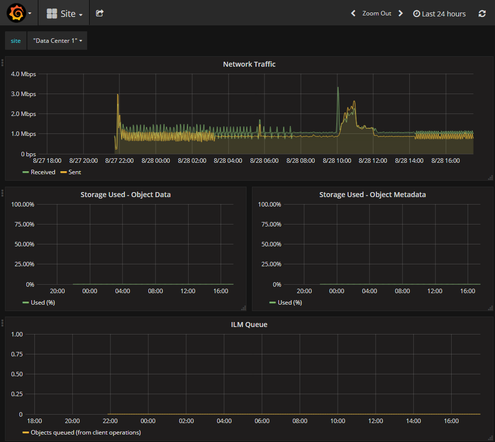

= Revisar las métricas de soporte
:allow-uri-read: 
:icons: font
:imagesdir: ../media/

[role="lead"]
Al solucionar problemas, puede trabajar con el soporte técnico para revisar métricas y gráficos detallados para su sistema StorageGRID.

.Antes de empezar
* Debe iniciar sesión en Grid Manager mediante una link:../admin/web-browser-requirements.html["navegador web compatible"].
* Tienes link:../admin/admin-group-permissions.html["permisos de acceso específicos"].

.Acerca de esta tarea
La página Metrics le permite acceder a las interfaces de usuario Prometheus y Grafana. Prometheus es un software de código abierto para recopilar métricas. Grafana es un software de código abierto para la visualización de métricas.

NOTE: Las herramientas disponibles en la página Métricas están destinadas al soporte técnico. Algunas funciones y elementos de menú de estas herramientas no son intencionalmente funcionales y están sujetos a cambios. Consulte la lista de link:commonly-used-prometheus-metrics.html["Métricas de Prometheus que se usan habitualmente"].

.Pasos
. Según lo indicado por el soporte técnico, seleccione *ASISTENCIA* > *Herramientas* > *métricas*.
+
A continuación se muestra un ejemplo de la página Metrics:

+
image::../media/metrics_page.png[Página de métricas]

. Para consultar los valores actuales de las métricas de StorageGRID y ver gráficos de los valores a lo largo del tiempo, haga clic en el enlace de la sección Prometheus.
+
Aparece la interfaz Prometheus. Puede utilizar esta interfaz para ejecutar consultas en las métricas de StorageGRID disponibles y para generar un gráfico de las métricas de StorageGRID a lo largo del tiempo.

+

NOTE: Las métricas que incluyen _private_ en sus nombres están destinadas únicamente a uso interno y están sujetas a cambios entre versiones de StorageGRID sin previo aviso.

. Para acceder a paneles preconstruidos que contienen gráficos de métricas de StorageGRID a lo largo del tiempo, haga clic en los enlaces de la sección Grafana.
+
Aparece la interfaz de Grafana para el enlace seleccionado.

+

