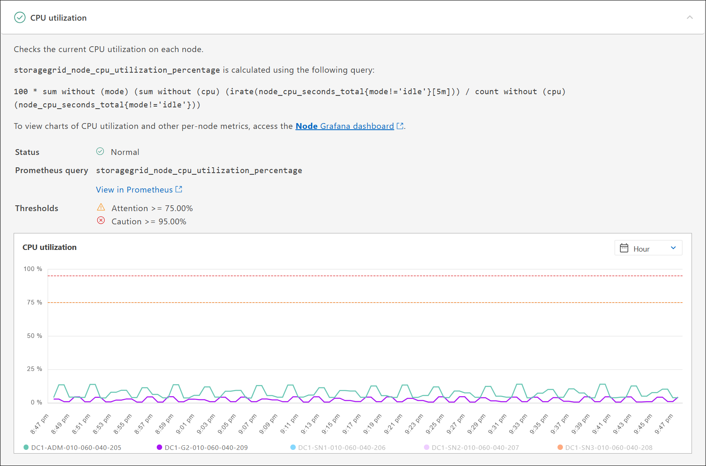

= Ejecutar diagnóstico
:allow-uri-read: 
:icons: font
:imagesdir: ../media/

[role="lead"]
Al solucionar un problema, el soporte técnico puede trabajar para ejecutar diagnósticos del sistema StorageGRID y revisar los resultados.

* link:reviewing-support-metrics.html["Revisar las métricas de soporte"]
* link:commonly-used-prometheus-metrics.html["Métricas de Prometheus que se usan habitualmente"]

.Antes de empezar
* Ha iniciado sesión en Grid Manager mediante una link:../admin/web-browser-requirements.html["navegador web compatible"].
* Tienes link:../admin/admin-group-permissions.html["permisos de acceso específicos"].

.Acerca de esta tarea
La página Diagnósticos realiza un conjunto de comprobaciones de diagnóstico en el estado actual de la cuadrícula. Cada control de diagnóstico puede tener uno de los tres Estados:

* image:../media/icon_alert_green_checkmark.png["Icono Alerta verde marca de verificación"] *Normal*: Todos los valores están dentro del rango normal.
* image:../media/icon_alert_yellow_minor.png["Alerta de icono menor amarilla"] *Atención*: Uno o más de los valores están fuera del rango normal.
* image:../media/icon_alert_red_critical.png["Alerta de icono Rojo crítico"] *Precaución*: Uno o más de los valores están significativamente fuera del rango normal.

Los Estados de diagnóstico son independientes de las alertas actuales y podrían no indicar problemas operativos con la cuadrícula. Por ejemplo, una comprobación de diagnóstico puede mostrar el estado Precaución aunque no se haya activado ninguna alerta.

.Pasos
. Seleccione *SUPPORT* > *Tools* > *Diagnostics*.
+
Aparece la página Diagnósticos y enumera los resultados de cada comprobación de diagnóstico. Los resultados se ordenan por gravedad (Precaución, atención y luego normal). Dentro de cada gravedad, los resultados se ordenan alfabéticamente.

+
En este ejemplo, todos los diagnósticos tienen un estado normal.

+
image::../media/support_diagnostics_page.png[Página de diagnóstico de soporte]

. Para obtener más información acerca de un diagnóstico específico, haga clic en cualquier lugar de la fila.
+
Aparecen detalles sobre el diagnóstico y sus resultados actuales. Se enumeran los siguientes detalles:

+
** *Estado*: El estado actual de este diagnóstico: Normal, atención o Precaución.
** *Consulta Prometheus*: Si se utiliza para el diagnóstico, la expresión Prometheus que se utilizó para generar los valores de estado. (No se utiliza una expresión Prometheus para todos los diagnósticos.)
** *Umbrales*: Si están disponibles para el diagnóstico, los umbrales definidos por el sistema para cada estado de diagnóstico anormal. (Los valores de umbral no se utilizan para todos los diagnósticos).
+

NOTE: No puedes cambiar estos umbrales.

** *Valores de estado*: Tabla que muestra el estado y el valor del diagnóstico en todo el sistema StorageGRID. En este ejemplo, se muestra el uso actual de la CPU para cada nodo de un sistema StorageGRID. Todos los valores de nodo están por debajo de los umbrales de atención y precaución, por lo que el estado general del diagnóstico es normal.

+

. *Opcional*: Para ver los gráficos Grafana relacionados con este diagnóstico, haga clic en el enlace *Grafana Dashboard*.
+
Este enlace no se muestra para todos los diagnósticos.

+
Aparece el panel Grafana relacionado. En este ejemplo, aparece el panel nodo que muestra la utilización de la CPU a lo largo del tiempo de este nodo, así como otros gráficos Grafana del nodo.

+

NOTE: También puede acceder a los paneles Grafana preconstruidos desde la sección Grafana de la página *SUPPORT* > *Tools* > *Metrics*.

+
image::../media/grafana_dashboard_nodes.png[Nodos de la consola de Grafana]

. *Opcional*: Para ver un gráfico de la expresión Prometheus a lo largo del tiempo, haga clic en *Ver en Prometheus*.
+
Aparece un gráfico Prometheus de la expresión utilizada en el diagnóstico.

+
image::../media/support_diagnostics_prometheus_png.png[Página de diagnóstico Prometheus de soporte]

