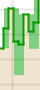

= Utilice gráficos y gráficos
:allow-uri-read: 
:icons: font
:imagesdir: ../media/

[role="lead"]
Puede utilizar gráficos e informes para supervisar el estado del sistema StorageGRID y solucionar problemas.

NOTE: Grid Manager se actualiza con cada versión, por lo que es posible que no coincida con las capturas de pantalla de los ejemplos de esta página.

== Tipos de gráficos

Los gráficos y los gráficos resumen los valores de métricas y atributos de StorageGRID específicos.

La consola de Grid Manager incluye tarjetas que resumen el almacenamiento disponible para el grid y cada sitio.

image::../media/dashboard_data_and_metadata_space_usage_breakdown.png[Desglose del uso del espacio de metadatos y datos de la consola]

En el panel Uso del almacenamiento de la consola del administrador de inquilino se muestra lo siguiente:

* Una lista de los bloques más grandes (S3) o los contenedores (Swift) para el inquilino
* Un gráfico de barras que representa los tamaños relativos de los cubos o contenedores más grandes
* La cantidad total de espacio utilizado y, si se establece una cuota, la cantidad y el porcentaje de espacio restante

image::../media/tenant_dashboard_with_buckets.png[Consola de inquilino]

Además, los gráficos que muestran cómo cambian las métricas y los atributos de StorageGRID con el tiempo están disponibles en la página Nodes y en la página *SUPPORT* > *Tools* > *Grid topolog*.

Existen cuatro tipos de gráficos:

* * Gráficos Grafana*: Se muestran en la página Nodes, los gráficos Grafana se utilizan para trazar los valores de las métricas Prometheus a lo largo del tiempo. Por ejemplo, la ficha *NODES* > *Network* de un nodo de almacenamiento incluye un gráfico Grafana para el tráfico de red.
+
image::../media/nodes_page_network_tab.png[Página Nodes pestaña Network]

+

NOTE: Los gráficos Grafana también se incluyen en los paneles preconstruidos disponibles en la página *SUPPORT* > *Tools* > *Metrics*.

* *Gráficos de línea*: Disponibles desde la página Nodos y desde la página *SOPORTE* > *Herramientas* > *Topología de cuadrícula* (seleccione el icono del gráfico image:../media/icon_chart_new_for_11_5.png["Gráfico de iconos (nuevo)"]después de un valor de datos), los gráficos de línea se utilizan para trazar los valores de los atributos StorageGRID que tienen un valor de unidad (como Compensación de frecuencia NTP, en ppm). Los cambios en el valor se representan en intervalos de datos regulares (bins) a lo largo del tiempo.
+
image::../media/line_graph.gif[Gráfico de líneas]

* *Gráficos de área*: Disponibles desde la página Nodos y desde la página *SUPPORT* > *Herramientas* > *Topología de cuadrícula* (seleccione el icono del gráfico image:../media/icon_chart_new_for_11_5.png["Gráfico de iconos (nuevo)"]después de un valor de datos), los gráficos de área se utilizan para trazar cantidades de atributos volumétricos, como recuentos de objetos o valores de carga de servicio. Los gráficos de área son similares a los gráficos de líneas, pero incluyen un sombreado marrón claro debajo de la línea. Los cambios en el valor se representan en intervalos de datos regulares (bins) a lo largo del tiempo.
+
image::../media/area_graph.gif[Gráfico de área]

* Algunos gráficos están marcados con un tipo diferente de icono de gráfico image:../media/icon_chart_new_for_11_5.png["Icono de gráfico"]y tienen un formato diferente:
+
image::../media/charts_lost_object_detected.png[Se ha detectado un objeto perdido de gráficos]

* *Gráfico de estado*: Disponible en la página *SUPPORT* > *Tools* > *Grid topology* (seleccione el icono del gráfico image:../media/icon_chart_new_for_11_5.png["Gráfico de iconos (nuevo)"]después de un valor de datos), los gráficos de estado se utilizan para trazar valores de atributos que representan estados distintos, como un estado de servicio que puede estar en línea, en espera o fuera de línea. Los gráficos de estado son similares a los gráficos de líneas, pero la transición es discontinua; es decir, el valor salta de un valor de estado a otro.
+
image::../media/state_graph.gif[Gráfico de Estados]

.Información relacionada
* link:viewing-nodes-page.html["Vea la página Nodes"]
* link:viewing-grid-topology-tree.html["Abra el árbol de topología de cuadrícula"]
* link:reviewing-support-metrics.html["Revisar las métricas de soporte"]

== Leyenda del gráfico

Las líneas y los colores utilizados para dibujar gráficos tienen un significado específico.

[cols="1a,3a"]
|===
| Ejemplo | Significado 

 a| 
image:../media/dark_green_chart_line.gif["captura de pantalla que muestra la línea verde oscura"]
 a| 
Los valores de atributo reportados se trazan utilizando líneas verdes oscuras.

 a| 

 a| 
El sombreado verde claro alrededor de líneas verdes oscuras indica que los valores reales en ese rango de tiempo varían y se han “agrupado” para un trazado más rápido. La línea oscura representa la media ponderada. El rango en verde claro indica los valores máximo y mínimo dentro de la bandeja. El sombreado marrón claro se utiliza para gráficos de áreas para indicar datos volumétricos.

 a| 
image:../media/no_data_plotted_chart.gif["captura de pantalla que muestra las áreas en blanco en la línea de trazado"]
 a| 
Las áreas en blanco (sin datos representados) indican que los valores de atributo no estaban disponibles. El fondo puede ser azul, gris o una mezcla de gris y azul, dependiendo del estado del servicio que informa sobre el atributo.

 a| 
image:../media/light_blue_chart_shading.gif["captura de pantalla que muestra sombreado azul claro que indica valores indeterminados"]
 a| 
El sombreado de azul claro indica que algunos o todos los valores de atributo en ese momento eran indeterminados; el atributo no estaba informando de valores porque el servicio estaba en estado desconocido.

 a| 
image:../media/gray_chart_shading.gif["captura de pantalla que muestra sombreado de gris debido a valores desconocidos"]
 a| 
El sombreado de gris indica que algunos o todos los valores de atributo en ese momento no se conocen porque el servicio que informa de los atributos estaba administrativamente inactivo.

 a| 
image:../media/gray_blue_chart_shading.gif["captura de pantalla que muestra la combinación de valores desconocidos e indeterminados"]
 a| 
Una mezcla de sombreado de gris y azul indica que algunos de los valores de atributo en ese momento eran indeterminados (porque el servicio estaba en un estado desconocido), mientras que otros no se conocían porque el servicio que reportaba los atributos estaba administrativamente abajo.

|===

== Mostrar gráficos y gráficos

La página nodos contiene los gráficos y los gráficos a los que debe acceder de manera regular para supervisar atributos como la capacidad de almacenamiento y el rendimiento. En algunos casos, especialmente al trabajar con soporte técnico, puede utilizar la página *SUPPORT* > *Tools* > *Grid topolog* para acceder a gráficos adicionales.

.Antes de empezar
Debe iniciar sesión en Grid Manager mediante una link:../admin/web-browser-requirements.html["navegador web compatible"].

.Pasos
. Selecciona *NODOS*. A continuación, seleccione un nodo, un sitio o toda la cuadrícula.
. Seleccione la ficha para la que desea ver información.
+
Algunas pestañas incluyen uno o más gráficos Grafana, que se utilizan para trazar los valores de las métricas Prometheus a lo largo del tiempo. Por ejemplo, la ficha *NODES* > *hardware* de un nodo incluye dos gráficos Grafana.

+
image::../media/nodes_page_hardware_tab_graphs.png[Página nodos gráficos de pestaña hardware]

. Opcionalmente, coloque el cursor sobre el gráfico para ver valores más detallados para un punto en el tiempo concreto.
+
image::../media/nodes_page_memory_usage_details.png[Detalles de uso de la memoria de la página Nodes]

. Según sea necesario, a menudo puede mostrar un gráfico para un atributo o métrica específicos. En la tabla de la página Nodos, seleccione el icono del gráfico image:../media/icon_chart_new_for_11_5.png["Icono de gráfico"]situado a la derecha del nombre del atributo.
+

NOTE: Los gráficos no están disponibles para todas las métricas y atributos.

+
*Ejemplo 1*: En la pestaña Objetos para un nodo de almacenamiento, puede seleccionar el icono del gráfico image:../media/icon_chart_new_for_11_5.png["Icono de gráfico"]para ver el número total de consultas correctas de almacenamiento de metadatos para el nodo de almacenamiento.

+
image::../media/nodes_page_objects_successful_metadata_queries.png[Consultas de metadatos correctas]

+
image::../media/nodes_page-objects_chart_successful_metadata_queries.png[Traza consultas de metadatos correctas]

+
*Ejemplo 2*: En la pestaña Objetos para un nodo de almacenamiento, puede seleccionar el icono del gráfico image:../media/icon_chart_new_for_11_5.png["Icono de gráfico"]para ver el gráfico Grafana del recuento de objetos perdidos detectados a lo largo del tiempo.

+
image::../media/object_count_table.png[Tabla de recuento de objetos]

+
image::../media/charts_lost_object_detected.png[Se ha detectado un objeto perdido de gráficos]

. Para mostrar gráficos de atributos que no se muestran en la página Nodo, seleccione *SUPPORT* > *Tools* > *Topología de cuadrícula*.
. Seleccione *_grid node_* > *_component o Service_* > *Descripción general* > *Principal*.
+
image::../media/nms_chart.gif[captura de pantalla descrita por el texto circundante]

. Seleccione el icono de gráfico image:../media/icon_chart_new_for_11_5.png["Icono de gráfico"]situado junto al atributo.
+
La pantalla cambia automáticamente a la página *Informes* > *gráficos*. El gráfico muestra los datos del atributo en el último día.

== Generar gráficos

Los gráficos muestran una representación gráfica de los valores de datos de atributos. Puede generar informes en el sitio de un centro de datos, en el nodo de grid, en el componente o en el servicio.

.Antes de empezar
* Debe iniciar sesión en Grid Manager mediante una link:../admin/web-browser-requirements.html["navegador web compatible"].
* Tienes link:../admin/admin-group-permissions.html["permisos de acceso específicos"].

.Pasos
. Seleccione *SUPPORT* > *Tools* > *Topología de cuadrícula*.
. Seleccione *_grid node_* > *_component o Service_* > *Reports* > *Charts*.
. Seleccione el atributo sobre el que desea informar en la lista desplegable *atributo*.
. Para forzar que el eje Y comience en cero, desactive la casilla de verificación *Escalado vertical*.
. Para mostrar valores con total precisión, seleccione la casilla de verificación *Datos sin procesar*, o para redondear los valores a un máximo de tres posiciones decimales (por ejemplo, para los atributos reportados como porcentajes), desactive la casilla de verificación *Datos sin procesar*.
. Seleccione el período de tiempo que desea generar el informe en la lista desplegable *Consulta rápida*.
+
Seleccione la opción Consulta personalizada para seleccionar un intervalo de tiempo específico.

+
El gráfico aparece después de unos momentos. Deje varios minutos para tabulación de intervalos de tiempo largos.

. Si ha seleccionado Consulta personalizada, personalice el período de tiempo del gráfico introduciendo *Fecha de inicio* y *Fecha de finalización*.
+
Utilice el formato `_YYYY/MM/DDHH:MM:SS_` en la hora local. Se requieren ceros a la izquierda para que coincidan con el formato. Por ejemplo, 2017/4/6 7:30:00 falla en la validación. El formato correcto es: 2017/04/06 07:30:00.

. Seleccione *Actualizar*.
+
Un gráfico se genera después de unos segundos. Deje varios minutos para tabulación de intervalos de tiempo largos. Según el tiempo establecido para la consulta, se muestra un informe de texto sin procesar o un informe de texto agregado.

