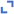

= Permite ver y gestionar el panel de control
:allow-uri-read: 
:icons: font
:imagesdir: ../media/

[role="lead"]
Puede utilizar la consola para supervisar las actividades del sistema de un vistazo. Puedes crear paneles personalizados para supervisar la implementación de StorageGRID.

TIP: Para cambiar las unidades de los valores de almacenamiento que se muestran en Grid Manager, seleccione el menú desplegable de usuario en la parte superior derecha del Grid Manager y, a continuación, seleccione *Preferencias de usuario*.

La consola puede variar en función de la configuración del sistema.

image::../media/grid_manager_dashboard.png[Consola de Grid Manager]

== Vea la consola

La consola consta de pestañas que contienen información específica sobre el sistema StorageGRID. Cada ficha contiene categorías de información que se muestran en las tarjetas.

Puede utilizar la consola proporcionada por el sistema tal cual. Además, puede crear paneles de control personalizados que contengan solo las pestañas y tarjetas relevantes para supervisar la implementación de StorageGRID.

Las fichas del panel de control proporcionadas por el sistema contienen tarjetas con los siguientes tipos de información:

[cols="1a,3a"]
|===
| En la consola proporcionada por el sistema | Contiene 

 a| 
Descripción general
 a| 
Información general sobre la cuadrícula, como alertas activas, uso del espacio y objetos totales en la cuadrícula.

 a| 
Rendimiento
 a| 
Uso de espacio, almacenamiento utilizado a lo largo del tiempo, S3 operaciones, duración de la solicitud, tasa de error.

 a| 
Reducida
 a| 
Uso de la cuota del inquilino y el uso del espacio lógico. Previsiones de uso del espacio para los datos de usuario y metadatos.

 a| 
ILM
 a| 
Cola de gestión del ciclo de vida de la información y tasa de evaluación.

 a| 
Nodos
 a| 
Uso de la CPU, los datos y la memoria por nodo. S3 operaciones por nodo. Distribución de nodo a sitio.

|===
Algunas de las tarjetas se pueden maximizar para facilitar la visualización. Seleccione el icono Maximizar en la esquina superior derecha de la tarjeta. Para cerrar una tarjeta maximizada, selecciona el icono Minimizar image:../media/icon_dashboard_card_minimize.png["Icono Minimizar"]o selecciona *Cerrar*.

== Gestionar paneles

Si dispone de acceso root (consulte link:../admin/admin-group-permissions.html["Permisos de grupo de administradores"]), puede realizar las siguientes tareas de gestión para los paneles de control:

* Cree un panel de control personalizado desde cero. Puede utilizar paneles personalizados para controlar qué información de StorageGRID se muestra y cómo se organiza dicha información.
* Clonar un panel de control para crear paneles personalizados.
* Definir un panel de control activo para un usuario. La consola activa puede ser la consola proporcionada por el sistema o una consola personalizada.
* Establezca un panel de control predeterminado, que es lo que ven todos los usuarios a menos que activen su propio panel de control.
* Editar un nombre de panel de control.
* Edite un panel de control para agregar o eliminar pestañas y tarjetas. Puede tener un mínimo de 1 y un máximo de 20 pestañas.
* Eliminar un panel de control.

NOTE: Si tiene cualquier otro permiso además del acceso root, solo puede establecer un panel de control activo.

Para administrar paneles, selecciona *Acciones* > *Administrar paneles*.

image::../media/dashboard_manage.png[Gestionar paneles]

== Configurar paneles de control

Para crear un nuevo panel clonando el panel activo, seleccione *Acciones* > *Clonar panel activo*.

Para editar o clonar un panel de control existente, selecciona *Acciones* > *Administrar paneles*.

NOTE: El panel proporcionado por el sistema no se puede editar ni eliminar.

Al configurar un panel de control, puede:

* Agregar o eliminar pestañas
* Cambie el nombre de las pestañas y asigne nombres únicos a las nuevas pestañas
* Agregue, elimine o reorganice (arrastre) tarjetas para cada pestaña
* Seleccione el tamaño de las tarjetas individuales seleccionando *S*, *M*, *L* o *XL* en la parte superior de la tarjeta

image::../media/dashboard_configure.png[Configurar el panel de control]
