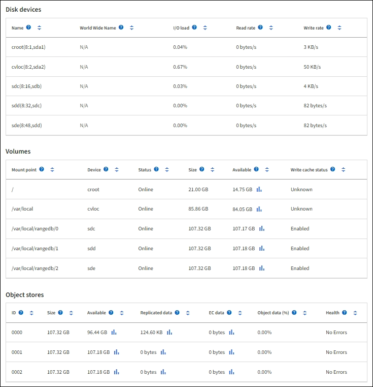

= Vea la pestaña hardware
:allow-uri-read: 
:icons: font
:imagesdir: ../media/

[role="lead"]
En la pestaña hardware, se muestra la utilización de CPU y la memoria de cada nodo, así como información de hardware adicional sobre los dispositivos.

NOTE: Grid Manager se actualiza con cada versión, por lo que es posible que no coincida con las capturas de pantalla de los ejemplos de esta página.

La pestaña hardware se muestra para todos los nodos.

image::../media/nodes_page_hardware_tab_graphs.png[Página Nodes pestaña hardware]

Para mostrar un intervalo de tiempo diferente, seleccione uno de los controles situados encima del gráfico o gráfico. Puede visualizar la información disponible para intervalos de 1 hora, 1 día, 1 semana o 1 mes. También puede establecer un intervalo personalizado, que le permite especificar intervalos de fecha y hora.

Para ver detalles sobre el uso de la CPU y el uso de memoria, coloque el cursor sobre cada gráfico.

image::../media/nodes_page_memory_usage_details.png[Página nodos > hardware > Detalles de uso de memoria]

Si el nodo es un nodo de dispositivo, en esta pestaña también se incluye una sección con más información sobre el hardware del dispositivo.

== Ver información sobre los nodos de almacenamiento de dispositivos

En la página Nodes, se incluye información sobre el estado del servicio y todos los recursos computacionales, de dispositivo de disco y de red para cada nodo de almacenamiento del dispositivo. También puede ver memoria, hardware de almacenamiento, versión del firmware de la controladora, recursos de red, interfaces de red, direcciones de red, y recibir y transmitir datos.

.Pasos
. En la página Nodes, seleccione un dispositivo Storage Node.
. Seleccione *Descripción general*.
+
La sección Información de nodos de la ficha Descripción general muestra información de resumen del nodo, como el nombre, tipo, ID y estado de conexión del nodo. La lista de direcciones IP incluye el nombre de la interfaz de cada dirección de la siguiente manera:

+
** *Eth*: Red Grid, red de administración o red de cliente.
** *Clic*: Uno de los puertos 10, 25 o 100 GbE físicos del aparato. Estos puertos se pueden unir y conectar a la red de cuadrícula de StorageGRID (eth0) y a la red de cliente (eth2).
** * mtc*: Uno de los puertos físicos de 1 GbE del aparato. Una o varias interfaces mtc se enlazan para formar la interfaz de red de administración de StorageGRID (eth1). Puede dejar disponibles otras interfaces mtc para la conectividad local temporal de un técnico en el centro de datos.
+
image::../media/nodes_page_overview_tab_extended.png[Descripción general de la página nodos ampliada]

+
En la sección Alerts de la pestaña Overview se muestran las alertas activas para el nodo.

. Seleccione *hardware* para obtener más información sobre el dispositivo.
+
.. Consulte los gráficos de utilización de CPU y memoria para determinar los porcentajes de uso de CPU y memoria a lo largo del tiempo. Para mostrar un intervalo de tiempo diferente, seleccione uno de los controles situados encima del gráfico o gráfico. Puede visualizar la información disponible para intervalos de 1 hora, 1 día, 1 semana o 1 mes. También puede establecer un intervalo personalizado, que le permite especificar intervalos de fecha y hora.
+
image::../media/nodes_page_hardware_tab_graphs.png[Gráficos de hardware]

.. Desplácese hacia abajo para ver la tabla de componentes del aparato. En esta tabla se incluye información como el nombre de modelo del dispositivo, los nombres de las controladoras, los números de serie y las direcciones IP, y el estado de cada componente.
+

NOTE: Algunos campos, como el hardware de informática y IP de BMC Controller, aparecen solo para dispositivos con esa función.

+
Los componentes de las bandejas de almacenamiento y las bandejas de expansión si forman parte de la instalación se muestran en una tabla aparte debajo de la tabla del dispositivo.

+
image::../media/nodes_page_hardware_tab_for_appliance.png[Página nodos ficha hardware para el dispositivo]

+
[cols="1a,2a"]
|===
| En la tabla dispositivo | Descripción 

 a| 
Modelo de dispositivo
 a| 
El número de modelo de este dispositivo StorageGRID se muestra en SANtricity OS.

 a| 
Nombre de la controladora de almacenamiento
 a| 
El nombre de este dispositivo StorageGRID se muestra en el sistema operativo SANtricity.

 a| 
IP de administración de la controladora de almacenamiento a
 a| 
La dirección IP del puerto de gestión 1 en la controladora de almacenamiento A. Utilice esta IP para acceder a SANtricity OS para solucionar problemas de almacenamiento.

 a| 
IP de gestión de la controladora de almacenamiento B.
 a| 
La dirección IP del puerto de gestión 1 en la controladora de almacenamiento B. Utilice esta IP para acceder a SANtricity OS para solucionar los problemas de almacenamiento.

Algunos modelos de dispositivos no tienen una controladora de almacenamiento B.

 a| 
WWID de la controladora de almacenamiento
 a| 
El identificador a nivel mundial de la controladora de almacenamiento que se muestra en el sistema operativo SANtricity.

 a| 
Número de serie del chasis del dispositivo de almacenamiento
 a| 
El número de serie del chasis del dispositivo.

 a| 
La versión de firmware de la controladora de almacenamiento
 a| 
La versión del firmware en el controlador de almacenamiento para este dispositivo.

 a| 
Versión del sistema operativo SANtricity de la controladora de almacenamiento
 a| 
La versión de sistema operativo SANtricity de la controladora de almacenamiento A.

 a| 
Versión de NVSRAM de la controladora de almacenamiento
 a| 
La versión de NVSRAM de la controladora de almacenamiento, según lo informado por SANtricity System Manager.

Para SG6060 y SG6160, si hay una discrepancia de versión de NVSRAM entre las dos controladoras, muestra la versión de la controladora A. Si la controladora A no está instalada ni operativa, muestra la versión de la controladora B.

 a| 
Hardware de almacenamiento
 a| 
El estado general del hardware de la controladora de almacenamiento. Si System Manager de SANtricity informa sobre el estado de necesita atención para el hardware de almacenamiento, el sistema StorageGRID también informa de este valor.

Si el estado es «Necesita atención», compruebe primero la controladora de almacenamiento con SANtricity OS. A continuación, asegúrese de que no exista ninguna otra alerta que se aplique a la controladora de computación.

 a| 
El número de unidades que la controladora de almacenamiento no pudo completar
 a| 
La cantidad de unidades que no se encuentran en estado óptimo.

 a| 
Controladora de almacenamiento A
 a| 
El estado de la controladora de almacenamiento A.

 a| 
Controladora de almacenamiento B
 a| 
El estado de la controladora de almacenamiento B. Algunos modelos de dispositivos no tienen una controladora de almacenamiento B.

 a| 
La controladora de almacenamiento proporciona alimentación A
 a| 
El estado de suministro de alimentación A para la controladora de almacenamiento.

 a| 
Suministro de alimentación de la controladora de almacenamiento B
 a| 
El estado del suministro de alimentación B para la controladora de almacenamiento.

 a| 
Tipo de unidad de datos de almacenamiento
 a| 
El tipo de unidades en el dispositivo, como HDD (unidad de disco duro) o SSD (unidad de estado sólido).

 a| 
Tamaño de las unidades de datos de almacenamiento
 a| 
El tamaño efectivo de una unidad de datos.

Para SG6160, también se muestra el tamaño de la unidad de caché.

*Nota*: Para los nodos con estantes de expansión, utilice el <<shelf_data_drive_size,El tamaño de las unidades de datos de cada bandeja>> en su lugar. El tamaño de unidad efectivo puede diferir en función de la bandeja.

 a| 
Modo RAID de almacenamiento
 a| 
El modo RAID configurado para el dispositivo.

 a| 
Conectividad del almacenamiento
 a| 
Estado de la conectividad del almacenamiento.

 a| 
Suministro de alimentación general
 a| 
El estado de todas las fuentes de alimentación del dispositivo.

 a| 
BMC IP de la controladora de computación
 a| 
La dirección IP del puerto del controlador de administración de la placa base (BMC) en el controlador de computación. Utilice esta IP para conectarse a la interfaz del BMC para supervisar y diagnosticar el hardware del dispositivo.

Este campo no se muestra para los modelos de dispositivos que no contienen una BMC.

 a| 
Número de serie de la controladora de computación
 a| 
El número de serie de la controladora de computación.

 a| 
Hardware de computación
 a| 
El estado del hardware de la controladora de computación. Este campo no se muestra para los modelos de dispositivos que no tienen hardware de computación y hardware de almacenamiento independientes.

 a| 
Temperatura de CPU de la controladora de computación
 a| 
El estado de temperatura de la CPU de la controladora de computación.

 a| 
Temperatura del chasis de la controladora de computación
 a| 
El estado de temperatura de la controladora de computación.

|===
+
[cols="1a,2a"]
|===
| En la tabla bandejas de almacenamiento | Descripción 

 a| 
Número de serie del chasis de la bandeja
 a| 
El número de serie del chasis de la bandeja de almacenamiento.

 a| 
ID de bandeja
 a| 
El identificador numérico de la bandeja de almacenamiento.

*** 99: Bandeja de controladoras de almacenamiento
*** 0: Primer estante de expansión
*** 1: Segunda bandeja de expansión

*Nota:* Los estantes de expansión solo se aplican a los modelos SG6060 y SG6160.

 a| 
Estado de bandeja
 a| 
El estado general de la bandeja de almacenamiento.

 a| 
Estado de IOM
 a| 
El estado de los módulos de entrada/salida (IOM) en cualquier bandeja de expansión. N/A si no se trata de una bandeja de ampliación.

 a| 
Estado de suministros de alimentación
 a| 
El estado general de los suministros de alimentación para la bandeja de almacenamiento.

 a| 
Estado de cajón
 a| 
El estado de los cajones en la bandeja de almacenamiento. N/A si la bandeja no contiene cajones.

 a| 
Estado de ventiladores
 a| 
El estado general de los ventiladores de refrigeración de la bandeja de almacenamiento.

 a| 
Ranuras de unidades
 a| 
El número total de ranuras de unidades de la bandeja de almacenamiento.

 a| 
Unidades de datos
 a| 
La cantidad de unidades de la bandeja de almacenamiento que se usan para el almacenamiento de datos.

 a| 
[[shelf_data_drive_size]]Tamaño de la unidad de datos
 a| 
El tamaño efectivo de una unidad de datos en la bandeja de almacenamiento.

 a| 
Unidades en caché
 a| 
La cantidad de unidades de la bandeja de almacenamiento que se usan como caché.

 a| 
Tamaño de la unidad de caché
 a| 
El tamaño de la unidad de caché más pequeña de la bandeja de almacenamiento. Normalmente, las unidades de caché tienen el mismo tamaño.

 a| 
Estado de configuración
 a| 
El estado de configuración de la bandeja de almacenamiento.

|===
.. Confirmar que todos los estados son nominales.
+
Si un estado no es nominal, revise las alertas actuales. También puede usar System Manager de SANtricity para obtener más información acerca de estos valores de hardware. Consulte las instrucciones de instalación y mantenimiento del aparato.

. Seleccione *Red* para ver la información de cada red.
+
El gráfico tráfico de red proporciona un resumen del tráfico de red general.

+
image::../media/nodes_page_network_traffic_graph.png[Gráfico de tráfico de red de la página Nodes]

+
.. Revise la sección Network interfaces.
+
image::../media/nodes_page_network_interfaces.png[Nodes Page Network interfaces]

+
Utilice la siguiente tabla con los valores de la columna *velocidad* de la tabla interfaces de red para determinar si los puertos de red 10/25-GbE del dispositivo se han configurado para utilizar el modo activo/backup o el modo LACP.

+

NOTE: Los valores mostrados en la tabla asumen que se utilizan los cuatro enlaces.

+
[cols="1a,1a,1a,1a"]
|===
| Modo de enlace | Modo de agregación | Velocidad de enlace de HIC individual (hipo 1, hipo 2, hipo 4) | Velocidad esperada de la red Grid/cliente (eth0,eth2) 

 a| 
Agregado
 a| 
LACP
 a| 
25
 a| 
100

 a| 
Fija
 a| 
LACP
 a| 
25
 a| 
50

 a| 
Fija
 a| 
Activa/Backup
 a| 
25
 a| 
25

 a| 
Agregado
 a| 
LACP
 a| 
10
 a| 
40

 a| 
Fija
 a| 
LACP
 a| 
10
 a| 
20

 a| 
Fija
 a| 
Activa/Backup
 a| 
10
 a| 
10

|===
+
Consulte https://docs.netapp.com/us-en/storagegrid-appliances/installconfig/configuring-network-links.html["Configure los enlaces de red"^] para obtener más información sobre la configuración de los puertos 10/25-GbE.

.. Revise la sección Comunicación de red.
+
Las tablas de recepción y transmisión muestran cuántos bytes y paquetes se han recibido y enviado a través de cada red, así como otras métricas de recepción y transmisión.

+
image::../media/nodes_page_network_communication.png[Comunicación de red de página nodos]

. Seleccione *almacenamiento* para ver gráficos que muestran los porcentajes de almacenamiento utilizados a lo largo del tiempo para los metadatos de objetos y datos de objetos, así como información sobre dispositivos de disco, volúmenes y almacenes de objetos.
+
image::../media/nodes_page_storage_used_object_data.png[Almacenamiento usado: Datos de objetos]

+
image::../media/storage_used_object_metadata.png[Almacenamiento utilizado: Metadatos de objetos]

+
.. Desplácese hacia abajo para ver la cantidad de almacenamiento disponible para cada volumen y almacén de objetos.
+
El nombre a nivel mundial de cada disco coincide con el identificador a nivel mundial (WWID) del volumen que aparece cuando se visualizan las propiedades del volumen estándar en SANtricity OS (el software de gestión conectado a la controladora de almacenamiento del dispositivo).

+
Para ayudarle a interpretar las estadísticas de lectura y escritura del disco relacionadas con los puntos de montaje del volumen, la primera parte del nombre que aparece en la columna *Nombre* de la tabla dispositivos de disco (es decir, _sdc_, _sdd_, _sde_, etc.) coincide con el valor que se muestra en la columna *dispositivo* de la tabla de volúmenes.

+

== Consulte información sobre los nodos de administración del dispositivo y los nodos de puerta de enlace

En la página Nodes, se incluye información sobre el estado del servicio y todos los recursos computacionales, de disco y de red para cada dispositivo de servicios que se utiliza como nodo de administración o nodo de puerta de enlace. También puede ver memoria, hardware de almacenamiento, recursos de red, interfaces de red, direcciones de red, y recibir y transmitir datos.

.Pasos
. En la página Nodes, seleccione un nodo de administrador de dispositivos o un Appliance Gateway Node.
. Seleccione *Descripción general*.
+
La sección Información de nodos de la ficha Descripción general muestra información de resumen del nodo, como el nombre, tipo, ID y estado de conexión del nodo. La lista de direcciones IP incluye el nombre de la interfaz de cada dirección de la siguiente manera:

+
** *Adllb* y *adlli*: Se muestra si se utiliza el enlace activo/de respaldo para la interfaz de red de administración
** *Eth*: Red Grid, red de administración o red de cliente.
** *Clic*: Uno de los puertos 10, 25 o 100 GbE físicos del aparato. Estos puertos se pueden unir y conectar a la red de cuadrícula de StorageGRID (eth0) y a la red de cliente (eth2).
** * mtc*: Uno de los puertos 1-GbE físicos del aparato. Una o más interfaces mtc se vinculan para formar la interfaz de red de administración (eth1). Puede dejar disponibles otras interfaces mtc para la conectividad local temporal de un técnico en el centro de datos.
+
image::../media/nodes_page_overview_tab_services_appliance.png[Pestaña Nodes de la página Overview para el dispositivo de servicios]

+
En la sección Alerts de la pestaña Overview se muestran las alertas activas para el nodo.

. Seleccione *hardware* para obtener más información sobre el dispositivo.
+
.. Consulte los gráficos de utilización de CPU y memoria para determinar los porcentajes de uso de CPU y memoria a lo largo del tiempo. Para mostrar un intervalo de tiempo diferente, seleccione uno de los controles situados encima del gráfico o gráfico. Puede visualizar la información disponible para intervalos de 1 hora, 1 día, 1 semana o 1 mes. También puede establecer un intervalo personalizado, que le permite especificar intervalos de fecha y hora.
+
image::../media/nodes_page_hardware_tab_graphs_services_appliance.png[Página nodos gráficos de la pestaña hardware para el dispositivo de servicios]

.. Desplácese hacia abajo para ver la tabla de componentes del aparato. Esta tabla contiene información, como el nombre del modelo, número de serie, versión de firmware de la controladora y el estado de cada componente.
+
image::../media/nodes_page_hardware_tab_services_appliance.png[Página nodos Ficha hardware para el dispositivo de servicios]

+
[cols="1a,2a"]
|===
| En la tabla dispositivo | Descripción 

 a| 
Modelo de dispositivo
 a| 
El número de modelo para este dispositivo StorageGRID.

 a| 
El número de unidades que la controladora de almacenamiento no pudo completar
 a| 
La cantidad de unidades que no se encuentran en estado óptimo.

 a| 
Tipo de unidad de datos de almacenamiento
 a| 
El tipo de unidades en el dispositivo, como HDD (unidad de disco duro) o SSD (unidad de estado sólido).

 a| 
Tamaño de las unidades de datos de almacenamiento
 a| 
El tamaño efectivo de una unidad de datos.

 a| 
Modo RAID de almacenamiento
 a| 
El modo RAID del dispositivo.

 a| 
Suministro de alimentación general
 a| 
El estado de todas las fuentes de alimentación del dispositivo.

 a| 
BMC IP de la controladora de computación
 a| 
La dirección IP del puerto del controlador de administración de la placa base (BMC) en el controlador de computación. Puede utilizar esta IP para conectarse a la interfaz del BMC para supervisar y diagnosticar el hardware del dispositivo.

Este campo no se muestra para los modelos de dispositivos que no contienen una BMC.

 a| 
Número de serie de la controladora de computación
 a| 
El número de serie de la controladora de computación.

 a| 
Hardware de computación
 a| 
El estado del hardware de la controladora de computación.

 a| 
Temperatura de CPU de la controladora de computación
 a| 
El estado de temperatura de la CPU de la controladora de computación.

 a| 
Temperatura del chasis de la controladora de computación
 a| 
El estado de temperatura de la controladora de computación.

|===
.. Confirmar que todos los estados son nominales.
+
Si un estado no es nominal, revise las alertas actuales.

. Seleccione *Red* para ver la información de cada red.
+
El gráfico tráfico de red proporciona un resumen del tráfico de red general.

+
image::../media/nodes_page_network_traffic_graph.png[Gráfico de tráfico de red de la página Nodes]

+
.. Revise la sección Network interfaces.
+
image::../media/nodes_page_hardware_tab_network_services_appliance.png[Página nodos ficha hardware Network Services Appliance]

+
Utilice la siguiente tabla con los valores de la columna *velocidad* de la tabla interfaces de red para determinar si los cuatro puertos de red 40/100-GbE del dispositivo estaban configurados para utilizar el modo activo/backup o el modo LACP.

+

NOTE: Los valores mostrados en la tabla asumen que se utilizan los cuatro enlaces.

+
[cols="1a,1a,1a,1a"]
|===
| Modo de enlace | Modo de agregación | Velocidad de enlace de HIC individual (hipo 1, hipo 2, hipo 4) | Velocidad esperada de la red Grid/cliente (eth0, eth2) 

 a| 
Agregado
 a| 
LACP
 a| 
100
 a| 
400

 a| 
Fija
 a| 
LACP
 a| 
100
 a| 
200

 a| 
Fija
 a| 
Activa/Backup
 a| 
100
 a| 
100

 a| 
Agregado
 a| 
LACP
 a| 
40
 a| 
160

 a| 
Fija
 a| 
LACP
 a| 
40
 a| 
80

 a| 
Fija
 a| 
Activa/Backup
 a| 
40
 a| 
40

|===
.. Revise la sección Comunicación de red.
+
Las tablas de recepción y transmisión muestran cuántos bytes y paquetes se han recibido y enviado a través de cada red, así como otras métricas de recepción y transmisión.

+
image::../media/nodes_page_network_communication.png[Comunicación de red de página nodos]

. Seleccione *almacenamiento* para ver información sobre los dispositivos de disco y los volúmenes del dispositivo de servicios.
+
image::../media/nodes_page_storage_tab_services_appliance.png[Página nodos ficha almacenamiento Servicios dispositivo]

