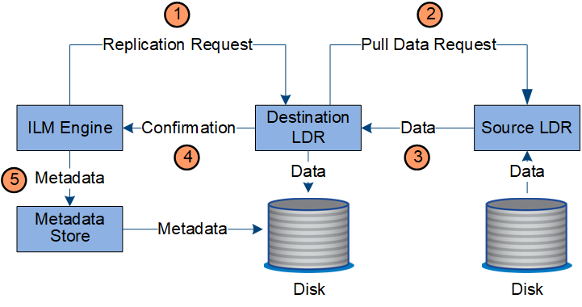

= Gestión de copias
:allow-uri-read: 
:icons: font
:imagesdir: ../media/

[role="lead"]
Los datos de objetos se gestionan mediante las políticas de ILM activas y las reglas de ILM asociadas. Las reglas de ILM hacen copias replicadas o con código de borrado para proteger los datos de objetos de la pérdida.

Es posible que sean necesarios diferentes tipos o ubicaciones de copias de objetos en distintos momentos de la vida del objeto. Las reglas de ILM se evalúan periódicamente para asegurarse de que los objetos estén ubicados según sea necesario.

El servicio LDR gestiona los datos de objetos.

== Protección de contenido: Replicación

Si las instrucciones de colocación del contenido de una regla de ILM requieren copias replicadas de datos de objetos, los nodos de almacenamiento que componen el pool de almacenamiento configurado y las almacenan en disco.

El motor de gestión del ciclo de vida de la información del servicio LDR controla la replicación y garantiza que se almacene el número correcto de copias en las ubicaciones correctas y la cantidad de tiempo correcta.

. El motor de ILM consulta al servicio ADC para determinar el mejor servicio LDR de destino dentro del pool de almacenamiento especificado por la regla de ILM. A continuación, envía ese servicio LDR un comando para iniciar la replicación.
. El servicio LDR de destino consulta al servicio ADC para obtener la mejor ubicación de origen. A continuación, envía una solicitud de replicación al servicio LDR de origen.
. El servicio LDR de origen envía una copia al servicio LDR de destino.
. El servicio LDR de destino notifica al motor de ILM que los datos del objeto se han almacenado.
. El motor de ILM actualiza el almacén de metadatos con los metadatos de la ubicación de objetos.

== Protección de contenido: Codificación de borrado

Si una regla de ILM incluye instrucciones para hacer copias con código de borrado de los datos de objetos, el esquema de código de borrado correspondiente divide los datos de los objetos en datos y fragmentos de paridad, y los distribuye por los nodos de almacenamiento que se configuran en el perfil de código de borrado.

El motor de ILM, que es un componente del servicio LDR, controla el código de borrado y garantiza que el perfil de código de borrado se aplique a los datos de los objetos.

image::../media/erasure_coding_data_flow.png[Flujo de datos de código de borrado]

. El motor ILM consulta al servicio ADC para determinar qué servicio DDS puede realizar mejor la operación de codificación de borrado. Cuando se determina, el motor de ILM envía una solicitud de inicio a ese servicio.
. El servicio DDS indica a un LDR que borre los datos del objeto.
. El servicio LDR de origen envía una copia al servicio LDR seleccionado para codificación de borrado.
. Después de crear el número adecuado de fragmentos de datos y paridad, el servicio LDR distribuye estos fragmentos por los nodos de almacenamiento (servicios Chunk) que forman el pool de almacenamiento del perfil de codificación de borrado.
. El servicio LDR notifica al motor de ILM y confirma que los datos del objeto se han distribuido correctamente.
. El motor de ILM actualiza el almacén de metadatos con los metadatos de la ubicación de objetos.

== Protección de contenido: Pool de almacenamiento en cloud

Si las instrucciones de colocación de contenido de una regla de ILM requieren que se almacene una copia replicada de los datos de objetos en un Cloud Storage Pool, los datos de objetos se duplican en el bloque de S3 externo o en el contenedor de almacenamiento de Azure Blob que se especificó para el Cloud Storage Pool.

El motor de ILM, que es un componente del servicio LDR, y el servicio Data mover controla el movimiento de objetos a Cloud Storage Pool.

image::../media/cloud_storage_pool_data_flow.png[Flujo de datos del pool de almacenamiento del cloud]

. El motor de ILM selecciona un servicio Data mover para replicar en el Cloud Storage Pool.
. El servicio Data mover envía los datos del objeto al Pool de almacenamiento en la nube.
. El servicio Data mover notifica al motor ILM que los datos del objeto se han almacenado.
. El motor de ILM actualiza el almacén de metadatos con los metadatos de la ubicación de objetos.

