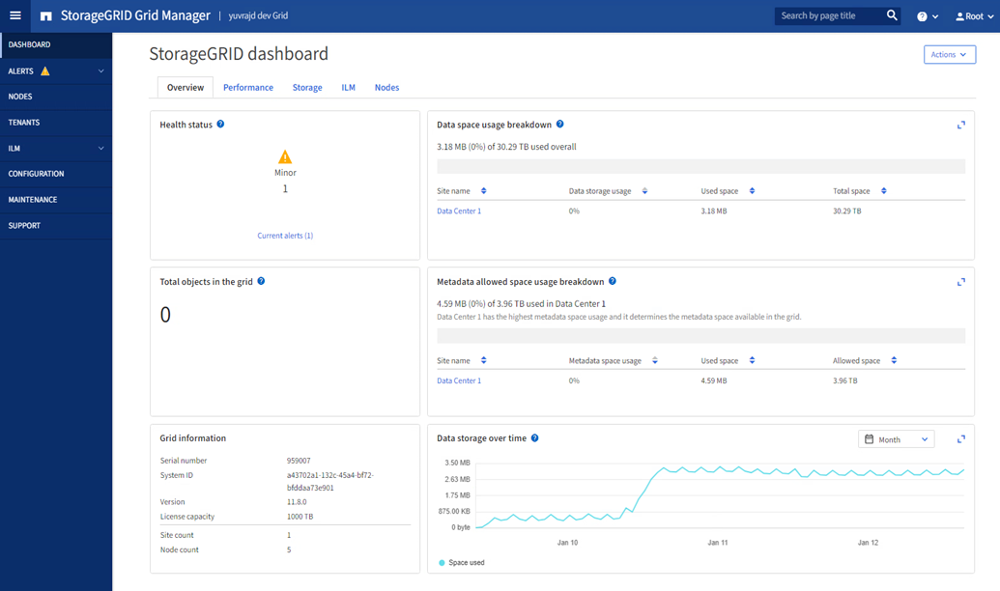

= Explore Grid Manager
:allow-uri-read: 
:icons: font
:imagesdir: ../media/

[role="lead"]
Grid Manager es una interfaz gráfica basada en navegador que permite configurar, administrar y supervisar el sistema StorageGRID.

NOTE: Grid Manager se actualiza con cada versión, por lo que es posible que no coincida con las capturas de pantalla de los ejemplos de esta página.

Cuando inicia sesión en Grid Manager, se conecta a un nodo de administración. Cada sistema StorageGRID incluye un nodo de administrador primario y cualquier número de nodos de administrador que no son primarios. Puede conectarse a cualquier nodo de administrador y cada nodo de administrador muestra una vista similar del sistema StorageGRID.

Puede acceder a Grid Manager mediante una link:../admin/web-browser-requirements.html["navegador web compatible"].

== Consola de Grid Manager

Cuando inicie sesión por primera vez en Grid Manager, puede utilizar el panel de control para link:../monitor/viewing-dashboard.html["supervise las actividades del sistema"]de un vistazo.

La consola contiene información sobre el estado y el rendimiento del sistema, el uso del almacenamiento, procesos de ILM, operaciones de S3 y los nodos del grid. Puede link:../monitor/viewing-dashboard.html["configure el panel de control"]seleccionar de entre una colección de tarjetas que contienen la información que necesita para controlar eficazmente su sistema.

Para obtener una explicación de la información que se muestra en cada tarjeta, seleccione el icono de ayuda de image:../media/icon_nms_question.png["icono de signo de interrogación"]esa tarjeta.

== Campo de búsqueda

El campo *Buscar* de la barra de encabezado permite navegar rápidamente a una página específica dentro de Grid Manager. Por ejemplo, puede introducir *KM* para acceder a la página Servidor de administración de claves (KMS).

Puede utilizar *Buscar* para buscar entradas en la barra lateral del Gestor de cuadrícula y en los menús Configuración, Mantenimiento y Soporte. También puede buscar por nombre elementos como nodos de cuadrícula y cuentas de inquilino.

== Menú de ayuda

El menú de ayuda image:../media/icon-help-menu-bar.png["icono ayuda en la barra de menús"]proporciona acceso a:

* El link:../fabricpool/use-fabricpool-setup-wizard.html["FabricPool"]asistente y.link:../admin/use-s3-setup-wizard.html["Configuración de S3"]
* El centro de documentación de StorageGRID para la versión actual
* link:../admin/using-grid-management-api.html["Documentación de API"]
* Información sobre la versión de StorageGRID instalada actualmente

== Menú Alertas

El menú Alertas proporciona una interfaz fácil de usar para detectar, evaluar y resolver problemas que pueden producirse durante el funcionamiento de StorageGRID.

En el menú Alertas, puede realizar lo siguiente paralink:../monitor/managing-alerts.html["gestionar alertas"]:

* Revisar las alertas actuales
* Revisar las alertas resueltas
* Configure silencios para suprimir notificaciones de alerta
* Defina reglas de alerta para condiciones que activen alertas
* Configure el servidor de correo electrónico para las notificaciones de alertas

== Nodos

La link:../monitor/viewing-nodes-page.html["Nodos"] muestra información sobre toda la cuadrícula, cada sitio de la cuadrícula y cada nodo de un sitio.

La página de inicio de los nodos muestra métricas combinadas para toda la cuadrícula. Para ver la información de un sitio o nodo en particular, seleccione el sitio o el nodo.

== Inquilinos

El link:../admin/managing-tenants.html["Inquilinos"]le permite link:../tenant/index.html["cree y supervise las cuentas de inquilino de almacenamiento"]utilizar para su sistema StorageGRID. Debe crear al menos una cuenta de inquilino para especificar quién puede almacenar y recuperar objetos y qué funcionalidad está disponible para ellos.

La página Tenants también proporciona detalles de uso para cada cliente, incluyendo la cantidad de almacenamiento usado y el número de objetos. Si establece una cuota cuando creó el arrendatario, puede ver la cantidad de esa cuota que se ha utilizado.

== Menú ILM

El link:using-information-lifecycle-management.html["Menú ILM"]le permite link:../ilm/index.html["Configurar las reglas y las políticas de gestión de la vida útil de la información (ILM)"]gobernar la durabilidad y la disponibilidad de los datos. También puede introducir un identificador de objeto para ver los metadatos de ese objeto.

En el menú de ILM, puede ver y gestionar ILM:

* Bases de datos
* Normativas
* Etiquetas de políticas
* Pools de almacenamiento
* Grados de almacenamiento
* Regiones
* Búsqueda de metadatos de objetos

== Menú de configuración

El menú Configuración le permite especificar los ajustes de red, la configuración de seguridad, la configuración del sistema, las opciones de supervisión y las opciones de control de acceso.

=== Tareas de red

Entre las tareas de red se incluyen:

* link:../admin/managing-high-availability-groups.html["Gestionar grupos de alta disponibilidad"]
* link:../admin/managing-load-balancing.html["Gestión de puntos finales del equilibrador de carga"]
* link:../admin/configuring-s3-api-endpoint-domain-names.html["Configuración de nombres de dominio de punto final S3"]
* link:../admin/managing-traffic-classification-policies.html["Gestión de directivas de clasificación de tráfico"]
* link:../admin/configure-vlan-interfaces.html["Configurando interfaces VLAN"]

=== Tareas de seguridad

Las tareas de seguridad incluyen:

* link:../admin/using-storagegrid-security-certificates.html["Gestión de certificados de seguridad"]
* link:../admin/manage-firewall-controls.html["Gestión de los controles internos del firewall"]
* link:../admin/kms-configuring.html["Configuración de servidores de gestión de claves"]
* Configuración de los valores de seguridad, incluidos link:../admin/manage-tls-ssh-policy.html["Política de TLS y SSH"] link:../admin/changing-network-options-object-encryption.html["opciones de seguridad de objetos y redes"], y link:../admin/changing-browser-session-timeout-interface.html["configuración de seguridad de la interfaz"].
* Configuración de los ajustes de un link:../admin/configuring-storage-proxy-settings.html["proxy de almacenamiento"] o un link:../admin/configuring-admin-proxy-settings.html["proxy de administración"]

=== Tareas del sistema

Las tareas del sistema incluyen:

* Uso link:../admin/grid-federation-overview.html["federación de grid"] para clonar información de cuenta de inquilino y replicar datos de objetos entre dos sistemas StorageGRID.
* Opcionalmente, habilitando link:../admin/configuring-stored-object-compression.html["Comprimir objetos almacenados"] la opción.
* link:../ilm/managing-objects-with-s3-object-lock.html["Gestión del bloqueo de objetos S3"]
* Descripción de la configuración de almacenamiento, link:../admin/what-object-segmentation-is.html["segmentación de objetos"] como y.link:../admin/what-storage-volume-watermarks-are.html["marcas de agua de volumen de almacenamiento"]
* link:../ilm/manage-erasure-coding-profiles.html["Gestione perfiles de código de borrado"].

=== Tareas de supervisión

Las tareas de supervisión incluyen:

* link:../monitor/configure-audit-messages.html["Configuración de los mensajes de auditoría y los destinos de registro"]
* link:../monitor/using-snmp-monitoring.html["Uso de la supervisión de SNMP"]

=== Tareas de control de acceso

Las tareas de control de acceso incluyen:

* link:../admin/managing-admin-groups.html["Gestión de los grupos de administración"]
* link:../admin/managing-users.html["Gestión de usuarios administradores"]
* Cambiar el link:../admin/changing-provisioning-passphrase.html["aprovisionamiento de la clave de acceso"] o. link:../admin/change-node-console-password.html["contraseñas de la consola del nodo"]
* link:../admin/using-identity-federation.html["Mediante la federación de identidades"]
* link:../admin/how-sso-works.html["Configurar SSO"]

== Menú de mantenimiento

El menú Mantenimiento le permite realizar tareas de mantenimiento, mantenimiento del sistema y mantenimiento de la red.

=== Tareas

Las tareas de mantenimiento incluyen:

* link:../maintain/decommission-procedure.html["Operaciones de decomisionar"] para eliminar los nodos y sitios de cuadrícula no utilizados
* link:../expand/index.html["Operaciones de expansión"] para agregar nuevos nodos y sitios de cuadrícula
* link:../maintain/warnings-and-considerations-for-grid-node-recovery.html["Procedimientos de recuperación de nodos de grid"] para sustituir un nodo con fallos y restaurar los datos
* link:../maintain/rename-grid-site-node-overview.html["Cambiar el nombre de los procedimientos"] para cambiar los nombres mostrados de la cuadrícula, los sitios y los nodos
* link:../troubleshoot/verifying-object-integrity.html["Operaciones de comprobación de existencia de objetos"] para verificar la existencia (aunque no la corrección) de los datos de objeto
* Ejecución de un link:../maintain/rolling-reboot-procedure.html["reinicio gradual"] para reiniciar varios nodos de cuadrícula
* link:../maintain/restoring-volume.html["Operaciones de restauración de volúmenes"]

=== Sistema

Algunas de las tareas de mantenimiento del sistema que se pueden realizar son:

* link:../admin/viewing-storagegrid-license-information.html["Ver información de licencias de StorageGRID"] o. link:../admin/updating-storagegrid-license-information.html["actualizando la información de licencia"]
* Generar y descargar el link:../maintain/downloading-recovery-package.html["paquete de recuperación"]
* Realizar actualizaciones de software StorageGRID, incluidas actualizaciones de software, correcciones urgentes y actualizaciones para el software de sistema operativo SANtricity en los dispositivos seleccionados
+
** link:../upgrade/index.html["Procedimiento de actualización"]
** link:../maintain/storagegrid-hotfix-procedure.html["Procedimiento de revisión"]
** https://docs.netapp.com/us-en/storagegrid-appliances/sg6000/upgrading-santricity-os-on-storage-controllers-using-grid-manager-sg6000.html["Actualice el sistema operativo SANtricity en las controladoras de almacenamiento SG6000 mediante Grid Manager"^]
** https://docs.netapp.com/us-en/storagegrid-appliances/sg5700/upgrading-santricity-os-on-storage-controllers-using-grid-manager-sg5700.html["Actualice el sistema operativo SANtricity en las controladoras de almacenamiento SG5700 mediante Grid Manager"^]

=== Red

Algunas de las tareas de mantenimiento de red que puede realizar son:

* link:../maintain/configuring-dns-servers.html["Configurando servidores DNS"]
* link:../maintain/updating-subnets-for-grid-network.html["Actualizando subredes de red de grid"]
* link:../maintain/configuring-ntp-servers.html["Gestionar servidores NTP"]

== Menú de soporte

El menú Soporte ofrece opciones que ayudan al soporte técnico a analizar y solucionar problemas del sistema.

=== Herramientas

En la sección Herramientas del menú Soporte, puede:

* link:../admin/configure-autosupport-grid-manager.html["Configure AutoSupport"]
* link:../monitor/running-diagnostics.html["Ejecutar diagnóstico"] en el estado actual de la cuadrícula
* link:../monitor/viewing-grid-topology-tree.html["Acceda al árbol de topología de cuadrícula"] para ver información detallada sobre los nodos de cuadrícula, los servicios y los atributos
* link:../monitor/collecting-log-files-and-system-data.html["Recopilar archivos de registro y datos del sistema"]
* link:../monitor/reviewing-support-metrics.html["Revisar las métricas de soporte"]
+

NOTE: Las herramientas disponibles en la opción * Metrics* están diseñadas para su uso por el soporte técnico. Algunas funciones y elementos de menú de estas herramientas no son intencionalmente funcionales.

=== Alarmas (heredadas)

La información sobre las alarmas heredadas se ha eliminado de esta versión de la documentación. Consulte https://docs.netapp.com/us-en/storagegrid-118/monitor/managing-alerts-and-alarms.html["Administrar alertas y alarmas (documentación de StorageGRID 11,8)"^].

=== Otros

Desde la otra sección del menú Soporte, puede:

* Gestione link:../admin/manage-link-costs.html["coste de enlace"]
* link:../admin/viewing-notification-status-and-queues.html["Sistema de gestión de redes (NMS)"]Ver entradas
* Gestione link:../admin/what-storage-volume-watermarks-are.html["marcas de agua de almacenamiento"]

