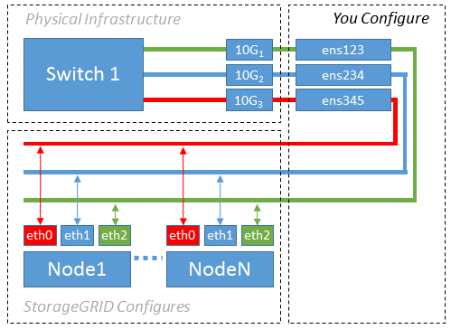

= Configurar la red host (Red Hat Enterprise Linux)
:allow-uri-read: 
:icons: font
:imagesdir: ../media/

[role="lead"]
Una vez finalizada la instalación de Linux en los hosts, puede que deba realizar alguna configuración adicional para preparar un conjunto de interfaces de red en cada host adecuado para la asignación a los nodos StorageGRID que se pondrá en marcha más adelante.

.Antes de empezar
* Ha revisado el link:../network/index.html["Directrices para redes de StorageGRID"].
* Ha revisado la información sobre link:node-container-migration-requirements.html["requisitos de migración de contenedores de nodos"].
* Si utiliza hosts virtuales, lea el <<mac_address_cloning_rhel,Consideraciones y recomendaciones para la clonación de direcciones MAC>> antes de configurar la red host.

NOTE: Si utiliza equipos virtuales como hosts, debe seleccionar VMXNET 3 como adaptador de red virtual. El adaptador de red VMware E1000 ha provocado problemas de conectividad con contenedores StorageGRID puestos en marcha en ciertas distribuciones de Linux.

.Acerca de esta tarea
Los nodos de grid deben poder acceder a la red de grid y, opcionalmente, a las redes de administrador y cliente. Para proporcionar este acceso, debe crear asignaciones que asocien la interfaz física del host con las interfaces virtuales para cada nodo de grid. Cuando se crean interfaces de host, se utilizan nombres descriptivos para facilitar la puesta en marcha en todos los hosts y para habilitar la migración.

La misma interfaz se puede compartir entre el host y uno o varios nodos. Por ejemplo, podría usar la misma interfaz para el acceso al host y el acceso a la red de administrador de nodo para facilitar el mantenimiento del host y del nodo. Aunque el host y los nodos individuales pueden compartir la misma interfaz, todos deben tener direcciones IP diferentes. Las direcciones IP no se pueden compartir entre nodos ni entre el host y cualquier nodo.

Puede utilizar la misma interfaz de red de host para proporcionar la interfaz de red de cuadrícula para todos los nodos StorageGRID del host; puede utilizar una interfaz de red de host diferente para cada nodo; o puede hacer algo entre ambos. Sin embargo, normalmente no debería proporcionar la misma interfaz de red host que las interfaces de red de Grid y Admin para un solo nodo, o bien como la interfaz de red de cuadrícula para un nodo y la interfaz de red de cliente para otro.

Puede completar esta tarea de muchas maneras. Por ejemplo, si los hosts son máquinas virtuales y va a implementar uno o dos nodos de StorageGRID para cada host, puede crear el número correcto de interfaces de red en el hipervisor y usar una asignación de 1 a 1. Si va a poner en marcha varios nodos en hosts con configuración básica para su uso en producción, puede aprovechar el soporte de la pila de red de Linux para VLAN y LACP para la tolerancia a fallos y el uso compartido de ancho de banda. En las siguientes secciones, se ofrecen enfoques detallados de estos dos ejemplos. No es necesario utilizar ninguno de estos ejemplos; puede utilizar cualquier enfoque que satisfaga sus necesidades.

NOTE: No utilice dispositivos de enlace o puente directamente como interfaz de red de contenedor. De esta manera, se podría evitar el inicio del nodo causado por un problema de kernel con el uso de MACVLAN con dispositivos de enlace y puente en el espacio de nombres del contenedor. En su lugar, utilice un dispositivo que no sea de vínculo, como un par VLAN o Ethernet virtual (veth). Especifique este dispositivo como la interfaz de red en el archivo de configuración del nodo.

.Información relacionada
link:creating-node-configuration-files.html["Creando archivos de configuración del nodo"]

== Consideraciones y recomendaciones para la clonación de direcciones MAC

.[[mac_address_clonation_rhel]]
La clonación de direcciones MAC hace que el contenedor utilice la dirección MAC del host y el host utilice la dirección MAC de una dirección que especifique o una generada aleatoriamente. Debe utilizar la clonación de direcciones MAC para evitar el uso de configuraciones de red en modo promiscuo.

=== Activación de la clonado de MAC

En algunos entornos, la seguridad se puede mejorar mediante el clonado de direcciones MAC porque permite utilizar un NIC virtual dedicado para la red de administración, la red de cuadrícula y la red de cliente. Si el contenedor utiliza la dirección MAC de la NIC dedicada en el host, podrá evitar el uso de configuraciones de red en modo promiscuo.

NOTE: La clonación de direcciones MAC está pensada para utilizarse con instalaciones de servidores virtuales y puede que no funcione correctamente con todas las configuraciones de dispositivos físicos.

NOTE: Si no se puede iniciar un nodo debido a que una interfaz objetivo de clonado MAC está ocupada, es posible que deba establecer el enlace a "inactivo" antes de iniciar el nodo. Además, es posible que el entorno virtual pueda evitar la clonación de MAC en una interfaz de red mientras el enlace está activo. Si un nodo no puede configurar la dirección MAC e iniciar debido a una interfaz que está ocupada, configurar el enlace a "inactivo" antes de iniciar el nodo puede solucionar el problema.

La clonación de direcciones MAC está deshabilitada de forma predeterminada y debe establecerse mediante claves de configuración de nodos. Debe habilitarla cuando instala StorageGRID.

Hay una clave para cada red:

* `ADMIN_NETWORK_TARGET_TYPE_INTERFACE_CLONE_MAC`
* `GRID_NETWORK_TARGET_TYPE_INTERFACE_CLONE_MAC`
* `CLIENT_NETWORK_TARGET_TYPE_INTERFACE_CLONE_MAC`

Si se establece la clave en "verdadero", el contenedor utilizará la dirección MAC de la NIC del host. Además, el host utilizará la dirección MAC de la red de contenedores especificada. De forma predeterminada, la dirección del contenedor es una dirección generada aleatoriamente, pero si ha establecido una con la `_NETWORK_MAC` clave de configuración del nodo, esa dirección se utiliza en su lugar. El host y el contenedor siempre tendrán direcciones MAC diferentes.

NOTE: Al habilitar la clonación MAC en un host virtual sin habilitar también el modo promiscuo en el hipervisor, es posible que la red de host Linux utilice la interfaz del host para dejar de funcionar.

=== Casos de uso de clonación DE MAC

Existen dos casos de uso a tener en cuenta con la clonación de MAC:

* Clonación MAC no activada: Cuando la `_CLONE_MAC` clave del archivo de configuración del nodo no está definida o se establece en false, el host utilizará la MAC NIC del host y el contenedor tendrá una MAC generada por StorageGRID a menos que se especifique una MAC en la `_NETWORK_MAC` clave. Si se establece una dirección en la `_NETWORK_MAC` clave, el contenedor tendrá la dirección especificada en la `_NETWORK_MAC` clave. Esta configuración de claves requiere el uso del modo promiscuo.
* Clonación de MAC habilitada: Cuando la `_CLONE_MAC` clave del archivo de configuración del nodo se establece en true, el contenedor utiliza el MAC de NIC del host y el host utiliza un MAC generado por StorageGRID a menos que se especifique un MAC en la `_NETWORK_MAC` clave. Si se establece una dirección en la `_NETWORK_MAC` clave, el host utiliza la dirección especificada en lugar de una generada. En esta configuración de claves, no debe utilizar el modo promiscuo.

NOTE: Si no desea utilizar la clonación de direcciones MAC y prefiere permitir que todas las interfaces reciban y transmitan datos para direcciones MAC distintas de las asignadas por el hipervisor, Asegúrese de que las propiedades de seguridad en los niveles de conmutador virtual y grupo de puertos estén establecidas en *Aceptar* para el modo promiscuo, los cambios de dirección MAC y las transmisiones falsificadas. Los valores establecidos en el conmutador virtual pueden ser anulados por los valores en el nivel de grupo de puertos, por lo que asegúrese de que la configuración sea la misma en ambos lugares.

Para activar la clonación MAC, consulte la link:creating-node-configuration-files.html["instrucciones para crear archivos de configuración de nodo"].

=== Ejemplo de clonación EN MAC

Ejemplo de clonación MAC habilitada con un host que tiene la dirección MAC 11:22:33:44:55:66 para la interfaz ens256 y las siguientes claves en el archivo de configuración del nodo:

* `ADMIN_NETWORK_TARGET = ens256`
* `ADMIN_NETWORK_MAC = b2:9c:02:c2:27:10`
* `ADMIN_NETWORK_TARGET_TYPE_INTERFACE_CLONE_MAC = true`

*Resultado*: El MAC de host para ens256 es b2:9c:02:c2:27:10 y el MAC de red de administración es 11:22:33:44:55:66

== Ejemplo 1: Asignación de 1 a 1 a NIC físicas o virtuales

El ejemplo 1 describe una asignación sencilla de interfaz física que requiere poca o ninguna configuración en el lado del host.

El sistema operativo Linux crea las `ensXYZ` interfaces automáticamente durante la instalación o el inicio, o cuando las interfaces se agregan en caliente. No se necesita ninguna configuración que no sea asegurarse de que las interfaces estén configuradas para que se encuentren en funcionamiento automáticamente después del arranque. Debe determinar qué `ensXYZ` red StorageGRID corresponde a qué red (Grid, Admin o Cliente) para poder proporcionar las asignaciones correctas más adelante en el proceso de configuración.

Tenga en cuenta que en la figura se muestran varios nodos StorageGRID; sin embargo, normalmente usaría esta configuración para máquinas virtuales de un solo nodo.

Si el conmutador 1 es un conmutador físico, debe configurar los puertos conectados a las interfaces 10G1 a 10G3 para el modo de acceso y colocarlos en las VLAN adecuadas.

== Ejemplo 2: Enlace LACP que transporta VLAN

.Acerca de esta tarea
En el ejemplo 2 se supone que está familiarizado con las interfaces de red de enlace y con la creación de interfaces VLAN en la distribución Linux que está utilizando.

El ejemplo 2 describe un esquema genérico, flexible y basado en VLAN que facilita el uso compartido de todo el ancho de banda de red disponible en todos los nodos de un único host. Este ejemplo se aplica especialmente a hosts con configuración básica.

Para entender este ejemplo, supongamos que tiene tres subredes distintas para las redes Grid, Admin y Client en cada centro de datos. Las subredes se encuentran en VLAN independientes (1001, 1002 y 1003) y se presentan al host en un puerto de tronco enlazado con LACP (bond0). Usted configuraría tres interfaces VLAN en el enlace: Bond0.1001, bond0.1002, y bond0.1003.

Si requiere VLAN y subredes independientes para redes de nodos en el mismo host, puede agregar interfaces VLAN en el vínculo y asignarlas al host (mostrado como bond0.1004 en la ilustración).

image::../media/rhel_install_vlan_diag_2.gif[Esta imagen se explica por el texto circundante.]

.Pasos
. Agregue todas las interfaces de red físicas que se utilizarán para la conectividad de red de StorageGRID en un único vínculo de LACP.
+
Utilice el mismo nombre para el enlace en cada host. Por ejemplo, `bond0`.

. Cree interfaces VLAN que utilicen este vínculo como su “dispositivo físico” asociado, usando la convención de nomenclatura de la interfaz VLAN estándar `physdev-name.VLAN ID`.
+
Tenga en cuenta que los pasos 1 y 2 requieren una configuración adecuada en los conmutadores EDGE que terminan los otros extremos de los enlaces de red. Los puertos del switch perimetral también deben agregarse a un canal de puerto LACP, donde se debe configurar como tronco y donde se puede pasar todas las VLAN requeridas.

+
Se proporcionan archivos de configuración de interfaz de muestra para este esquema de configuración de red por host.

.Información relacionada
link:example-etc-sysconfig-network-scripts.html["Ejemplo de /etc/sysconfig/network-scripts"]
