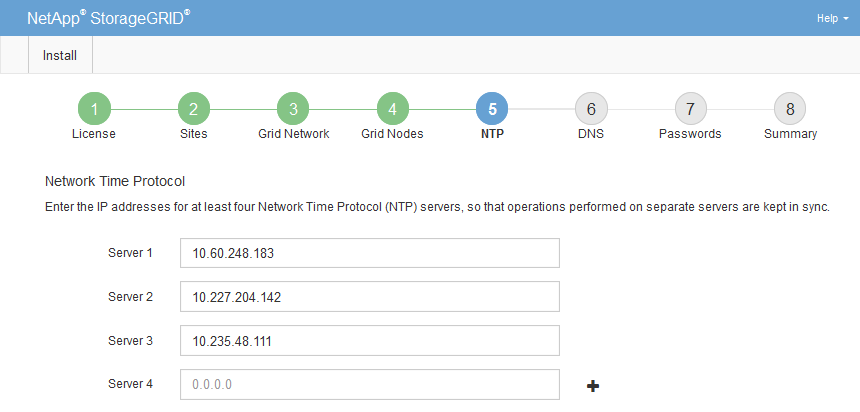

= Especifique la información del servidor de protocolo de tiempo de redes
:allow-uri-read: 
:icons: font
:imagesdir: ../media/

[role="lead"]
Es necesario especificar la información de configuración del protocolo de tiempo de redes (NTP) para el sistema StorageGRID, de manera que se puedan mantener sincronizadas las operaciones realizadas en servidores independientes.

.Acerca de esta tarea
Debe especificar las direcciones IPv4 para los servidores NTP.

Debe especificar servidores NTP externos. Los servidores NTP especificados deben usar el protocolo NTP.

Debe especificar cuatro referencias de servidor NTP de estrato 3 o superior para evitar problemas con la desviación del tiempo.

[NOTE]
====
Al especificar el origen NTP externo para una instalación de StorageGRID en el nivel de producción, no use el servicio Windows Time (W32Time) en una versión de Windows anterior a Windows Server 2016. El servicio de tiempo en versiones anteriores de Windows no es lo suficientemente preciso y no es compatible con Microsoft para su uso en entornos de gran precisión como StorageGRID.

https://support.microsoft.com/en-us/help/939322/support-boundary-to-configure-the-windows-time-service-for-high-accura["Límite de soporte para configurar el servicio de tiempo de Windows para entornos de alta precisión"^]

====
Los nodos a los que asignó previamente roles NTP primarios utilizan los servidores NTP externos.

CAUTION: Asegúrese de que al menos dos nodos de cada sitio puedan acceder a al menos cuatro fuentes de NTP externas. Si solo un nodo de un sitio puede acceder a los orígenes NTP, se producirán problemas de tiempo si ese nodo falla. Además, designar dos nodos por sitio como orígenes NTP primarios garantiza una sincronización precisa si un sitio está aislado del resto de la cuadrícula.

(Solo VMware) Realice comprobaciones adicionales para VMware, como asegurarse de que el hipervisor use la misma fuente NTP que la máquina virtual y usar VMTools para deshabilitar la sincronización horaria entre el hipervisor y las máquinas virtuales StorageGRID .

.Pasos
. Especifique las direcciones IPv4 para al menos cuatro servidores NTP en los cuadros de texto *servidor 1* a *servidor 4* .
. Si es necesario, seleccione el signo más junto a la última entrada para agregar entradas adicionales del servidor.
+

. Seleccione *Siguiente*.

.Información relacionada
link:../network/index.html["Directrices sobre redes"]
