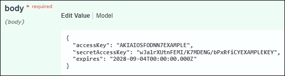

= Clone las claves de acceso S3 mediante la API
:allow-uri-read: 
:icons: font
:imagesdir: ../media/

[role="lead"]
Si su cuenta de inquilino tiene el permiso *Usar conexión de federación de grid*, puede usar la API de administración de inquilinos para clonar manualmente las claves de acceso S3 del inquilino en la cuadrícula de origen al inquilino en la cuadrícula de destino.

.Antes de empezar
* La cuenta de inquilino tiene el permiso *Use grid federation connection*.
* La conexión de federación de red tiene un *estado de conexión* de *Conectado*.
* Ha iniciado sesión en el gestor de inquilinos en la cuadrícula de origen del inquilino mediante un link:../admin/web-browser-requirements.html["navegador web compatible"].
* Pertenece a un grupo de usuarios que tiene el link:tenant-management-permissions.html["Administre sus propias credenciales de S3 o permiso de acceso raíz"].
* Si clona claves de acceso para un usuario local, el usuario ya existe en ambas cuadrículas.
+

NOTE: Cuando se clonan las claves de acceso S3 para un usuario federado, se agregan al inquilino de destino las claves de acceso S3 y el usuario.

== Clone sus propias claves de acceso

Puede clonar sus propias claves de acceso si necesita acceder a los mismos depósitos en ambas cuadrículas.

.Pasos
. Utilice el gestor de inquilinos en la cuadrícula de origen y link:creating-your-own-s3-access-keys.html["cree sus propias claves de acceso"]descargue `.csv` el archivo.
. En la parte superior del Administrador de inquilinos, selecciona el icono de ayuda y selecciona *Documentación de API*.
. En la sección *S3*, seleccione el siguiente punto final:
+
`POST /org/users/current-user/replicate-s3-access-key`

+
image::../media/grid-federation-post-current-user-replicate.png[Punto final POSTERIOR para replicar la propia clave de acceso]

. Seleccione *probar*.
. En el cuadro de texto *body*, reemplace las entradas de ejemplo de *accessKey* y *secretAccessKey* con los valores del archivo *.csv* que descargó.
+
Asegúrese de conservar las comillas dobles alrededor de cada cadena.

+

. Si la clave caduca, reemplace la entrada de ejemplo para *Expires* con la fecha y hora de vencimiento como una cadena en formato ISO 8601 data-time (por ejemplo, `2024-02-28T22:46:33-08:00`). Si la clave no caduca, introduzca *null* como valor para la entrada *Expires* (o elimine la línea *Expires* y la coma anterior).
. Seleccione *Ejecutar*.
. Confirme que el código de respuesta del servidor es *204*, lo que indica que la clave se clonó correctamente en la cuadrícula de destino.

== Clonar las claves de acceso de otro usuario

Puede clonar las claves de acceso de otro usuario si necesita acceder a los mismos depósitos en ambas cuadrículas.

.Pasos
. Utilice el gestor de inquilinos en la cuadrícula de origen y link:creating-another-users-s3-access-keys.html["Cree las claves de acceso S3 del otro usuario"]descargue `.csv` el archivo.
. En la parte superior del Administrador de inquilinos, selecciona el icono de ayuda y selecciona *Documentación de API*.
. Obtenga el ID de usuario. Necesitará este valor para clonar las claves de acceso del otro usuario.
+
.. En la sección *users*, selecciona el siguiente punto final:
+
`GET /org/users`

.. Seleccione *probar*.
.. Especifique los parámetros que desee utilizar al buscar usuarios.
.. Seleccione *Ejecutar*.
.. Busque el usuario cuyas claves desea clonar y copie el número en el campo *id*.

. En la sección *S3*, seleccione el siguiente punto final:
+
`POST /org/users/{userId}/replicate-s3-access-key`

+
image::../media/grid-federation-post-other-user.png[Punto final POSTERIOR para replicar la clave de acceso de otro usuario]

. Seleccione *probar*.
. En el cuadro de texto *UserId*, pega el ID de usuario que copiaste.
. En el cuadro de texto *body*, reemplace las entradas de ejemplo de *example access key* y *secret access key* con los valores del archivo *.csv* para ese usuario.
+
Asegúrese de conservar las comillas dobles alrededor de la cadena.

. Si la clave caduca, reemplace la entrada de ejemplo para *Expires* con la fecha y hora de vencimiento como una cadena en formato ISO 8601 data-time (por ejemplo, `2023-02-28T22:46:33-08:00`). Si la clave no caduca, introduzca *null* como valor para la entrada *Expires* (o elimine la línea *Expires* y la coma anterior).
. Seleccione *Ejecutar*.
. Confirme que el código de respuesta del servidor es *204*, lo que indica que la clave se clonó correctamente en la cuadrícula de destino.

