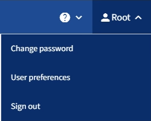

= Cierre la sesión del responsable de inquilinos
:allow-uri-read: 
:icons: font
:imagesdir: ../media/

[role="lead"]
Cuando haya terminado de trabajar con el Administrador de inquilinos, debe cerrar sesión para asegurarse de que los usuarios no autorizados no puedan acceder al sistema StorageGRID. Es posible que cerrar el navegador no le cierre la sesión del sistema según la configuración de cookies del navegador.

.Pasos
. Busque el menú desplegable username en la esquina superior derecha de la interfaz de usuario.
+

. Seleccione el nombre de usuario y luego seleccione *Cerrar sesión*.
+
** Si SSO no está en uso:
+
Ha cerrado sesión en el nodo de administrador. Se muestra la página de inicio de sesión del administrador de inquilinos.

+

NOTE: Si ha iniciado sesión en más de un nodo de administrador, debe cerrar la sesión de cada nodo.

** Si SSO está habilitado:
+
Inició sesión en todos los nodos de administrador a los que accedían. Aparece la página Inicio de sesión de StorageGRID. El nombre de la cuenta de arrendatario a la que acaba de acceder aparece como el valor predeterminado en el menú desplegable *Cuentas recientes*, y se muestra el *ID de cuenta* del arrendatario.

+

NOTE: Si SSO está activado y también ha iniciado sesión en Grid Manager, también debe cerrar sesión en Grid Manager para cerrar sesión en SSO.

